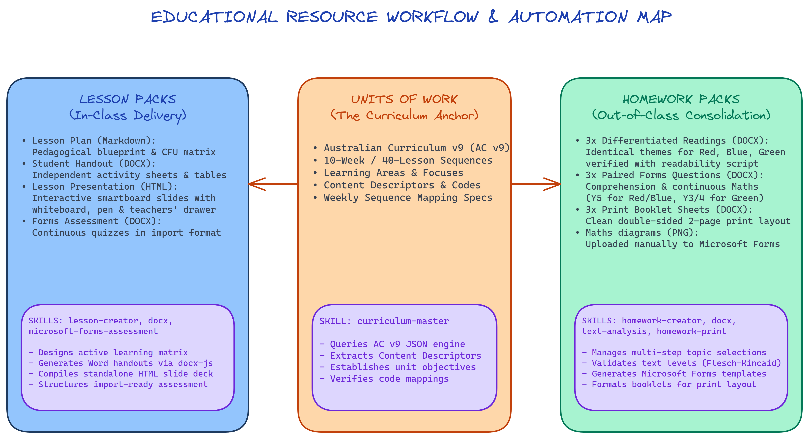

# Educational Resource Structure & Workflows

This directory contains the visual mapping and technical breakdown of our resource generation pipelines. Both **Lesson Packs** and **Homework Packs** are deeply rooted in the core **Units of Work**, ensuring learning objectives are aligned in and out of the classroom.

## 🗺️ Visual Flowchart
The structure is mapped in:
*   [structure_map.excalidraw](file:///c:/Users/dsuth/Documents/Joshua/Lesson_Homework_Structure/structure_map.excalidraw) - Raw Excalidraw JSON file (editable).
*   [structure_map.png](file:///c:/Users/dsuth/Documents/Joshua/Lesson_Homework_Structure/structure_map.png) - High-resolution rendered image.



---

## 🏗️ Core Architecture & Pipelines

Our system operates as a unified educational hierarchy, branching from high-level curriculum standards down to differentiated student work.

```
                  ┌──────────────────────────────┐
                  │      Unit of Work (AC v9)     │
                  │  (Anchor & Source of Truth)  │
                  └──────────────┬───────────────┘
                                 │
         ┌───────────────────────┴───────────────────────┐
         ▼                                               ▼
┌─────────────────┐                             ┌─────────────────┐
│  Lesson Packs   │                             │  Homework Packs │
│  (In-Class)     │                             │  (Out-of-Class) │
└────────┬────────┘                             └────────┬────────┘
         │                                               │
         ├─► Lesson Plan (MD)                            ├─► Differentiated Reading (DOCX)
         ├─► Student Handout (DOCX)                      ├─► Forms-ready Questions (DOCX)
         ├─► Interactive Slides (HTML)                   ├─► Maths Diagrams (PNG)
         └─► MS Forms Assessment (DOCX)                  └─► Print-ready Sheets (DOCX)
```

### 1. The Anchor: Units of Work (AC v9)
Everything begins with a specific **Unit of Work** (e.g., Year 5 English Unit 2 or Science Mould Unit). This layer defines the learning boundaries:
*   **Curriculum Alignment:** Mapped directly to the Australian Curriculum v9 (AC v9) content descriptors.
*   **Sequencing:** Structured into logical weekly learning pathways (e.g., 10-week, 40-lesson teaching sequences).
*   **Master Skills:** 
    *   `curriculum-master`: Queries official standards, content descriptors, and year levels.

### 2. Classroom Delivery: Lesson Packs
A Lesson Pack consists of highly structured files created for a specific lesson in the unit's sequence.
*   **Artifacts Generated:**
    1.  **Lesson Plan (Markdown):** The pedagogical blueprint detailing learning intentions, teaching flow, interactive matrices, and classroom whiteboard markers.
    2.  **Student Handout (DOCX):** Practical worksheets for student use during independent tasks.
    3.  **Interactive Slides (HTML):** Standalone smartboard-compatible HTML slides containing the embedded drawing canvas, whiteboard, highlighters, and teachers' drawer.
    4.  **MS Forms Assessment (DOCX):** Differentiated quizzes formatted strictly for direct import into Microsoft Forms.
*   **Master Skills:**
    *   `lesson-creator`: Manages the end-to-end workflow, pedagogical thinking matrix, and HTML compiler navigation.
    *   `docx`: Automation tool that compiles templates into professional Word documents.
    *   `microsoft-forms-assessment`: Formats assessments into a machine-readable structure (`ANSWER: X`).

### 3. Out-of-Class Consolidation: Homework Packs
Homework Packs reinforce the concepts introduced during the week's classroom lessons, offering targeted practice differentiated by students' learning levels.
*   **Ages & Groups Differentiation:**
    *   **Red Group:** Ages 12-13 (Year 5/6 extension; complex subject-specific language).
    *   **Blue Group:** Ages 10-11 (Year 5 core; average text complexity).
    *   **Green Group:** Ages 8-9 (Year 3/4 foundation; decodable simplified texts).
*   **Artifacts Generated:**
    1.  **Three Differentiated Readings (DOCX):** Differentiated texts with matching content but varying complexity (verified via readability grade scripts).
    2.  **Three Paired Questions (DOCX):** Forms-ready files containing 15 reading comprehension questions and 15 continuous maths questions (Red/Blue receive Y5 maths, Green receives Y3/4 maths).
    3.  **Maths Diagrams (PNG):** Dedicated diagram assets generated and saved to `images/` to be manually uploaded to Microsoft Forms.
    4.  **Three Print-ready Documents (DOCX):** High-quality two-page printed booklets combining the reading text and a two-column maths/comprehension layout.
*   **Master Skills:**
    *   `homework-creator`: Manages the multi-step topic selector and readability checking pipeline.
    *   `text-analysis`: Runs readability formulas to audit and pass texts before DOCX compilation.
    *   `homework-print`: Handles formatting scripts that output optimized print booklets.
