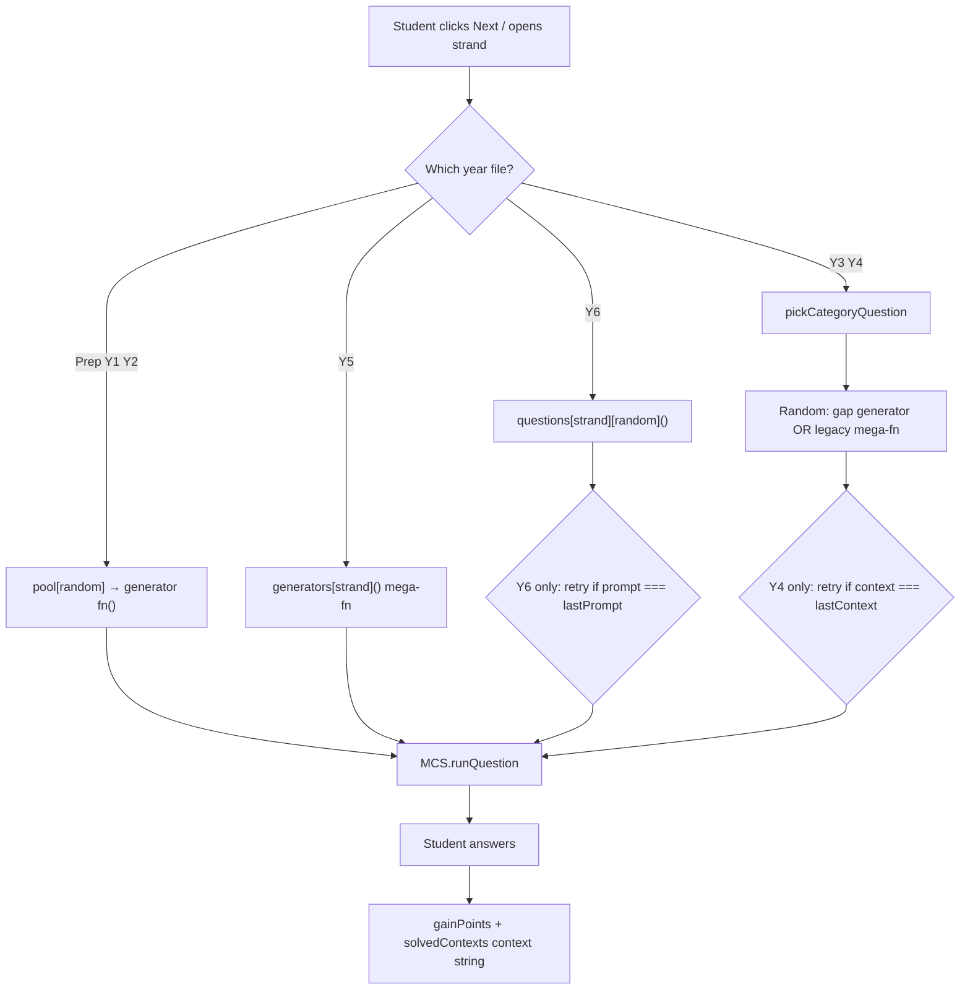

# Maths Command Station — Question Variety & Repetition Audit

**Date:** 2026-06-19  
**Scope:** All practice consoles (`prep-practice.js` through `year6-practice.js`), question generators, and selection logic. Assessment terminals (`year3.js`–`year6.js`) are noted where relevant.  
**Author:** Automated static analysis + manual code review  

---

## Executive summary

Your observation is correct: **students frequently see the same question again**, sometimes back-to-back and often within a short practice session. This is not a single bug but a **systemic gap** between what the product promises (“infinite generators”) and what the code actually guarantees.

| Finding | Severity |
|--------|----------|
| No shared **session-level deduplication** (same prompt/variables asked again) | **Critical** |
| Many question types have only **2–4 fixed variants** (legacy-keep gap generators) | **High** |
| ~**70 generator functions** return the **same question every time** (no randomisation) | **High** |
| Existing anti-repeat logic only avoids **one consecutive repeat** (and only on Y4/Y6) | **Medium** |
| `solvedContexts` tracks **question types** for badges, not **question instances** | **Medium** (design mismatch) |
| Y4 `pathway-algorithm` has a **good dedup pattern** but it is isolated to one context | **Opportunity** |

**Bottom line:** Random number generation exists in many places, but **nothing reliably prevents the same instance from being drawn twice in a session**. Combined with small finite pools from Phase 3 “legacy-keep” gap generators, repetition is mathematically likely during normal use (e.g. a 20-question session on Year 4 Number can exhaust a 3-variant pool many times over).

---

## How question selection works today



### Per-file selection behaviour

| Year file | Load function | Selection pattern | Session dedup |
|-----------|---------------|-------------------|---------------|
| `prep-practice.js` | `loadQuestion` | Random generator from strand array | **None** |
| `year1-practice.js` | `loadQuestion` | Random generator from strand array | **None** |
| `year2-practice.js` | `loadQuestion` | Random generator from strand array | **None** |
| `year3-practice.js` | `loadQuestion` | `pickCategoryQuestion` — random gap vs legacy | **None** |
| `year4-practice.js` | `initSandboxQuestion` | `pickCategoryQuestion` + context retry | **Consecutive context only**; pathway variants tracked separately |
| `year5-practice.js` | `loadNextPracticeQuestion` | Single mega-generator per strand | **None** |
| `year6-practice.js` | `loadNextQuestion` | Random from `questions[strand]` array | **Consecutive identical prompt only** |

### What `context` and `solvedContexts` actually mean

- **`context`** (e.g. `grid-multiplication`, `equivalence-fraction-check`) is a **frozen curriculum key** used for badges and achievement tracking. It identifies the *family* of question, not a specific instance.
- **`solvedContexts`** in `localStorage` records which families a student has answered correctly at least once. It does **not** record “$3 × 4 array” vs “$5 × 6 array”.
- Therefore, even after a student “solves” `grid-array-multiplication`, the picker will still serve that context again with equal probability.

This is correct for the badge pipeline but **does not meet** the product goal of not repeating the same concrete question.

---

## Root causes (diagnosis)

### 1. Missing instance fingerprint / session memory (primary)

There is **no central utility** that:

1. Builds a stable key for a rendered question (context + parameters, or normalised prompt).
2. Maintains a `Set` of keys seen **this session** (per strand or global).
3. Re-rolls generation until an unseen key is found (with a safe fallback when the pool is exhausted).

The only partial implementation is **Year 4 `pathway-algorithm`** (`pickPathwayScenario`, `usedPathwayVariants`, `profile.solvedPathwayVariants`). That pattern should be the template for all parametric and finite-pool questions.

### 2. Legacy-keep gap generators with tiny pools (Phase 3 side-effect)

Phase 3 migration added `gapGenerators` using `makeLegacyNumeric` / `makeLegacyChoice` to achieve badge context coverage quickly. Many pick from **hard-coded arrays of 2–4 items**:

| Context | Year | Pool size | Example |
|---------|------|-----------|---------|
| `reasonableness-check` | Y3 | **2** | `38+42`, `91−28` only |
| `quantity-estimation` | Y3 | **3** | 23, 48, 95 marbles |
| `mental-recall-grid` | Y3 | **3** | `6+7`, `9+8`, `15−6` |
| `multiply-by-10` | Y4 | **3** | Fixed ×10/×100 examples |
| `divide-by-10` | Y4 | **3** | Fixed ÷10/÷100 examples |
| `grid-multiplication` | Y4 | **3** | 23×4, 35×3, 42×5 only |
| `division-step-no-rem` | Y4 | **3** | Fixed short divisions |
| `factor-tree-check` | Y6 | **3** | 42, 63, 55 only |
| `equivalence-fraction-check` | Y6 | **1** | Always “equivalent to 1/2” |

Static analysis counted **29 finite-pool** gap generators (≤4 variants) and **70 fully fixed** generators (no `Math.random` in the function body) across practice files.

With uniform random selection, a 20-question session on one strand that includes these generators will **repeat the same concrete question many times** (birthday-paradox effect).

### 3. Fully static questions (~70 functions)

These always return identical prompts, options, and answers. Some are **intentionally** fixed (conceptual MCQs: “Which unit for a classroom?”). Others should be parametric but were shipped as single templates during migration.

**Year 6 is the worst affected:** 25 of 49 named `generate*` functions have no randomisation, including `generateEquivFraction`, `generateBodmasFlow`, `generateAreaRect`, and several statistics/probability recall items.

### 4. Weak “don’t repeat” guards where they exist

**Year 6** (`year6-practice.js`):

```javascript
// Retries only while prompt === lastPrompt (same strand, previous question only)
do {
    rawQuestion = randomGen();
} while (categoryGenerators.length > 1 && rawQuestion.prompt === lastPrompt && attempts < maxAttempts);
```

- Only blocks **immediate** back-to-back identical **prompt text**.
- Does not block `3×4` then `5×2` then `3×4` again.
- Does not remember anything across more than one step.

**Year 4** (`year4-practice.js`):

```javascript
// Retries only while context === lastContext
while (poolSize > 1 && question.context === lastContext && attempts < maxAttempts)
```

- Only avoids the same **question family** twice in a row (e.g. two `multiply-by-10` in a row).
- Does **not** avoid repeating the same variant within `multiply-by-10` (still only 3 variants).

### 5. Mega-generator architecture (Y3, Y4, Y5)

**Year 5** uses one function per strand that randomly picks a `subType` (e.g. Number has 8 subtypes: multiplication, division, fractions, etc.). Subtypes often use good parametric ranges, but:

- No dedup → `12 × 15` can appear twice in one session.
- Subtype pick is uniform → rare subtypes and common subtypes have equal weight.

**Year 3 / Year 4** combine a parametric mega-generator with gap generators. Gap items are **equal-weight** with the entire mega-generator output, so a 3-variant gap generator can feel disproportionately repetitive.

### 6. Small parametric ranges (year-appropriate but combinatorially tiny)

Some generators are “random” but the Cartesian product is small:

| Generator | Year | Effective combinations |
|-----------|------|------------------------|
| `generateFinancialMultiplicative` | Y3 | price 2–5 × qty 2–5 → **16** |
| `generateFinancialAdditive` | Y3 | **20** |
| `generateGridArrayMultiplication` | Y3 | rows 2–4 × cols 2–5 → **12** |
| `generateMentalPartitioning` | Y3 | total 12–17 → **6** |

For Foundation–Year 2, many generators use `randomInt` appropriately (e.g. Prep counting 3–8), but **without session dedup** collisions remain frequent in longer sessions.

### 7. Prep / Year 1 / Year 2 — discrete pools without memory

Each strand exposes an array of generator functions (Prep: 14 total; Y1: 8; Y2: 12). Selection is `pool[Math.floor(Math.random() * pool.length)]()` with **no dedup**. Individual generators often randomise (good), but the **same function** can fire twice in a row with the same rolled values.

### 8. Assessment terminals (out of scope for practice fix, noted for completeness)

Files like `year3.js` use **fixed ordered question lists** (e.g. 20 fact-recall equations). Repetition there is by design for standardized assessment flow. Practice mode should not inherit this pattern.

---

## Per-year summary

### Prep (`prep-practice.js`)

| Aspect | Assessment |
|--------|------------|
| Generators | 14 functions across strands; most use `randomInt` |
| Fixed items | `generateShareFair` (always 8 shared), `generateMissionDayOrder` (fixed event sequence), pattern/survey variants with small `variants` arrays |
| Dedup | None |
| Risk | Moderate — randomisation helps, but no session memory |

### Year 1 (`year1-practice.js`)

| Aspect | Assessment |
|--------|------------|
| Generators | 8 functions |
| Fixed / small pools | `generateCountBy` (3 step patterns), `generatePictureGraphFavourites` (2 surveys) |
| Dedup | None |
| Risk | Moderate |

### Year 2 (`year2-practice.js`)

| Aspect | Assessment |
|--------|------------|
| Generators | 12 functions |
| Parametric | Clock, arrays, place value generally randomised |
| Dedup | None |
| Risk | Moderate; only 1/9 widget families complete per roadmap — limited strand coverage may *feel* more repetitive |

### Year 3 (`year3-practice.js`)

| Aspect | Assessment |
|--------|------------|
| Structure | Legacy mega-generator + 26 gap generators |
| Gap generators | 14× `makeLegacyNumeric`, 17× `makeLegacyChoice`; many tiny pools |
| Fixed MCQs | 8 gap generators with zero randomisation (unit selection, angles, shape properties, etc.) |
| Dedup | **None** |
| Risk | **High** — user-reported multiplication repetition likely from `grid-array-multiplication` (12 combos, no dedup) plus static mental-recall sets |

### Year 4 (`year4-practice.js`)

| Aspect | Assessment |
|--------|------------|
| Structure | Legacy mega-generator + 25 gap generators |
| Finite pools | 10 gap generators with ≤4 variants (multiply/divide by 10, grid multiplication, rounding, etc.) |
| Best practice | `pathway-algorithm` session + profile variant tracking |
| Dedup | Consecutive **context** only |
| Risk | **High** for gap generators; **lower** for pathway-algorithm |

### Year 5 (`year5-practice.js`)

| Aspect | Assessment |
|--------|------------|
| Structure | Mega-generator per strand; heavy `Math.random` (~150 uses) |
| Subtypes | Number: 8 subtypes with generally good year-5 ranges (e.g. 3-digit × 1-digit) |
| Finite pools | `fracOptions` (10), `pctOptions` (8), word-problem scenario lists |
| Dedup | **None** |
| Risk | **Medium** — large variety possible but collisions inevitable in 20+ questions; no memory |

### Year 6 (`year6-practice.js`)

| Aspect | Assessment |
|--------|------------|
| Structure | `questions[strand]` array: canonical widgets + 49 gap generators |
| Fixed generators | **25** always-identical questions |
| Finite pools | **13** with ≤4 variants |
| Dedup | Consecutive identical **prompt** only |
| Risk | **Very high** — worst static/finite-pool density of all years |

---

## Highest-impact offenders (fix first)

Prioritised by *how often students hit them* × *how narrow the variety is*:

| Priority | Context | Year | Issue |
|----------|---------|------|-------|
| P0 | **All strands** | All | No session fingerprint / dedup layer |
| P1 | `grid-multiplication`, `multiply-by-10`, `divide-by-10` | Y4 | 3 fixed examples each |
| P1 | `mental-recall-grid`, `quantity-estimation`, `reasonableness-check` | Y3 | 2–3 fixed examples |
| P1 | `equivalence-fraction-check`, `number-line-position` | Y6 | Single static MCQ |
| P1 | `factor-tree-check`, `decimal-shift-multiply/divide` | Y6 | 3-variant pools |
| P2 | `grid-array-multiplication`, `financial-*` | Y3 | Small parametric space, no dedup |
| P2 | Number mega-generator subtypes | Y5 | No dedup across large space |
| P3 | Conceptual MCQs (unit selection, prism slice, etc.) | Y3–Y6 | Legitimately fixed — rotate distractors or variant phrasing only |

---

## Recommended repairs

### Option A — Shared session question picker (recommended foundation)

Add a small shared module (e.g. `mcs-question-picker.js`) used by **all** practice files:

```javascript
// Conceptual API (not yet implemented)
MCS.questionPicker = {
  /** Stable key for a concrete instance */
  fingerprint(q) {
    return [q.context, q.descriptor, q.prompt].join('::');
    // Better: generators attach q.instanceKey = 'grid-mult:23x4' at build time
  },

  /** Pick question, avoiding sessionSeen; re-roll up to maxAttempts */
  pick(generateFn, sessionSeen, maxAttempts = 24) { /* ... */ },

  /** Pick from array of generator fns with same dedup */
  pickFromPool(pool, sessionSeen) { /* ... */ },

  /** When pool exhausted: reset seen for that context only, or shuffle full deck */
  onExhausted(context, seenSet) { /* ... */ },
};
```

**Session state** (in each practice file’s `state`):

```javascript
sessionSeenQuestions: new Set(),  // fingerprints
// Optional: sessionSeenByContext: { 'grid-multiplication': Set([...]) }
```

**Generator contract extension** (optional but cleaner than prompt hashing):

```javascript
return {
  context: 'grid-multiplication',
  instanceKey: `${a}x${b}`,  // set by generator for parametric questions
  // ...
};
```

**Recommended:** fingerprint = `context + '::' + (instanceKey || prompt)`.

This directly implements your requirement: *once asked a particular question with particular variables, do not ask that exact question again* (for the current session). Optionally persist `profile.seenInstances[context]` for cross-session variety (like `solvedPathwayVariants`).

### Option B — Expand finite pools to parametric generators (P1)

Replace array-pick patterns with year-appropriate random ranges:

| Context | Current | Suggested |
|---------|---------|-----------|
| Y3 `grid-array-multiplication` | rows 2–4, cols 2–5 | Keep ranges; add dedup; optionally widen cols 2–6 |
| Y4 `grid-multiplication` | 3 fixed pairs | `a`: 11–49, `b`: 2–9, partition-friendly |
| Y4 `multiply-by-10` / `divide-by-10` | 3 fixed | Random n in curriculum band, factor 10 or 100 |
| Y6 `factor-tree-check` | 3 numbers | Random composite 24–99 with clear smallest prime factor |
| Y6 `equivalence-fraction-check` | Always 1/2 | Random target fraction + equivalent options |

Keep `legacy-keep` tag where widget work is deferred, but **parametric legacy-keep** is still valid.

### Option C — Deck-based selection for legitimately finite content

For conceptual MCQs that should stay fixed (e.g. “best unit for a classroom”), treat the strand’s static items as a **shuffled deck**:

1. Build all variants (or accept singleton).
2. Shuffle; pop until empty; reshuffle.
3. Guarantees full cycle before any repeat.

Useful when parametric expansion would weaken the teaching intent.

### Option D — Audit gate script (Slice 0, aligns with migration program)

Add `scripts/g-question-variety-audit.mjs` that FAILs when:

- A `generate*` function has no `Math.random` / `randomInt` and no `variants` array with length > 1.
- A finite pool array has length < 5 (configurable threshold per year).
- A practice file’s `loadQuestion` path does not reference `MCS.questionPicker` (once introduced).

Wire into existing gate culture (`g3-y*`, `g4-*`, `g5-widget-inventory-audit.mjs`).

### Option E — Year-band range registry

Centralise curriculum ranges to avoid Y3 generators accidentally using Y5-sized numbers and to document intent:

```javascript
// mcs-curriculum-ranges.js (illustrative)
MCS.ranges = {
  y3: { multiplication: { factor: [2, 5], product: [4, 25] } },
  y4: { multiplication: { multiplicand: [11, 99], multiplier: [2, 9] } },
  // ...
};
```

Generators import ranges by year + skill. Makes audit script and future AC updates easier.

---

## Phased implementation plan

| Phase | Work | Outcome |
|-------|------|---------|
| **0** | `g-question-variety-audit.mjs` + this report | Measurable baseline; FAIL list per context |
| **1** | `mcs-question-picker.js` + wire Prep→Y6 load paths | Session dedup for **all** questions |
| **2** | Expand P1 finite pools (Y3–Y4 number, Y6 number) | Larger variety space |
| **3** | Parametrize or deck-shuffle Y6 fixed MCQs | Remove “always identical” strand fatigue |
| **4** | `instanceKey` on canonical packages + optional profile persistence | Cross-session variety for power users |
| **5** | Range registry + generator refactor | Maintainability + curriculum alignment |

Estimated effort: Phase 0–1 is the highest ROI for your stated goal; Phase 2–3 address the worst individual offenders.

---

## What is working well (preserve)

1. **Year 4 `pathway-algorithm`** — `pickPathwayScenario` + `usedPathwayVariants` + `profile.solvedPathwayVariants` is exactly the right idea; generalise it.
2. **Year 5 mega-generators** — broad parametric ranges for core number work (multiplication, division with remainder, fraction addition).
3. **Year 3 widget-backed items** — fraction bars, number lines, clocks with random numerators/denominators/times.
4. **Prep / Y1 `randomInt` helpers** — good age-appropriate randomisation at the generator level.
5. **Frozen `context` strings** — keep as-is for badge compatibility; dedup keys should *include* context, not replace it.

---

## Testing recommendations

After Phase 1 (session picker):

1. **Automated:** Run 100 picks per strand; assert unique fingerprint count ≥ min(expected, poolSize) for finite pools.
2. **Manual QA (per `07-Roadmap-and-Migration.md`):** 20-question session per strand; log `[context, fingerprint]`; confirm zero duplicate fingerprints.
3. **Regression:** Badge `solvedContexts` still accrues on first correct per context; points unchanged.

---

## Appendix A — Selection code locations

| File | Key functions | Lines (approx.) |
|------|---------------|-----------------|
| `prep-practice.js` | `loadQuestion` | ~1011 |
| `year1-practice.js` | `loadQuestion` | ~851 |
| `year2-practice.js` | `loadQuestion` | ~1205 |
| `year3-practice.js` | `pickCategoryQuestion`, `loadQuestion` | ~2188, ~2203 |
| `year4-practice.js` | `pickCategoryQuestion`, `pickPathwayScenario`, `initSandboxQuestion` | ~947, ~2707, ~2734 |
| `year5-practice.js` | `loadNextPracticeQuestion` | ~3840 |
| `year6-practice.js` | `loadNextQuestion` | ~2485 |

## Appendix B — Static analysis snapshot

| Metric | Count |
|--------|------:|
| Practice files audited | 7 |
| Named `generate*` functions (Y3–Y6 + Prep–Y2) | ~134 |
| Fully fixed generators (no random in body) | ~70 |
| Finite-pool generators (array pick, ≤4 items) | ~29 |
| Practice files with session dedup | **0** (partial: Y4 pathway only) |
| Practice files with consecutive-only guard | 2 (Y4, Y6) |

---

## Appendix C — Related documentation

- `Improvement_Infrastructure/02-Architecture.md` §4 — canonical question package (`descriptor`, `context`, `evaluate`)
- `Improvement_Infrastructure/phase3-practice-migration/README.md` — legacy-keep / gap generator policy (source of many small pools)
- `Improvement_Infrastructure/07-Roadmap-and-Migration.md` §6 — manual QA checklist (extend with variety checks)

---

*This audit is diagnostic only. No application code was changed. Recommended next step: **Slice 0** audit script, then **Slice 1** shared `mcs-question-picker.js` wired into one year (suggest Year 3 or 4 where repetition is most visible) for review before rolling out to all years.*
