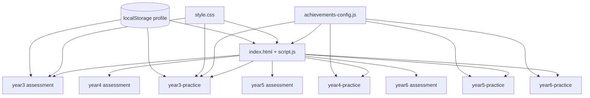

# Maths Command Station — Application Overview

**Maths Command Station** is a browser-based maths learning application built for Joshua. It presents Australian Curriculum v9 maths (Years 3–6) through an interactive "space command terminal" theme — complete with progress bars, system logs, rank titles, and achievement badges. There is no server, database, or install step: open the HTML files in a browser and it runs.

---

## What the App Does

Students land on a **portal** (`index.html`) and pick a year level. Each active year offers two paths:

| Mode | Purpose | Experience |
|------|---------|------------|
| **Practice Bay** | Ongoing skill building | Pick a maths strand (Number, Algebra, etc.), get endless generated questions, earn points and badges |
| **Assessment Terminal** | Structured check-in | Linear multi-phase journey with fixed tasks, ending in a summary report |

Prep through Year 2 appear on the portal but are marked "Coming Soon." Years 3, 4, 5, and 6 are fully wired up.

Progress follows the student everywhere via **browser local storage** — name, total score, level, rank, streak, and achievements persist between visits.

---

## Code Structure at a Glance

The project is a **multi-page static web app**: plain HTML, one shared stylesheet, and vanilla JavaScript. No React, no bundler, no backend.

```
Maths_Command_Station/
├── index.html              ← Portal (home)
├── script.js               ← Portal logic (profile display, trophy room)
├── style.css               ← All visual styling (~3,600 lines)
├── achievements-config.js  ← Shared badge & curriculum definitions
│
├── year3.html + year3.js              ← Year 3 Assessment
├── year3-practice.html + year3-practice.js
├── year4.html + year4.js              ← Year 4 (amber theme)
├── year4-practice.html + year4-practice.js
├── year5.html + year5.js              ← Year 5
├── year5-practice.html + year5-practice.js
├── year6.html + year6.js              ← Year 6 (emerald theme)
├── year6-practice.html + year6-practice.js
└── DESIGN.md               ← Design tokens & curriculum notes (reference doc)
```

Each **year level is its own mini-app**: its HTML defines the layout, and its JS file holds almost all behaviour for that page.

---

## The Three Shared Layers

### 1. `style.css` — One Design System for Everything

All pages link to the same stylesheet. It defines:

- **Colour palette** (Joshua Blue primary, neutrals, error states)
- **Typography** (Space Grotesk headings, Work Sans body, JetBrains Mono for "terminal" labels)
- **Layout** (`.terminal-layout`, three-panel dashboard, cards, buttons, progress bars)
- **Year-level colour themes** via body classes:
  - Year 3 → `theme-teal`
  - Year 4 → `theme-amber`
  - Year 5 → default blue
  - Year 6 → `theme-emerald`

The portal uses the default blue; each year page swaps accent colours without duplicating layout CSS.

### 2. `achievements-config.js` — The Curriculum "Dictionary"

This is the only file whose **data** is shared across pages. It defines:

- **`STRAND_THEMES`** — colours and labels for the six maths strands
- **`DESCRIPTOR_BADGES`** — one badge per Australian Curriculum content descriptor (e.g. `AC9M3N01`), with points required and which practice "contexts" count toward it
- **`GLOBAL_BADGES`** — cross-cutting awards (first question, streaks, all-rounder)
- **`GRAND_BADGES`** — "strand master" trophies when every descriptor in a strand is completed

Practice pages and the portal read this file to decide when to unlock badges and how to populate the Trophy Room.

### 3. `localStorage` — The Student Profile Database

Every practice page and the portal read/write the same key: `joshua_math_profile`.

The profile holds things like:

- Display name and lifetime score
- Level (1–7) and rank title (e.g. "Novice Calibrator" → "Station Admiral")
- Current streak and best streak
- Points per curriculum descriptor (`scoresByDescriptor`)
- Which question types the student has solved (`solvedContexts`)
- Roll-up scores per strand per year (`scoresByCatY3`, `scoresByCatY4`, etc.)

Assessment terminals can also **award points** into this profile when a run finishes, so practice and assessment feed the same progress ledger.

---

## Page Types and How They Connect



Navigation is simple links between HTML files (`index.html` ↔ `year3-practice.html` ↔ `year3.html`, etc.).

---

## Portal (`index.html` + `script.js`)

**Role:** Hub and progress dashboard.

**Layout:**

- **Left panel** — student profile (name, avatar initial, level bar, lifetime score, badge shelf, Trophy Room button)
- **Centre panel** — grid of year-level cards with Practice / Assessment buttons

**Logic in `script.js`:**

- Loads the profile from local storage
- Calculates level and rank from total score
- Renders earned badges on the shelf
- Opens the **Trophy Room** modal (tabs by year and strand, locked vs unlocked badges)
- Plays short UI sounds via the Web Audio API
- Lets the student edit their display name

The portal does **not** host maths questions — it only displays progress and routes to year pages.

---

## Practice Mode (`yearN-practice.html` + `yearN-practice.js`)

**Role:** Open-ended practice with gamification.

**Layout (consistent across years):**

- **Header** — links back to portal and to that year's assessment
- **Left panel** — profile, badges, streak, system log
- **Centre panel** — six strand tabs + question workspace

**How a practice page works internally:**

1. **State object** — tracks active strand, current question, attempts left (usually 2), timers, etc.

2. **Question generators** — a `generators` object keyed by strand (`number`, `algebra`, …). Each generator is a function that returns a question **package**:
   - Question text
   - A `renderFunc(container)` that builds interactive UI (SVG grids, keypads, sliders, etc.)
   - Logic to check the student's answer
   - Hint and solution text for the second-chance / give-up flow

3. **Curriculum tagging** — after generating a question, code assigns an **AC v9 descriptor code** and a **context id** (e.g. `numeral-ordering-value`). Those tie into badge unlock rules in `achievements-config.js`.

4. **Attempt flow:**
   - Submit → correct: points, streak up, maybe new badge, "Next challenge"
   - Wrong with attempts left → optional hint on second try
   - Wrong with no attempts left → show full solution, then next question

5. **Profile sync** — load on start, save after each correct answer; badge checks run against descriptor points and solved contexts.

Year 5 practice is the largest file (~4,500 lines) because it includes many interactive widgets (coordinate grids, line graphs, compound shapes, marble bags, etc.). Year 6 practice is newer and structured slightly differently (array of generator functions per strand rather than one generator per strand), but the user experience matches.

---

## Assessment Mode (`yearN.html` + `yearN.js`)

**Role:** Fixed, staged assessment — more like a structured test or mission.

**Layout:**

- **Header** — progression tracker (e.g. `SYS_INIT` → `FACT_RECALL` → `PLACE_VALUE` → `DISPATCH` → `DIAGNOSTICS`)
- **Left panel** — system log (timestamped messages)
- **Centre panel** — one **stage** visible at a time

**How assessment pages work internally:**

1. **Stage containers** — each phase is a `<div class="stage-container">` in the HTML (intro, stage 1, stage 2, …). Only one has class `active` at a time.

2. **State machine** — `state.activeStage` drives which stage is shown. `transitionToStage()` switches visibility, updates the header tracker, writes log entries, and calls stage-specific setup (e.g. `initStage1()`).

3. **Fixed content** — unlike practice, many tasks use **predetermined questions** (e.g. Year 3 Stage 1 has a hard-coded list of 20 addition/subtraction facts) or scripted scenarios (Year 3's "Eggerling's Eggs" dispatch story with maps and clocks).

4. **Validation** — each substation has validate functions that check inputs before allowing progress.

5. **Final report** — the last stage compiles results and may write bonus points into the shared profile.

Assessment JS files are large (roughly 1,000–1,400 lines per year) because they include UI wiring, animations, SVG interactions, and scoring — all in one file per year.

---

## Patterns Repeated in Every JS File

Because there is no shared module system, each page's script is **self-contained** and repeats similar blocks:

| Block | What it does |
|-------|----------------|
| Audio synthesizer | Small `playSound()` helper + named sounds (click, success, error, badge unlock) |
| Profile load/save | Same structure as portal; practice pages also update scores and badges |
| Logger (`addLog`) | Prepends timestamped messages to the left-panel log |
| DOM ready wrapper | Everything runs inside `document.addEventListener('DOMContentLoaded', …)` |

That duplication is a deliberate trade-off: no build step, each page works if opened alone, but profile/audio logic appears in several places.

---

## Curriculum Alignment

Content is organised around **Australian Curriculum v9 Mathematics**:

- Six strands: Number, Algebra, Measurement, Space, Statistics, Probability
- Practice questions map to **content descriptor codes** (e.g. `AC9M5N01`)
- Badges require points and sometimes specific **context types** solved
- `DESIGN.md` documents Year 5 widget specs (coordinate grids, line graphs, etc.) for designers; the live behaviour lives in the year JS files

---

## Scale and Maturity by Year

| Year | Assessment | Practice | Notes |
|------|------------|----------|-------|
| 3 | ~1,440 lines | ~1,820 lines | Teal theme; reference implementation |
| 4 | ~976 lines | ~1,930 lines | Amber theme |
| 5 | ~1,050 lines | ~4,550 lines | Richest interactive widgets |
| 6 | ~1,000 lines | ~1,270 lines | Newer; negative numbers, percentages, statistics |

---

## Architectural Summary

**Strengths of the structure:**

- Easy to open and use — double-click HTML, no install
- Clear mental model: portal → year → mode
- One CSS file keeps the "command station" look consistent
- Central achievement config keeps badges aligned with curriculum codes
- Shared local storage gives one persistent student identity

**Trade-offs:**

- Logic is duplicated across files (profile, audio, trophy UI)
- Each year's behaviour lives in large single files rather than small reusable modules
- No automated tests or package manager in this folder — it's a hand-crafted educational site

---

## In Short

**Maths Command Station** is a family of linked static pages sharing one stylesheet and one achievement config, with **two parallel code paths per year** — staged assessment HTML+JS pairs and generator-driven practice HTML+JS pairs — all tied together by a **browser-stored student profile** and a sci-fi terminal presentation layer.
