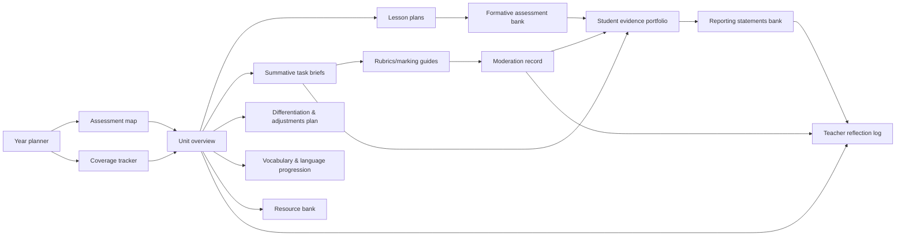

# Designing a Full-Year F–6 Unit Planning Document System Aligned to the Australian Curriculum

## Executive summary

A “full-year” (Foundation–Year 6) program of high-quality units succeeds or fails on **coherence**: coherence to the Australian Curriculum (what is to be taught and the quality expected), coherence across time (sequencing, revisiting, assessment pacing), and coherence across teachers (shared documents, shared standards, shared evidence protocols). The Australian Curriculum itself is designed to be used flexibly by schools, but it is explicit that **teachers use content descriptions and achievement standards as the key elements** for planning, teaching, assessing and reporting; elaborations and work samples are additional supports. citeturn10view0turn4view2turn34view0

This report provides:

A refined set of “high-quality unit” principles that explicitly link curriculum design, cognitive science (how students learn), assessment design (how evidence is elicited and judged), differentiation, language development, engagement, sequencing, and evidence-of-learning routines. citeturn10view0turn11search5turn11search0turn12search4turn13search0turn11search3turn12search6turn14search0turn9view0

A mapped description of the Australian Curriculum’s structure (learning areas; strands/sub-strands; content descriptions; achievement standards; general capabilities; cross-curriculum priorities; supporting elements) and a precise identification of which curriculum elements you must reference within each planning document. citeturn5view0turn4view0turn4view1turn7view2turn4view2turn10view0turn9view0turn7view0turn8view0

An “exhaustive but practical” **document suite** for a year of units (year planner → assessment map → unit overviews → lesson plans → evidence portfolios → moderation records → reporting statements), including governance, cadences, and ownership. citeturn10view0turn34view0

A set of downloadable markdown templates for each required document type, plus how they interlock. (Links are included in the “Templates” section.)

Three detailed exemplar “unit snapshots” (lower/middle/upper primary; English/Mathematics/Science) showing: filled template entries, curriculum code examples, success criteria, rubrics aligned to achievement standards, formative checks, and moderation/evidence protocols.

## What makes a high-quality unit of work

A high-quality unit is best defined as a **system** that reliably produces learning, not a collection of activities. The Australian Curriculum frames this system through the non-negotiable curriculum components used by teachers: content descriptions (what to teach) and achievement standards (expected quality), supported by elaborations and work samples. citeturn10view0turn4view2turn34view0

Below is a refined set of explicit principles (with practical implications for documents). Each principle is “evidence-seeking”: it states what must be true in the unit, and what evidence you would look for in planning documents and student work.

### Alignment and standards integrity as the organising constraint

A unit is “aligned” when the **taught curriculum**, **assessed curriculum**, and **reported curriculum** all reference the same intended learning. In the Australian Curriculum, that means (at minimum) mapping tasks and judgements back to **content descriptions and achievement standards**. citeturn10view0turn4view2

Practically, high-quality unit documentation makes alignment auditable:

The unit overview explicitly lists content description codes, identifies the targeted achievement standard aspects, and shows how each assessment (formative and summative) elicits evidence for those aspects.

The assessment map distributes achievement standard coverage over time rather than “over-assessing” one narrow slice of the standard.

This is not bureaucracy: alignment is the foundation for validity (you are judging what you intended to judge) and for defensible on-balance teacher judgements at reporting time. citeturn10view0turn13search7turn29search11

### Sequencing and cognitive architecture

Units produce robust learning when they are designed around the way knowledge and skill build into mental structures (“schemas”). Cognitive Load Theory explains why novices struggle when tasks overload working memory; learning improves when instruction reduces unnecessary load and supports schema formation (for example through clear modelling and worked examples before independent problem solving). citeturn11search5turn11search1

Planning implications (what “good” looks like in documents):

A unit overview includes (a) prerequisites and a diagnostic check, (b) likely misconceptions, and (c) a phase sequence that moves from explicit instruction → guided practice → independent application.

Lessons are written with **high signal-to-noise**: clear learning intention, careful example selection, explicit modelling, and short “checks for understanding” that diagnose misconceptions early.

The sequence increases complexity gradually, and revisits core ideas across time (see retrieval principle below), rather than attempting mastery in one block.

### Practice that strengthens long-term memory

A unit is stronger when it plans memory deliberately:

Retrieval practice: Taking tests/quizzes is not only measurement; it strengthens later retention (the “testing effect”). citeturn11search0turn11search8

Spacing: Learning is more durable when practice is distributed over time (meta-analytic evidence across many experiments). citeturn12search4turn12search0

Interleaving: Mixing problem types (rather than blocking one type) can enhance later discrimination and performance, including in mathematics contexts. citeturn12search9turn12search17

Planning implications:

Your unit overview contains an explicit “Retrieval and spaced review plan” (what is retrieved; when; how).

Lesson plans start with a short retrieval warm-up (not “busywork”: it targets known fragile knowledge from prior lessons/weeks).

Your formative assessment bank includes short, repeatable probes (exit tickets, hinge questions) that can be reused as spaced checks.

### Assessment design that produces usable evidence

High-quality units treat assessment as **evidence collection** and **decision-making**, not as an end-of-unit event.

Formative assessment is most powerful when it produces frequent, instructionally actionable evidence and feedback that moves learning forward. citeturn13search0turn11search3turn12search6

Feedback has strong potential impact but is not automatically positive; it must be specific, usable, and oriented to task/process/self-regulation rather than vague praise. citeturn12search6turn12search22

Planning implications:

Assessment maps state what evidence will be collected, where it will be stored, and how it will be judged (rubric/criteria aligned to the achievement standard).

Rubrics and marking guides are written from the achievement standard (“the standard of quality”) downward, ensuring criteria are not arbitrary.

Formative assessment tools are pre-designed and schedule-linked (not improvised only when things go wrong).

### Differentiation, accessibility, and inclusion by design

The Australian Curriculum explicitly frames flexibility and inclusivity: it “comes alive in the hands of teachers” and values diversity by supporting multiple means of representation, action, expression and engagement, and by enabling curriculum adjustments so students can access age-equivalent content and participate on the same basis as peers. citeturn10view0turn9view0

A research-aligned way to operationalise this is structured universal design (multiple means) alongside targeted adjustments where required. citeturn12search15turn12search7turn10view0

Planning implications:

Differentiation is not “extra worksheets”; it is pre-planned adjustments in teaching and assessment conditions, with monitoring of impact.

Lesson plans include universal scaffolds (worked examples, visuals, sentence stems) plus targeted supports and extensions.

Summative task briefs include an “adjustments” section documenting access provisions (without compromising the intended learning).

### Language development as a learning accelerator (not just “English time”)

The English curriculum is explicit that oral language is foundational, and that students build vocabulary and learn how to use words according to context. citeturn9view0

More broadly, vocabulary and academic language matter for comprehension and for learning across disciplines; evidence supports explicit vocabulary instruction improving reading achievement, and highlights the role of academic vocabulary in accessing curriculum language. citeturn14search0turn14search10turn14search14

Planning implications:

Each unit includes a “Vocabulary and language” section that is not decorative: it defines terms, gives student-friendly definitions, includes example sentences, and schedules retrieval.

Task briefs and rubrics include language supports (sentence stems, exemplars) that help students show their learning without lowering the cognitive demand.

### Engagement through meaning, agency, and competence

Engagement is most sustainable when students experience competence, autonomy and relatedness (self-determination theory), not when units rely on novelty alone. citeturn14search3turn14search19

Planning implications:

Units include authentic audiences/purposes where possible (e.g., presentations, community issues, design challenges), without sacrificing explicit teaching.

Lesson plans include short “wins” through guided practice, ensuring competence grows and students persist.

### Evidence of learning as a continuous thread

The Australian Curriculum work samples are designed to show evidence of student learning in relation to achievement standards; they highlight that work samples are evidence-focused and not necessarily exhaustive, which implies schools must collect their own evidence sets responsibly across the year. citeturn34view0

Planning implications:

A student evidence portfolio template exists and is populated continuously.

Moderation is scheduled and documented to support consistent judgements.

#### Unit quality indicators checklist (auditable)

A unit is high-quality when its documentation can answer these questions clearly:

| Quality indicator | Evidence in documents |
|---|---|
| Is it anchored to Australian Curriculum codes and achievement standard aspects? | Unit overview: codes + achievement standard excerpt; assessment map: codes → tasks; rubric: criteria → standard. citeturn10view0turn4view2 |
| Is the learning sequence explicit and instructionally coherent? | Unit progression phases; lesson plans with modelling + checks. citeturn11search5 |
| Does it plan for durable learning over time? | Retrieval + spacing plan; formative bank; revisit schedule. citeturn11search0turn12search4 |
| Does assessment produce usable evidence and feedback? | Formative schedule; rubric clarity; feedback timing; evidence storage. citeturn13search0turn12search6turn10view0 |
| Does it plan for differentiation and access? | Adjustment plan; universal scaffolds; summative adjustments documented. citeturn10view0turn12search15 |
| Does it explicitly develop vocabulary and disciplinary language? | Vocabulary progression; talk moves; explicit language features. citeturn9view0turn14search0turn14search14 |
| Is evidence moderated and reporting defensible? | Moderation record; on-balance judgement notes; reporting statement bank tied to evidence. citeturn10view0turn29search1turn29search0turn34view0 |

## Australian Curriculum structure and required curriculum references

The Australian Curriculum is “3-dimensional”: learning areas, general capabilities, and cross-curriculum priorities. General capabilities and cross-curriculum priorities are not separate subjects; they are developed through learning area content and are identified where they are embedded or applied. citeturn4view0turn4view1turn5view0turn4view3

### Curriculum architecture you must plan against

Learning areas: There are 8 learning areas (with some comprising multiple subjects). citeturn5view0

Curriculum content elements used for planning: year/band descriptions, content descriptions (organised into strands and sometimes sub-strands), content elaborations, and achievement standards; annotated work samples support judgement-making. citeturn4view2turn4view3turn10view0turn34view0

How learning areas are presented: English and Mathematics are presented by year level from Foundation to Year 10; Science and HASS present knowledge/understanding by year level and skills in 2-year bands; other learning areas use Foundation then 2-year bands. citeturn7view2

Below is a practical map (what your documents should mirror).

image_group{"layout":"carousel","aspect_ratio":"16:9","query":["Australian Curriculum three dimensions learning areas general capabilities cross-curriculum priorities diagram","Australian Curriculum Version 9 English content structure Language Literature Literacy diagram","Australian Curriculum Version 9 Mathematics content structure six strands diagram","Australian Curriculum Version 9 Science content structure three strands diagram"],"num_per_query":1}

### Learning area structure examples (English, Mathematics, Science)

English: Organised under three interrelated strands (Language, Literature, Literacy) with defined sub-strands (e.g., Language for interacting with others; Text structure and organisation; Phonic and word knowledge, etc.). citeturn9view0

Mathematics: Organised under six interrelated strands (Number, Algebra, Measurement, Space, Statistics, Probability) and includes an embedded expectation of mathematical proficiency across strands (reasoning/problem solving as integral). citeturn7view0turn6search15

Science: Organised under three interrelated strands (Science understanding; Science as a human endeavour; Science inquiry) with sub-strands; Science understanding content is described by year level, while Science as a human endeavour is described in 2-year bands. citeturn8view0turn7view2

### Curriculum elements that must be referenced in each planning document

The precise “must reference” set depends on the document’s function. A lesson plan does not need the same breadth as a year plan, but it must still be traceable to curriculum intent.

The table below identifies the minimum curriculum elements to reference so your documents are auditable and defensible against the Australian Curriculum planning frame (“content descriptions and achievement standards are the key elements”). citeturn10view0turn4view2turn4view3

| Planning document | Must reference curriculum elements | Why this is non-negotiable |
|---|---|---|
| Year planner (whole year) | Learning area, year level(s), unit titles/durations, assessment points mapped to achievement standard aspects | Prevents “coverage by accident” and assessment clustering; supports whole-year coverage of expected quality. citeturn10view0turn5view0 |
| Year-level curriculum map / coverage tracker | Strands/sub-strands, all relevant content description codes, achievement standard (full or excerpted aspects), and where each is taught/assessed; GC/CCP where explicit | Creates a living record of what was actually taught + evidenced (critical for reporting and transitions). citeturn4view2turn10view0turn4view0turn4view1 |
| Unit overview | Content description codes + unpacked meanings; achievement standard excerpt and targeted aspects; planned GC/CCP; evidence plan | Unit is the “atomic” planning level where alignment is designed, not guessed. citeturn10view0turn4view2turn4view0turn4view1 |
| Lesson plan | Content description codes (subset for lesson); lesson-level success criteria aligned to unit; formative evidence check | Ensures teaching time is traceable to intended curriculum and evidence. citeturn10view0turn13search0 |
| Assessment map | Every task linked to codes + achievement standard aspects; moderation points; evidence storage | Enables on-balance judgement against standards using multiple evidence sources. citeturn10view0turn29search11turn29search0 |
| Summative task brief | Task links to unit codes and the achievement standard aspects being judged (internally); student-facing success criteria | Students and teachers share a clear view of what counts as quality. citeturn11search3turn13search0 |
| Rubric/marking guide | Criteria derived from achievement standard aspects; performance descriptors; task-specific evidence notes | Aligns judgement to “quality of learning expected”. citeturn4view2turn10view0turn29search11 |
| Formative assessment bank | Each probe linked to a code or achievement standard aspect; diagnostic distractors where useful | Makes formative assessment systematic and actionable (not ad hoc). citeturn13search0turn11search3 |
| Differentiation/adjustments plan | The same curriculum intent (codes/standard) plus planned access adjustments | Protects equity: students access age-equivalent content with planned adjustments. citeturn10view0turn12search15 |
| Vocabulary/language progression | Curriculum demands (discipline language, text types) plus planned vocabulary retrieval cycle | Language is a performance constraint; planning it improves student access to demonstrating learning. citeturn9view0turn14search0turn14search14 |
| Moderation record | Explicit reference to achievement standard and rubric; annotated samples | Builds consistent teacher judgement and defensibility. citeturn29search1turn29search0turn10view0 |
| Student evidence portfolio | Evidence items tagged to learning area, unit, code(s), achievement standard aspects | Makes reporting and transitions evidence-based rather than memory-based. citeturn10view0turn34view0 |
| Reporting statement bank | Statements mapped (internally) to achievement standard aspects + evidence sources | Ensures reporting claims match evidence. citeturn10view0turn29search11 |

## Year-long document suite and templates

The Australian Curriculum provides the curriculum components; your school’s document suite provides the **implementation infrastructure**: pacing, alignment, assessment validity, evidence capture, moderation, and reporting consistency. citeturn10view0turn7view2turn34view0

### Document relationships

### Comparative table: scope, ownership, update cadence

This table is the governance layer: it makes the work shareable and sustainable across a year-level team.

| Document | Primary audience | Typical scope | Owner (recommended) | Update cadence |
|---|---|---|---|---|
| Year planner | Year-level team + leadership | Whole year | Year-level lead with leadership | Termly + mid-year review |
| Assessment map | Year-level team | Whole year | Assessment lead (team) | Termly + before reporting |
| Curriculum coverage tracker | Team + next-year teachers | Whole year | Year-level lead | Continuous; minimum per unit |
| Year-level curriculum map | Team | Whole year | Curriculum lead (team) | Annual + after major curriculum change |
| Unit overview | Team + relief teachers | 3–8 weeks | Unit author + team | Before teaching; post-unit revision |
| Lesson plans | Classroom teachers | Daily/weekly | Classroom teacher | Weekly |
| Formative assessment bank | Team | Ongoing | Team (shared) | Continuous improvement |
| Summative task brief | Students + families + teachers | Per task | Task designer | Each assessment cycle |
| Rubric/marking guide | Teachers | Per task | Task designer + moderator | Pre-task; refined post-moderation |
| Differentiation/adjustments plan | Teachers + support staff | Per unit | Classroom teacher + support staff | Pre-unit + mid-unit review |
| Vocabulary/language progression | Teachers | Per unit | Unit author | Pre-unit + refine post-unit |
| Resource bank | Teachers | Per unit/year | Unit author + librarian (if available) | As resources change |
| Moderation record | Team + leadership | Per task/term | Moderator (rotating role) | Each summative task |
| Student evidence portfolio | Teacher + student + leadership (as needed) | Whole year per student | Classroom teacher | Continuous |
| Teacher reflection log | Team + next cycle implementers | Per unit | Unit author | Post-unit; termly synthesis |
| Reporting statements bank | Teachers + leadership | Whole year | Year-level lead | Prior to reporting; refine annually |

Moderation and evidence artefacts exist because moderation is fundamentally the work of making consistent teacher judgements against standards through comparison of student work and agreed criteria. citeturn29search1turn29search0turn29search11turn10view0

### Downloadable template set

**Template pack index (markdown files):**

| Template | Download |
|---|---|
| README (how the suite fits together) | [Download README_document_suite.md](sandbox:/mnt/data/README_document_suite.md) |
| Year planner | [Download 01_year_planner_template.md](sandbox:/mnt/data/01_year_planner_template.md) |
| Year-level curriculum map | [Download 02_year_level_curriculum_map_template.md](sandbox:/mnt/data/02_year_level_curriculum_map_template.md) |
| Unit overview | [Download 03_unit_overview_template.md](sandbox:/mnt/data/03_unit_overview_template.md) |
| Lesson plan | [Download 04_lesson_plan_template.md](sandbox:/mnt/data/04_lesson_plan_template.md) |
| Whole-year assessment map | [Download 05_assessment_map_template.md](sandbox:/mnt/data/05_assessment_map_template.md) |
| Summative task brief | [Download 06_summative_task_brief_template.md](sandbox:/mnt/data/06_summative_task_brief_template.md) |
| Rubric / marking guide | [Download 07_rubric_and_marking_guide_template.md](sandbox:/mnt/data/07_rubric_and_marking_guide_template.md) |
| Formative assessment bank | [Download 08_formative_assessment_bank_template.md](sandbox:/mnt/data/08_formative_assessment_bank_template.md) |
| Differentiation and adjustments plan | [Download 09_differentiation_and_adjustments_plan_template.md](sandbox:/mnt/data/09_differentiation_and_adjustments_plan_template.md) |
| Vocabulary and language progression | [Download 10_vocabulary_and_language_progression_template.md](sandbox:/mnt/data/10_vocabulary_and_language_progression_template.md) |
| Resource bank | [Download 11_resource_bank_template.md](sandbox:/mnt/data/11_resource_bank_template.md) |
| Moderation record | [Download 12_moderation_record_template.md](sandbox:/mnt/data/12_moderation_record_template.md) |
| Student evidence portfolio | [Download 13_student_evidence_portfolio_template.md](sandbox:/mnt/data/13_student_evidence_portfolio_template.md) |
| Teacher reflection log | [Download 14_teacher_reflection_log_template.md](sandbox:/mnt/data/14_teacher_reflection_log_template.md) |
| Reporting statements bank | [Download 15_reporting_statements_bank_template.md](sandbox:/mnt/data/15_reporting_statements_bank_template.md) |
| Curriculum coverage tracker (live register) | [Download 16_curriculum_coverage_tracker_template.md](sandbox:/mnt/data/16_curriculum_coverage_tracker_template.md) |

### Document-by-document specifications (purpose, fields, curriculum links, cadence, evidence)

The “fields/sections” below match the headings in the templates and can be treated as required schema.

**Year planner**

| Item | Specification |
|---|---|
| Purpose & audience | Pacing and assessment distribution across the year; audience is the year-level team and leadership. citeturn10view0 |
| Exact fields/sections | Context; planning assumptions; year overview table; assessment load check; whole-year evidence plan. |
| Curriculum linkage | References learning areas and year level(s) (e.g., English Year 4), and identifies where achievement standard evidence is collected each term. citeturn5view0turn10view0 |
| Frequency & ownership | Termly update; owned by year-level lead. |
| Evidence/moderation hooks | Names moderation points per term and links to assessment map. citeturn29search0turn29search1 |

**Year-level curriculum map**

| Item | Specification |
|---|---|
| Purpose & audience | “Curriculum intent ledger”: the comprehensive list of what must be taught and evidenced across the year; audience is the team and next-year teachers. citeturn7view2turn4view2 |
| Exact fields/sections | Achievement standard (paste); strands/sub-strands; content descriptions list; general capabilities/CCP table; coverage status; risks/dependencies. citeturn4view0turn4view1turn4view2 |
| Curriculum linkage | Lists all content description codes and notes where in the year they are taught/assessed; includes achievement standard excerpt. citeturn10view0turn4view2 |
| Frequency & ownership | Annual build + per-unit updates; owned by curriculum lead/year-level lead. |
| Evidence/moderation hooks | “Evidence source” column ties each code to artefacts stored in evidence portfolios and moderated samples. citeturn34view0turn29search0 |

**Curriculum coverage tracker (live)**

| Item | Specification |
|---|---|
| Purpose & audience | An operational “audit trail” of what was taught, practised, assessed and revisited; audience is team + leadership + transitions. citeturn10view0turn34view0 |
| Exact fields/sections | Content descriptions coverage table; achievement standard aspects coverage table; GC/CCP tracking table. citeturn4view0turn4view1turn4view2 |
| Curriculum linkage | Code-level tracking (e.g., AC9M1N01 taught Term 1, assessed Week 8). |
| Frequency & ownership | Minimum per unit; owned by year-level lead with contributions from all teachers. |
| Evidence/moderation hooks | Forces explicit links from codes → evidence sources. citeturn34view0turn29search1 |

**Unit overview**

| Item | Specification |
|---|---|
| Purpose & audience | The unit blueprint that makes alignment and sequencing explicit; audience is the teaching team, relief teachers, and leaders reviewing quality. citeturn10view0turn4view2 |
| Exact fields/sections | Unit ID; rationale; big ideas/questions; content descriptions; achievement standard excerpt; GC/CCP; learning intentions/success criteria; sequencing + retrieval; assessment overview; differentiation; vocabulary; resources; safety; reflection. citeturn10view0turn4view2turn4view3 |
| Curriculum linkage | Lists content description codes and identifies achievement standard aspects to be evidenced; includes GC/CCP only where authentic. citeturn10view0turn4view0turn4view1 |
| Frequency & ownership | Draft before teaching; revise after teaching; owned by unit author; team-reviewed. |
| Evidence/moderation hooks | Embeds formative assessment schedule, summative task definition, and moderation plan. citeturn13search0turn29search0 |

**Lesson plans**

| Item | Specification |
|---|---|
| Purpose & audience | Instructional delivery plan enabling consistent routines and evidence checks; primarily for classroom teacher use, but also supports team consistency. citeturn11search5turn13search0 |
| Exact fields/sections | Lesson ID; curriculum alignment; learning intention & success criteria; retrieval warm-up; explicit instruction; guided practice; independent practice; exit ticket; language; inclusion; resources; reflection. citeturn11search5turn11search0 |
| Curriculum linkage | Includes subset of unit codes and the achievement standard aspect targeted by the lesson’s evidence check. citeturn10view0turn11search3 |
| Frequency & ownership | Weekly/daily; owned by classroom teacher. |
| Evidence/moderation hooks | Exit ticket + observation checklist items become evidence snapshots for portfolio/moderation sampling. citeturn34view0turn29search1 |

**Whole-year assessment map**

| Item | Specification |
|---|---|
| Purpose & audience | Prevents assessment overload and ensures achievement standard coverage; audience is the year-level team and leaders who oversee reporting consistency. citeturn10view0 |
| Exact fields/sections | Schedule/alignment table; assessment balance check; reporting alignment table. |
| Curriculum linkage | Links each task to content description codes and achievement standard aspects (the “expected standard”). citeturn10view0turn4view2 |
| Frequency & ownership | Termly; owned by assessment lead. |
| Evidence/moderation hooks | Includes moderation indicator and evidence storage field. citeturn29search0turn34view0 |

**Summative task brief**

| Item | Specification |
|---|---|
| Purpose & audience | Student-facing clarity about task, success criteria, logistics, and supports; also controls task validity by clarifying intended evidence. citeturn11search3turn13search0 |
| Exact fields/sections | Task title; purpose; what you will do; success criteria; instructions; resources; how assessed; integrity/support; adjustments. |
| Curriculum linkage | Internally links to codes and achievement standard aspects; student-facing language uses success criteria, not code jargon. citeturn10view0turn11search3 |
| Frequency & ownership | Per summative task; owned by task designer. |
| Evidence/moderation hooks | Explicitly states what artefact(s) will be stored for evidence and sampled for moderation. citeturn34view0turn29search1 |

**Rubric / marking guide**

| Item | Specification |
|---|---|
| Purpose & audience | Provides defensible criteria and performance levels; audience is teachers and moderators. citeturn29search11turn29search0turn10view0 |
| Exact fields/sections | Context; achievement standard excerpt; performance levels; criteria table; marking notes; moderation notes (pre). |
| Curriculum linkage | Criteria derived from achievement standard wording (quality) and aligned to the task. citeturn4view2turn10view0turn29search11 |
| Frequency & ownership | Per summative task; refined post-moderation; owned by task designer + moderator. |
| Evidence/moderation hooks | Includes “anchor samples” and grade boundary definitions. citeturn29search0turn29search1 |

**Formative assessment bank**

| Item | Specification |
|---|---|
| Purpose & audience | Makes formative assessment repeatable and diagnostic across team; audience is teachers and support staff. citeturn13search0turn11search3 |
| Exact fields/sections | Item list; hinge questions with distractor diagnosis; conferencing checklist. |
| Curriculum linkage | Each item tagged to code(s) and/or achievement standard aspects; supports planning “where learners are” and “how to get there.” citeturn13search0turn11search3 |
| Frequency & ownership | Continuous; owned collectively by team; curated by assessment lead. |
| Evidence/moderation hooks | Selected formative artefacts can become shared “anchor evidence” for moderation, especially at grade boundaries. citeturn29search1turn29search0 |

**Differentiation and adjustments plan**

| Item | Specification |
|---|---|
| Purpose & audience | Documents planned access supports and extensions; audience is classroom teachers and support staff. citeturn10view0turn12search15 |
| Exact fields/sections | Cohort snapshot; universal design; targeted adjustments; extension pathways; review. |
| Curriculum linkage | Holds curriculum intent constant while varying access (teaching/assessment/environment). citeturn10view0turn12search15 |
| Frequency & ownership | Per unit; revised mid-unit if data demands. |
| Evidence/moderation hooks | Ensures moderation considers how adjustments affected evidence without altering standard expectations. citeturn29search0turn29search11 |

**Vocabulary and language progression**

| Item | Specification |
|---|---|
| Purpose & audience | Makes language demands explicit and teachable; audience is team and support staff (including EAL/D specialists where available). citeturn9view0turn14search14 |
| Exact fields/sections | Tiered vocabulary list; language features to teach; oral language routines; retrieval plan. citeturn14search0turn12search4 |
| Curriculum linkage | Links to the unit’s text types, discipline language, and explicit language features implied by content descriptions. citeturn9view0turn14search10 |
| Frequency & ownership | Per unit; owned by unit author; refined with student work evidence. |
| Evidence/moderation hooks | Provides shared language expectations that increase consistency of judgement, especially for writing/speaking tasks. citeturn29search1turn12search6 |

**Resource bank**

| Item | Specification |
|---|---|
| Purpose & audience | Saves teacher time and keeps resources aligned and licensed; audience is the team. citeturn10view0 |
| Exact fields/sections | Core resources; supplementary resources; handouts list; equipment/consumables. |
| Curriculum linkage | Resource selection is anchored to the content descriptions and taught sequence (not “nice activities”). citeturn10view0turn4view2 |
| Frequency & ownership | Updated when resources change; shared ownership. |
| Evidence/moderation hooks | Stores exemplar texts/samples used as anchor references for student performance. citeturn34view0turn29search0 |

**Moderation record**

| Item | Specification |
|---|---|
| Purpose & audience | Builds consistent judgement by comparing student work against agreed criteria/standards; audience is the marking team and leaders. citeturn29search1turn29search0turn29search4 |
| Exact fields/sections | Meeting details; purpose; pre-moderation; sample selection protocol; moderation notes table; post-moderation actions. |
| Curriculum linkage | Explicitly cites the achievement standard excerpt and rubric criteria used. citeturn10view0turn29search11 |
| Frequency & ownership | Each summative task (minimum termly); owned by a rotating moderator. |
| Evidence/moderation hooks | Produces “anchor samples” and an audit trail of grade boundary decisions. citeturn29search0turn29search1 |

**Student evidence portfolio**

| Item | Specification |
|---|---|
| Purpose & audience | Makes evidence continuous and portable; audience is teacher, student, and (as required) leadership. citeturn34view0turn10view0 |
| Exact fields/sections | Student details; evidence index; optional reflection prompts. |
| Curriculum linkage | Each artefact is tagged to codes and achievement standard aspects (internal). citeturn10view0turn4view2 |
| Frequency & ownership | Continuous; owned by classroom teacher (collection) with student involvement. |
| Evidence/moderation hooks | Simplifies moderation sampling and reporting by making evidence findable and tagged. citeturn29search1turn29search0 |

**Teacher reflection log**

| Item | Specification |
|---|---|
| Purpose & audience | Creates an improvement loop; audience is current and future implementers. citeturn10view0turn31search15 |
| Exact fields/sections | Evidence review; implementation review; quality review; changes; version control notes. citeturn10view0turn11search5 |
| Curriculum linkage | Records whether achievement standard evidence collection was sufficient, and how to improve alignment and learning sequence. citeturn10view0 |
| Frequency & ownership | Post-unit; owned by unit author; discussed at term review. |
| Evidence/moderation hooks | References grade distributions, moderation outcomes, and re-teach priorities. citeturn29search0turn29search11 |

**Reporting statements bank**

| Item | Specification |
|---|---|
| Purpose & audience | Makes reporting consistent and evidence-anchored; audience is teachers and leaders. citeturn10view0 |
| Exact fields/sections | Statements by learning area; a “bank fields” table mapping statement to evidence sources. |
| Curriculum linkage | Uses achievement standards as reference point for reporting consistency; internal mapping ensures statements are not generic praise. citeturn10view0turn29search11 |
| Frequency & ownership | Updated before reporting; refined annually. |
| Evidence/moderation hooks | Requires evidence sources to be recorded for each statement used. citeturn34view0turn29search1 |

## Exemplar unit snapshots with aligned assessments

These exemplars demonstrate how the templates work as a coherent system. Codes are provided as examples; where a code is sourced from non-ACARA pages (e.g., Scootle or state authority documents), that’s noted by citation.

### Lower primary exemplar: Year 1 Mathematics unit

**Unit title:** Place value and numbers to 120 (Term 1, ~4 weeks)

**Australian Curriculum links (examples):**

AC9M1N01: recognise, represent and order numbers to at least 120… citeturn0search5  
AC9M1N02: partition one- and two-digit numbers… tens and ones. citeturn0search5

**Achievement standard alignment (excerpt):** By the end of Year 1, students connect number names, numerals and quantities, order numbers to at least 120, and demonstrate partitioning of one- and two-digit numbers (including tens and ones). citeturn16search11

**Learning intentions (teacher-facing):**
Students will know: number names/numerals to 120; tens/ones.  
Students will understand: two-digit numbers can be decomposed and recomposed.  
Students will be able to: represent numbers using materials, numerals, number lines and explain partitioning.

**Success criteria (student-facing):**
I can order numbers to 120 on a number line.  
I can show the same number in tens and ones in more than one way.  
I can explain how I know my representation matches the numeral.

**Retrieval and spacing plan (embedded):**
Week 1: daily 2–3 minute retrieval on number sequences and teen numbers.  
Week 2–4: twice-weekly mixed retrieval: ordering + partitioning + skip counting (interleaved practice). citeturn11search0turn12search4turn12search9

**Summative task brief (sample entry): “Number Museum Exhibit”**
Students create a mini “exhibit” for one chosen number between 40–120 showing: numeral, word form, base-ten blocks/drawing, number line placement, and two different partitions (tens + ones). Students orally explain one representation to a peer (teacher observes with checklist).

**Rubric aligned to the achievement standard (condensed):**

| Criterion (from Year 1 Maths achievement standard excerpt) | At standard (C) | Above (A/B) | Developing (D/E) |
|---|---|---|
| Orders numbers to at least 120 | Correctly orders and places number on number line | Explains ordering using place-value reasoning | Orders inconsistently; needs prompts |
| Partitions two-digit numbers into tens and ones | Shows correct tens/ones and at least one alternative partition | Uses multiple partitions and explains equivalence | Partitions incorrectly or cannot explain |
| Communicates reasoning with representations | Uses materials/diagrams to show thinking | Selects representations strategically and justifies | Representation incomplete or mismatched |

This rubric is “standards-derived”: the criteria are lifted from the achievement standard wording (ordering and partitioning) and then made task-specific. citeturn16search11turn29search11

**Moderation/evidence protocol (sample):**
Collect 6 anchor samples: two “borderline at standard”, two “at standard”, two “above”; moderate using the rubric; store photos of exhibits + one audio clip each for two students at boundaries. citeturn29search0turn29search1turn34view0

### Middle primary exemplar: Year 4 English unit

**Unit title:** Persuasive writing and presenting: fact, opinion, audience (Term 2, ~5 weeks)

**Australian Curriculum links (examples):**

AC9E4LA01: explore language used to develop relationships in formal and informal situations. citeturn1search4  
AC9E4LY06: plan, create, edit and publish written and multimodal imaginative, informative and persuasive texts… citeturn35search3  
AC9E4LY07: plan, create, rehearse and deliver structured oral/multimodal presentations… present an argument using subjective and objective language… citeturn35search4

**Achievement standard alignment (excerpt):** By the end of Year 4, students interact with others, and listen to and create spoken/multimodal texts; they use text structures to organise and link ideas, and use language features including subjective and objective language and topic-specific vocabulary. citeturn17search0

**Learning intentions (teacher-facing):**
Students will understand how persuasive texts use structure and language features for audience/purpose, and will create a written persuasive text and a short oral argument.

**Success criteria (student-facing):**
I can state my opinion and give reasons supported with relevant details.  
I can organise my ideas using an introduction, body paragraphs and a conclusion.  
I can use subjective language for persuasion and objective language when stating facts.  
I can deliver a clear presentation using appropriate pace, volume and visuals.

**Formative assessment bank (example items):**
Hinge question: “Which sentence is objective?” with distractors targeting common confusion between feelings and facts.  
Exit ticket: “Write one objective claim + one subjective claim about our topic.” citeturn13search0turn11search3

**Summative assessment (paired tasks):**
Written persuasive letter (multimodal optional) + 2-minute oral presentation. Students submit a planning sheet (structure + evidence) and one edited draft with teacher feedback notes.

**Rubric aligned to the achievement standard (condensed):**

| Criterion (AS-aligned) | C (At standard) | B/A (High/Exceptional) | D/E (Developing/Beginning) |
|---|---|---|---|
| Text structure links ideas | Clear intro/arguments/conclusion; ideas linked | Cohesive argument with purposeful paragraphing and linking | Structure unclear; linking limited |
| Language features for persuasion | Uses subjective language and topic vocab appropriately | Selects language strategically for impact; precise vocabulary | Limited persuasive features; vague language |
| Speaking/presenting | Delivers structured talk with some control of voice/visuals | High control of tone/pace/visual features for audience | Delivery disorganised; difficult to follow |
| Interaction/engagement with audience | Shares ideas; responds appropriately | Extends ideas and uses audience cues effectively | Minimal engagement |

**Moderation/evidence protocol (sample):**
Moderate written and oral separately (two evidence modes), but record a single on-balance judgement against the relevant Year 4 English achievement standard aspects. Store: final letter PDF, audio/video clip, and one annotated “boundary” sample set. citeturn10view0turn29search0turn29search1turn34view0

### Upper primary exemplar: Year 6 Science unit

**Unit title:** Habitats, physical conditions, and survival (Term 1 or 3, ~6 weeks)

**Australian Curriculum links (examples):**

AC9S6U01: investigate the physical conditions of a habitat and analyse how growth/survival is affected by changing physical conditions. citeturn1search10

Science inquiry example codes (from a Year 6 alignment resource):
AC9S6I01: pose investigable questions to identify patterns and test relationships and make reasoned predictions (example). citeturn32search0  
AC9S6I02 and related inquiry planning elements appear in Year 6 planning/fieldwork expectations (example). citeturn32search0

**Achievement standard alignment (excerpt, v9 text in a state alignment document):** By the end of Year 6, students explain how changes in physical conditions affect living things… and use inquiry practices to plan and conduct investigations and communicate findings. citeturn18search1turn32search0

**Learning intentions (teacher-facing):**
Students will learn to identify key physical habitat variables (e.g., light, water, temperature), design a repeatable investigation, analyse patterns, and argue conclusions about survival impacts using evidence.

**Success criteria (student-facing):**
I can identify and measure key physical conditions in a habitat model.  
I can plan a fair test (what I change, measure, keep the same) and explain risks/safety.  
I can represent results using tables/graphs and describe patterns.  
I can use evidence to explain how changing conditions affect growth/survival.

**Summative task (investigation report + scientific poster):**
Students conduct an investigation (e.g., seedling growth under different light/water conditions), produce a structured report (question/prediction/method/results/conclusion), and create a poster explaining findings for an audience (another class/community).

**Rubric aligned to achievement standard (condensed):**

| Criterion (AS-aligned) | C (At standard) | B/A (High/Exceptional) | D/E (Developing/Beginning) |
|---|---|---|---|
| Explains impact of physical conditions on living things | Explains relationships using evidence from results | Explains with multiple variables/limitations; strong reasoning | Explanation weak or not evidence-based |
| Investigation design and safety | Plans repeatable method; identifies variables and risks | Controls variables well; justifies design choices | Method incomplete; variables unclear |
| Data representation and analysis | Tables/graphs accurate; identifies pattern | Uses graphs effectively; discusses outliers/errors | Data unclear/inaccurate; pattern not identified |
| Communication | Report/poster clear and structured | Highly clear, precise scientific language and visuals | Structure unclear; limited scientific language |

**Moderation/evidence protocol (sample):**
Before marking: agree what counts as “evidence-based explanation” and what counts as “repeatable method”. During moderation: compare 8 samples (including adjusted submissions), agree grade boundaries, and identify teaching implications (e.g., graph interpretation). citeturn29search0turn29search4turn29search1turn29search11

## Moderation, evidence, and quality assurance protocols

### Moderation protocol that is rigorous but workable in primary settings

Moderation is most defensible when it is standard-referenced and evidence-centred: teachers compare student work against agreed criteria/standards to support consistent teacher judgements. citeturn29search1turn29search0turn29search4

A practical school-ready protocol (built into the moderation record template):

Pre-moderation (30–45 min): clarify task intent; paste the achievement standard excerpt; agree “look-fors” and boundary definitions; confirm adjustments. citeturn29search0turn29search11turn10view0

Independent marking (time varies): teachers mark using the shared rubric and annotate evidence.

Consensus moderation (45–60 min): bring a structured sample set (borderlines + at standard + above + adjusted). Make explicit which evidence aligns to which criterion and record consensus grades. citeturn29search0turn29search1turn29search4

Post-moderation actions (15–20 min): revise rubric wording if needed, identify reteach needs and adjust the formative assessment bank; log changes in the teacher reflection log. citeturn29search0turn12search6turn13search0

### Evidence protocols: what to collect, how to store it, how to use it

The Australian Curriculum work samples remind teachers that evidence should demonstrate the standard and that collections may not address every aspect of the achievement standard; this implies a school must deliberately plan its evidence set across the year. citeturn34view0turn10view0

A high-functioning evidence protocol includes:

Minimum evidence set per unit: at least one summative artefact (product/performance) plus two formative evidence snapshots (e.g., exit ticket sample + observation checklist). citeturn13search0turn34view0

Tagging: every stored artefact is tagged to learning area, unit, curriculum code(s), and achievement standard aspect(s) (internal tagging). This is what makes reporting defensible and time-efficient. citeturn10view0turn4view2

Sampling for moderation: store a small “anchor set” each term, not everything. Anchor sets should include boundary samples and annotated notes. citeturn29search0turn29search1

### Quality assurance and version control across a full year

Because curriculum and resources evolve, quality systems need version control. The Australian Curriculum records changes to key elements (including content descriptions and achievement standards) through version history practices. citeturn31search15

A practical governance model:

Each unit overview and rubric carries a version/date stamp.

After each implementation, the teacher reflection log records evidence trends, what to change, and why.

At year end, the year-level team updates the year planner, assessment map and coverage tracker, ensuring that the next cohort benefits from the learning (not just the documents). citeturn10view0turn31search15turn29search0