# Meteorological Aspects of Severe Tropical Cyclone George’s Impact on the Pilbara

**27 February – 12 March 2007**

Perth Tropical Cyclone Warning Centre
Bureau of Meteorology
12 October 2007

---

Perth Tropical Cyclone Warning Centre

Bureau of Meteorology 1100 Hay St West Perth WA 6005

### 12 October 2007

## Summary

Severe Tropical Cyclone (TC) George was both very intense and physically large. George was the most destructive cyclone to affect Port Hedland since TC Joan in 1975.

TC George formed on 3 March in the Joseph Bonaparte Gulf. It weakened back to a tropical low as it tracked westwards across the northern Kimberley and then re-intensified shortly after moving offshore into the Indian Ocean on 5 March. George intensified to a Severe Tropical Cyclone (Category 3) on the evening of 7 March and reached Category 5 as it approached the coast. It was still at its maximum intensity when it crossed the coast 50 km northeast of Port Hedland at 10 pm Western Daylight Savings Time (WDT) on Thursday 8 March.

The wind impact was greatest between Wallal and Whim Creek. A 10-minute mean wind of 194 km/h, equivalent to wind gusts of approximately 275 km/h, was recorded offshore at Bedout Island. At Port Hedland Airport, gusts of 154 km/h were recorded around 11 pm WDT prior to equipment failure. It is likely that stronger winds were experienced around midnight, on the outer edge of the band of maximum winds.

### Winds decreased markedly as the system tracked inland overnight however George is estimated to have continued to produce “very destructive winds” (Category 3 or higher intensity) until just after 6 am WDT 9 March, at which time it was approximately 115 km south southeast of Port Hedland.

TC George produced large amounts of rain in the northern Kimberley and the Northern Territory earlier in its lifecycle. Upon approaching the Pilbara coast, substantial (but not exceptional) falls occurred. A lack of previous rainfall and the steady movement of George prevented significant flooding.

Reported impacts include three fatalities and numerous injuries at locations south of Port Hedland. Less than 2% of buildings in the greater Port Hedland area (i.e. including South Hedland) sustained structural damage (Cyclone Testing Station, School of Engineering, James Cook University Queensland, (CTS) 2007a). The majority of damaged buildings were later identified as having weaknesses due to poor maintenance and it is notable that the majority of housing stock withstood the wind gusts, which were estimated to have reached around 200 km/h (ibid.). The Bureau's Port Hedland radar dome sustained damage.

## 1. Preface

This report is concerned with meteorological aspects of the impact of Severe Tropical Cyclone George in the Pilbara region of Western Australia. It does not deal with impacts in other areas (such as the Kimberley or the Northern Territory). Neither does it provide a full account of the life cycle of George. Those topics will be covered in a report to be published at a later date. Unless otherwise indicated, all dates and times in this report are given in Western Daylight Savings Time (WDT). WDT is 9 hours ahead of Coordinated Universal Time (UTC) - also known as Greenwich Mean Time (GMT).

## 2. Meteorological Characteristics 3-6 March Formation Tropical Cyclone George formed on 3 March when a tropical low, which had tracked across the “Top End” of the Northern Territory, moved offshore into the Joseph Bonaparte Gulf.
George subsequently weakened back to a tropical low as it moved westwards across the northern Kimberley. The system then re-intensified into a tropical cyclone (see Appendix F for definitions) shortly after moving offshore into the Indian Ocean on 5 March. George then moved away from the coast tracking steadily west at 6-8 knots (11-15 km/h) – close to the climatological average. Appendix A provides a table summarising the track, intensity and structure of George and Appendix B provides a graphical depiction of the track.

Oceanographic conditions along George’s track were favourable throughout its life with broad areas of warmer than usual sea surface temperatures (SSTs) existing off the northwest coast of Australia.

George slowly intensified during 5 March and reached Category 2 intensity at 3 am 6 March before weakening back to Category 1 at 9 pm 6 March.
### 7 March Abrupt southerly track shift On the morning of 7 March TC George turned abruptly to the south, making an almost 90 degree turn to the left of its previous track, and began to rapidly intensify. It became a Severe Tropical Cyclone (Category 3) by 9 pm 7 March.

The rate of intensification during the 24-hour period to 9 am 8 March was twice that of the standard Dvorak model of tropical cyclone development (Dvorak, 1984). Its maximum sustained (10-minute) wind speed is estimated to have increased from 90 km/h to around 165 km/h during this period. It is not uncommon for intense tropical cyclones (Category 4 or 5) to undergo some period of rapid development during their life cycle (Kaplan and DeMaria 2003;
Holliday and Thompson 1979).
### 8 March Intensification continues up to coastal crossing Severe Tropical Cyclone George came into range of the Port Hedland radar during the morning of 8 March, allowing hourly analysis of track positions.  Figure D2 in Appendix D shows a satellite image of George close to midday on 8 March. Only minimal intensification occurred during the less favourable diurnal period from 9 am to 3 pm. However over the next three hours to 6 pm significant intensification occurred and the eye is estimated to have shrunk to around half the diameter of 24 hours earlier.  At 7 pm Bedout Island recorded a 10- minute mean wind of 194 km/h as the eye wall passed over the island. This is the highest 10-

minute mean wind speed ever officially recorded in Australia. However it is very unlikely to be the highest mean wind speed that has ever occurred in Australia.

### Characteristics of TC George close to landfall Peak intensity Dvorak analysis of satellite imagery (Dvorak, 1984, 1995) indicates that peak intensity was reached just prior to landfall, with 10-minute mean winds of around 205 km/h, and wind gusts of around 285 km/h (Category 5). George was still at its maximum intensity when it crossed the coast 50 km northeast of Port Hedland at 10 pm. Figure D1 in Appendix D shows satellite imagery of TC George close to landfall.

Verification of Dvorak-based maximum mean wind speed estimates of tropical cyclones in the Atlantic basin against estimates based on aircraft reconnaissance indicates that 50 per cent of Dvorak estimates are within 9 km/h, 75 per cent are within 22 km/h and 90 per cent are within 33 km/h (Brown and Franklin, 2004).

The supporting observation from Bedout Island provides added confidence in the Dvorak- based “best track” estimate of peak wind gusts (285 km/h).
### Radius to the maximum wind speed band Radar imagery of George as it approached landfall showed a well-defined elliptical eye of up to 25 km diameter across its long axis and around 15 km across the short axis. The ellipse rotated in a clockwise direction. Elliptical eyes are common in tropical cyclones with the ellipse often observed to rotate in the same direction as the cyclone circulation (Lewis and Hawkins, 1982).

After landfall the shape of the radar-observed eye became more variable, but generally retained marked asymmetry. As George tracked inland the eye diameter increased to around 30-35 km. This is consistent with a weakening in intensity.

The eye was clearly depicted in radar imagery through to 2 am 9 March after which radar imagery was not available again until the system centre was outside radar range. The eye could be identified in microwave imagery at around 3 am; however at 7 am the eye region was only weakly defined and had begun to fill with rain. By 9 am 9 March no eye could be discerned.

The radius of maximum winds (RMW) is generally observed to lie outside the inner radar-eye radius (IRR) by several to tens of km (Meighen, 1990). The relative position of the RMW to the IRR varies across different tropical cyclones and during the life cycle of a particular system. For an intense tropical cyclone with a small IRR - such as George at landfall - the RMW is typically found around 5 to 10 km outside the IRR (ibid.).  On this basis the RMW for George is likely to have been around 15 to 20 km at landfall, increasing to around 20 to 25 km by 3 am 9 March.

The asymmetries described above should be kept in mind when interpreting the simplified depiction of the “eye swathe” in Figure 1.
### Radius to Gales The radius to gales is commonly used as one measure of the size of a tropical cyclone.
Underlying terrain has an influence on the measurement of wind speeds. The increased roughness of the land surface compared with the ocean leads to greater frictional forces.
Greater frictional forces result in lower mean wind speeds over land compared with over the ocean, but can also result in a higher ratio of wind gusts to mean wind speed - greater “gustiness”. Thus the radius to gales measured over a water surface will be greater than if the same system were over land. In the following discussion we compare figures for radius to gales only when over an ocean surface.

*Figure 1. Simplified depiction of the swathe of the eye and of Very Destructive winds.*

Scatterometer data from the QuikScat satellite provide periodic estimates of winds near the ocean surface. In the absence of in situ anemometers this data provides the best possible means of ascertaining radius to gales and has been used extensively in the “best track” analysis. (Additional information on scatterometry and the QuikScat satellite can be obtained from http://manati.orbit.nesdis.noaa.gov/quikscat/.)  Anemometer data from Rowley Shoals and Bedout Island was used to validate the scatterometer data whenever possible.

Early on 8 March George had an average gale radius of around 200 km. This is significantly larger than the climatological average of around 150 km for cyclones of Category 3 or greater intensity in the southeast Indian Ocean. (Average calculated on post-1999 data for which gale radius estimates are more reliable due to availability of scatterometer data.)

Gales extended further from the centre in the northern and southern quadrants (around 240 km) than in the eastern and western quadrants (150 and 180 km respectively).
### Gale periods at observation sites Rowley Shoals experienced a period of gales of approximately 25 hours, commencing around 3 am 8 March. Bedout Island recorded a period of gales lasting approximately 40 hours.
Gales had commenced by 1 am 8 March and continued through until after 5 pm 9 March.
Mean winds above hurricane force (119 km/h or greater) were recorded from 5 pm 8 March through until 11 pm 8 March inclusive, excluding a lull during the passage of the eye.

The first measurement of gales (mean wind speeds of 63 to 88 km/h) by the Port Hedland anemometer occurred at 5:20 pm 8 March. By 9:00 pm WDT mean winds had increased to storm force (mean wind speed of 89 to 118 km/h). Wind gusts greater than 125 km/h, classified as “destructive” wind gusts, began to be felt in the Port Hedland area around this time. Loss of anemometer data at around 11 pm has prevented an assessment of the duration of gales in Port Hedland.

By the time the Port Hedland anemometer was returned to service (just prior to 1 pm 9 March) mean winds at Port Hedland had eased below gale force but were still above 55 km/h.

---

Observations from Bedout Island (found to be in close agreement with the scatterometer data) indicate that gales continued over the ocean until 6 pm 9 March.
### Rate of weakening after landfall There is limited meteorological data upon which to assess the intensity and structure of George as it tracked inland. No wind speed measurements were obtained inland close to the centre of the system. Damage to the radar dome at Port Hedland resulted in the radar being offline from 10:10 pm 8 March until 7:20 pm 9 March. Imagery from the Dampier radar was available until 2:00 am 9 March. Satellite imagery was accessible throughout. In addition to these sources of information, useful information was obtained from interviews with people who experienced the passage of the cyclone and through the work of the Cyclone Testing Station (2007b).

The Dvorak technique for analysing the intensity of tropical cyclones (Dvorak, 1984, 1995) was not developed, nor calibrated, for use on systems weakening after landfall. However the structural changes indicated in satellite imagery remain useful indicators of the rate of weakening of the system and it is possible to make a subjective assessment of the rate of weakening based on available satellite imagery. By 2 am 9 March the eye appeared larger than it had at landfall and deep convection was waning both near the centre and in the peripheral rain bands. However the distribution and intensity of deep convection was still better than at 9 am 8 March.

Upper winds tend to be stronger in the mid-latitudes than in the tropics, particularly during winter. Hence tropical cyclones making landfall on the Pilbara coast in March or April often encounter increasingly unfavourable upper winds as they track southwards. The combination of landfall with increasing vertical wind shear leads to rapid weakening of the system despite a relatively flat terrain. In the case of George however it is notable that the vertical shear remained weak as the system tracked south over land and George was observed to retain its cloud structure longer than average. It is therefore estimated that George weakened more slowly than is typical for intense systems making landfall in the Pilbara.

Kaplan and DeMaria (1995) developed an empirical model of the rate of decay of tropical cyclone winds after landfall based on analysis of tropical cyclones making landfall in the USA where aircraft reconnaissance and a dense land-based network provide better observational data as a foundation to the post-analysis. This model has been applied to George and forms the basis of the estimates of inland wind speed provided in the “best track”. These estimates are entirely independent of the wind speeds estimated by the CTS (2007b). The close agreement between the two methods creates greater confidence in the results than could be obtained by applying either of the methods in isolation.

Figure 1 shows the swathe of “very destructive” winds and the area likely to have experienced the relative calm within the eye.  The area experiencing the band of maximum winds will be larger than the “eye swathe”. Hence the eye swathe should not be interpreted as the area experiencing the zone of maximum winds. The eye swathe matches both the available radar imagery and eyewitness reports. Although less useful due to poorer resolution, microwave imagery was also assessed for this part of the post-analysis.

The eye expanded as George moved inland, reaching a diameter of 30-35 km by around 3 am 9 March. A lull indicative of an eye passage was reported from Fortescue Metals Group’s (FMG) Rail Village One (RV1) and the Wodgina mine site, but not from Indee Station.  Radar imagery shows the eye deteriorated as it moved further inland, which is expected as a consequence of the weakening of the system after landfall.

Over the next few days George tracked in a generally southeasterly direction. The system is estimated to have weakened below tropical cyclone intensity by 9 am 10 March and lost identity as a discrete low pressure system around 3 pm 12 March.

---

## 3. Impact De Grey Pastoral Station Tropical Cyclone George crossed the coast close to the mouth of the De Grey River. The De Grey pastoral station homestead sits on the banks of the De Grey River approximately 20 km inland. The closest approach of George to the homestead was around 20 km at 11 pm WDT.
Gusts in the zone of maximum winds are estimated to have been around 275 km/h at this time, while the radius of the eye is estimated to have been around 12-14 km and the radius to the band of maximum wind about 18-20 km. This is in agreement with witness reports indicating that a lull, indicating eye passage, was not experienced. It is also consistent with the observed level of damage and the directional spread of debris. Figures E1 to E3 in
Appendix E shows examples of the damage sustained at De Grey pastoral station.  
### Port Hedland

Gales commenced in Port Hedland around 5 pm 8 March and “destructive wind gusts” (gusts of 125km/h or greater) commenced at around 8:30 pm. Unfortunately the Bureau’s Automatic Weather Station at Port Hedland Airport failed prior to the period of peak winds and was not returned to service until after winds had subsided below gale force. The peak mean wind measured at the airport prior to the equipment failure was 113km/h at 10:51 pm. The highest recorded wind gust was 154km/h at around 11 pm. Although there are no reliable anemometer records of the peak winds occurring in the Greater Port Hedland area, estimates of peak gust speeds can be made based on the failure of simple structures (CTS, 2007a).
The CTS estimated peak gust speeds in the Port Hedland area of 200 km/h (ibid.).

The closest approach of George to Port Hedland occurred around midnight when the centre came within 40 km. By this time the maximum gusts in the eyewall region are estimated to have been around 250 km/h, having dropped from around 285 km/h at the coastal crossing.
### Winds are estimated to have been at a maximum 20 km from the centre, dropping off markedly with increasing radial distance.  The estimates provided by the CTS (2007a) are thus consistent with the estimates of peak wind gusts, given the observed structure of the system and taking account of the uncertainties involved.

Less than 2 per cent of buildings sustained structural damage (ibid.) The low damage figure relates to the fact that the estimated wind speed was 65 per cent of the current design wind speed for the area. Significant structural damage was only recorded in Port Hedland (not in South Hedland) and only in older buildings (ibid).
### Storm surge When a tropical cyclone crosses or closely approaches the coast, there is a concomitant rise in sea level above that expected from astronomical tides alone. This rise in water level is called a storm surge. It is caused principally by wind stress on the water surface and to a lesser degree by the reduction in atmospheric pressure. The sum of the storm surge and the astronomical tide produces the storm tide.  Along the central Pilbara coast where tidal ranges are large, significant coastal inundation is generally averted if a tropical cyclone crosses at low astronomical tide, since the storm surge is rarely greater than the inter-tidal range.

### Port Hedland escaped impact from storm surge, due to two mitigating factors. Firstly the cyclone crossed east of the town and winds in the Port Hedland area were generally blowing from the land out to sea, so in this area the wind was acting to reduce water levels. The area of maximum storm surge would have occurred just east of the mouth of the De Grey River.
Secondly, the astronomical tide was relatively low at the time of coastal crossing, and, as previously discussed, this acts to minimise the storm tide thus protecting low-lying areas from inundation.

Coastal crossing occurred on a rising tide at around 1300 UTC between the low tide of 1.16m at 1123 UTC and the high tide of 6.41m at 1733 UTC. Modelling suggests that George would have produced a storm surge of around 4.8m, including an allowance of 0.5m for wave set-

---

up. (The input parameters were chosen to provide an upper estimate of storm surge risk so it is unlikely that the storm surge would have exceeded this figure.) Significant inundation occurs when the storm tide (storm surge plus the astronomical tide) exceeds the highest astronomical tide. The predicted tide close to the time of coastal crossing was around 2.3m.
The Highest Astronomical Tide (HAT) height for Port Hedland is 7.5m. Hence we would expect that the storm tide of around 7.1m (2.3 + 4.8) at the time of coastal crossing did not exceed the HAT of 7.5m.

There are no tide gauges installed in the area where George crossed the coast. When the storm tide exceeds the HAT it is possible to obtain an estimate of the storm tide from a survey of debris lines in the impact zone. In this case a survey was not attempted, as it was unlikely that any evidence would remain. This decision was supported by reports from people at De Grey Station indicating they were unable to find any evidence of storm surge at the coast.
### Inland Unfortunately no anemometer data is available inland close to George’s track. The methodology used to estimate wind speeds for this part of George’s track is described in Section B: Meteorological Characteristics.

Figure E4 in Appendix E shows an overturned tanker at Indee Station, where one fatality occurred and significant damage was sustained.  Wind gusts of around 215 km/h are estimated to have occurred at this location.

Figures E5 to E8 illustrate the level of damage sustained at Fortescue Metal Group’s Rail Village One (FMG RV1). Two fatalities and numerous injuries occurred at this location.
The “best track” estimate of maximum wind speed indicates that gusts of around 195 km/h are likely to have been experienced at this site (see Appendix A).

The CTS was unable to find reliable structural indicators of wind speed at the RV1 site (CTS, 2007b). However a comparison of tree damage in the area with that of the Port Hedland area (where estimates were able to be made based on failure of simple structures) produced an estimate of wind gusts of approximately 180 km/h. Given the relative uncertainties in both methods this is considered close agreement.

## 4. Observations Wind The maximum mean wind recorded in Tropical Cyclone George was a 10-minute average wind of 194 km/h at Bedout Island at 7 pm 8 March.  The Bedout Island anemometer reports a 10-minute mean wind once per hour. At the Port Hedland Airport, the peak 10-minute average wind recorded was 113 km/h at 10:51 pm 8 March, and the peak gust of 154 km/h was measured around 11 pm 8 March.  However, wind speed data is missing during the time of closest approach, so it is very likely the actual peak winds experienced were stronger than the values reported above. The lowest pressure recorded at Port Hedland Airport was 962.7 hPa at 00:12 am 9 March, confirming that George was closest to Port Hedland around midnight.
### Rainfall Substantial but not exceptional falls occurred as George approached and crossed the Pilbara coast, including 131mm at Pardoo in the 24 hours to 9 am 9 March (see Table 1). However the lack of previous rainfall and the steady movement of George meant that no significant flooding occurred. As can be seen in Figure 2 the monsoonal flow on the Kimberley coast was producing 24-hour rainfall totals comparable to that produced directly by George.

---

Date Rainfall (mm) in 24hrs to 9 am Location 140 Derby 131 Pardoo 09/03/2007 124 Kuri Bay 110 Warrawagine 93 Telfer 10/03/2007 87 Bonney Downs
Table: 1 Selected rainfall figures in WA during and after landfall of Tropical Cyclone George. 

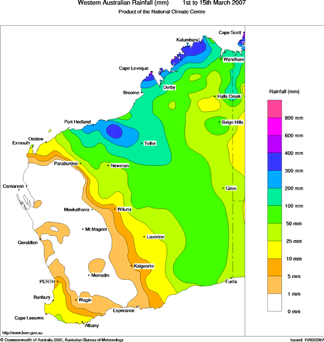
*Figure 2. Rainfall in WA during the first half of March.*

## 5. Forecast Performance Summary of Warnings The first mention of the discrete tropical low that was to become Tropical Cyclone George was made on the Northern Tropical Cyclone Outlook issued by the Northern Territory Regional Office on 25 February 2007. On 26 and 27 February the outlook was low/moderate potential for tropical cyclone development for the subsequent three days with the low expected to remain over the far northeast of the Top End. After following an erratic path for some days the system began to track westwards on 1 March.

On 2 March the Northern Tropical Cyclone Outlook indicated a high potential for development on 4 and 5 March. The first Tropical Cyclone Advice was issued at 4:30 pm (5:00 pm CST) Friday 2 March 2007. That Tropical Cyclone Advice placed the coastal and island communities between Daly River Mouth in the Northern Territory and Mitchell Plateau in Western Australia on Tropical Cyclone Watch.

The first Tropical Cyclone Warning was issued at 10:30 am (11:00 am CST) Saturday 3 March 2007 for coastal communities from Daly River Mouth in the Northern Territory to Kalumburu in Western Australia. A Tropical Cyclone Watch area extended west for coastal and island communities from Kalumburu to Kuri Bay.

---

The first mention of re-intensification for the transition from the Kimberley out into the Indian Ocean was made at 10:30 pm (11:00 pm CST) Sunday 4 March 2007.

After moving offshore on 5 March, Tropical Cyclone Warnings were cancelled for the Kimberley at 4 am Tuesday, 6 March 2007. The possibility that Tropical Cyclone George could recurve to the south was identified on 7 March and a Tropical Cyclone Watch was issued for coastal areas between Coral Bay and Roebourne at 12:55 pm 7 March 2007. The table below shows the Watch/Warning boundary changes indicated on advices issued for George.

The area of coast where George ultimately made landfall was first put under a Tropical Cyclone Warning at 10:05 pm 7 March, approximately 24 hours prior to landfall and around 22 hours prior to the onset of gales in Port Hedland. The Tropical Cyclone Warning area was extended inland to include the FMG RV1 site at 4:15 am 8 March.

The Tropical Cyclone Forecast Track Map is a graphical product that provides a track of the cyclone showing recent movement and forecast movement in the next 48 hours  - with track uncertainty indicated. The Forecast Track Map “likely range of movement of the cyclone” first impinges on the coast between Exmouth and Mardie with the map issued at 10 pm 7 March.
Table 3 below shows the coastal boundaries of the uncertainty area and the changes with time.

Throughout this period the forecasts consistently indicated that George was expected to impact the coast as a Severe Tropical Cyclone (Category 3, 4 or 5). Furthermore the forecasts clearly indicated that the system was expected to produce “very destructive winds” (i.e. to remain a Severe Tropical Cyclone) for more than 100 km inland.

### Track forecast performance Track forecast accuracy for George was significantly poorer than the five-year average over the 2001/2002 to 2005/2006 seasons as indicated in Figure 3. It can be seen that the

accuracy of the track forecasts deteriorated markedly with increasing lead-time. The 48-hour lead-time forecasts are the worst for any tropical cyclone in the Western Region in the last five years and are slightly worse than the average accuracy in the mid-eighties (477 km).

Figure 3. Track forecast accuracy 2006-2007 season

The Perth Tropical Cyclone Warning Centre (TCWC) did not forecast the abrupt southerly turn that occurred on 7 March and had a major impact on the overall track forecast performance. The TCWC constructs track forecasts based on a consensus approach, combining the available dynamical and statistical forecast aids in a way that has been shown to enhance forecast skill on seasonal time scales (Burton, 2006). Despite being the most skillful track forecasting methodology available – practised in all the major tropical cyclone warning centres around the world – it is still dependent on the skill of the component guidance (ibid.). The Perth TCWC has access to a wide range of dynamical and statistical guidance.
The forecasts issued on 6 March drew directly upon guidance from nine independent models.
Forecasters also informed their decision-making by assessing output from dynamical models run in ensemble mode (where the model is run many times under slightly varying conditions to generate a spread of likely outcomes). Remarkably, the available guidance had a “low spread” (meaning all the tracks were similar, there was very little variation in the direction or speed of the tracks – as illustrated in Figure 4) and none of the available guidance indicated the abrupt southerly shift in motion. The spread of possible outcomes depicted by the ensemble guidance failed to capture the motion that actually occurred. In the current state of tropical cyclone track forecasting this is a most remarkable outcome. While it is common for some of the available guidance to be relatively poor it is extremely rare for all the guidance to fail. The low spread in the guidance tracks would normally lend higher confidence to the track forecast. Hence this is the worst kind of situation a forecaster can face – high confidence, but ultimately low accuracy.

---

It is extremely difficult to diagnose why all the models failed to accurately forecast George’s track and it is likely that numerical modellers will use TC George as a test case for some years to come.  Possible factors of influence will be examined further in the full report.

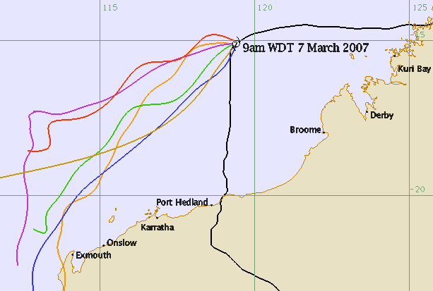
*Figure 4. Illustration of the 'low-spread' in guidance tracks.*

---

## 6. Acknowledgements

The Bureau of Meteorology gratefully acknowledges the assistance and cooperation of the following:
o Geoff Boughton and Debbie Falck of TimberED Services who produced the technical reports on behalf of the Cyclone Testing Station and travelled with the author to conduct the impact survey.
o The management and staff of Fortescue Metals Group for their cooperation in granting access to RV1, their willingness to assist in the post–impact investigations and their permission to reproduce photographs of the damage at this site.
o John Bettini and the staff of De Grey Pastoral Station for their hospitality for relating their accounts of the cyclone passage and for permission to publish the photographs.
o Colin and Betty Hanstrum-Brierly of Indee Pastoral Station for the information they provided and their permission to reproduce a photo.
o The staff and volunteers of the Fire and Emergency Services Authority (WA) with whom the Bureau of Meteorology shares a very valuable partnership.
o The United States National Office of Oceanic and Atmospheric Administration (NOAA), the Japanese Meteorological Agency (JMA) and the United States Naval Research Laboratory (NRL) for the provision of satellite imagery.

## 7. References

Brown, D.B., and J.L. Franklin, 2004: Dvorak TC wind speed biases determined from reconnaissance-based best track data (1997-2003). 26th Conf. Hurr. And Trop. Meteor., Miami, FL, Amer. Meteor. Soc., 86-87.

Burton, A., 2006: Sharing experiences in operational consensus forecasting. Topic 3a, Proceedings of the Sixth WMO International Workshop on Tropical Cyclones, San Jose, Costa Rica, 21-30 November 2006.

Cyclone Testing Station, 2007a: Technical Report No. 52 “Tropical Cyclone George: Damage to buildings in the Port Hedland area.” Authors: Boughton G., and Falck D.; Cyclone Testing Station, School of Engineering, James Cook University Queensland, 4811.

Cyclone Testing Station, 2007b: Technical Report No. 53 “Tropical Cyclone George: Wind penetration inland.” Authors: Boughton G., and Falck D.; Cyclone Testing Station, School of Engineering, James Cook University Queensland, 4811.

Dvorak, V.F., 1984: Tropical cyclone intensity analysis using satellite data. NOAA Technical Report NESDIS 11, NTIS, Springfield, VA 22161, 45pp.

Dvorak, V.F., 1995:  Tropical clouds and cloud systems observed in satellite imagery: Tropical cyclones. Workbook Vol. 2.  [Available from NOAA/NESDIS, 5200 Auth rd. Washington, DC, 20333]

Holliday, C.R., and A.H. Thompson, 1979: Climatological characteristics of rapidly intensifying typhoons. Mon. Wea.Rev., 107, 1022-1034.

Kaplan, J., and M. DeMaria, 1995: A Simple Empirical Model for Predicting the Decay of Tropical Cyclone Winds after Landfall. J. Appl. Meteor., 34, 2499–2512.

Kaplan, J., and M. DeMaria, 2003: Large-Scale Characteristics of Rapidly Intensifying Tropical Cyclones in the North Atlantic Basin. Weather and Forecasting: Vol. 18, No. 6, pp.
1093–1108

Lewis, B.M., and H.F. Hawkins, 1982; Polygonal eyewalls and rainbands in hurricanes. Bull.
Amer. Meteor. Soc., 63, 1294-1300.

---

## Appendix A. Best track summary for TC George, for the period 5 - 12 March 2007. 

---

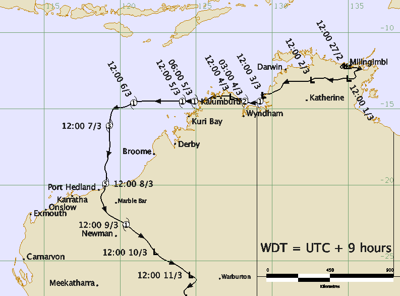
*Appendix B. Track of TC George, 27 February - 12 March 2007.*

## Appendix B. Track of TC George, 27 February -12 March 2007. Times shown in UTC 

## Appendix D. Selected satellite imagery of TC George 

*Figure D1. Satellite imagery of TC George at 9 pm WDT 8 March.*
(image courtesy of United States Naval Research Laboratory: http://www.nrlmry.navy.mil/)

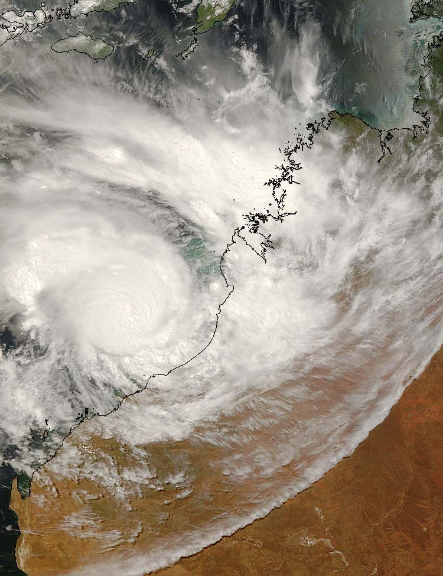
*Figure D2. Satellite image of TC George at 10:55 am WDT 8 March.*

---

## Appendix E. Damage photographs 

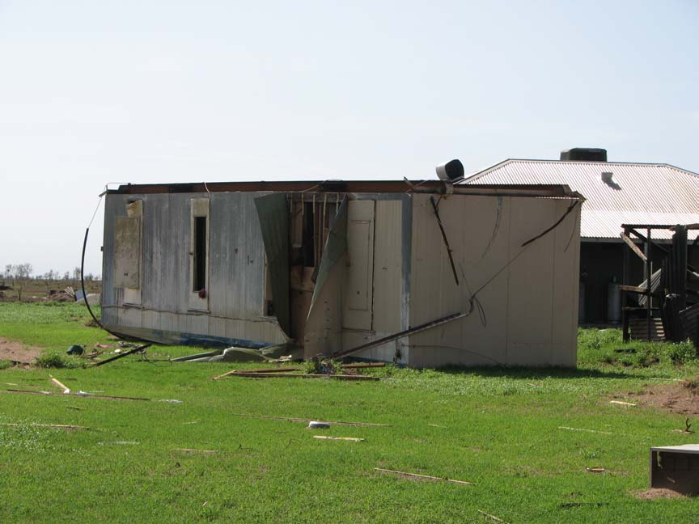
*Figure E1. Overturned transportable building at De Grey Pastoral Station.*

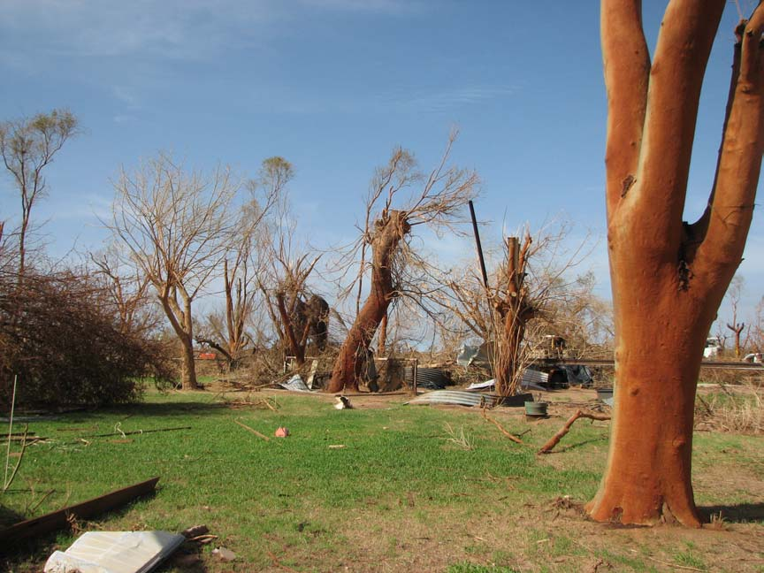
*Figure E2. Damage to trees at De Grey Pastoral Station.*

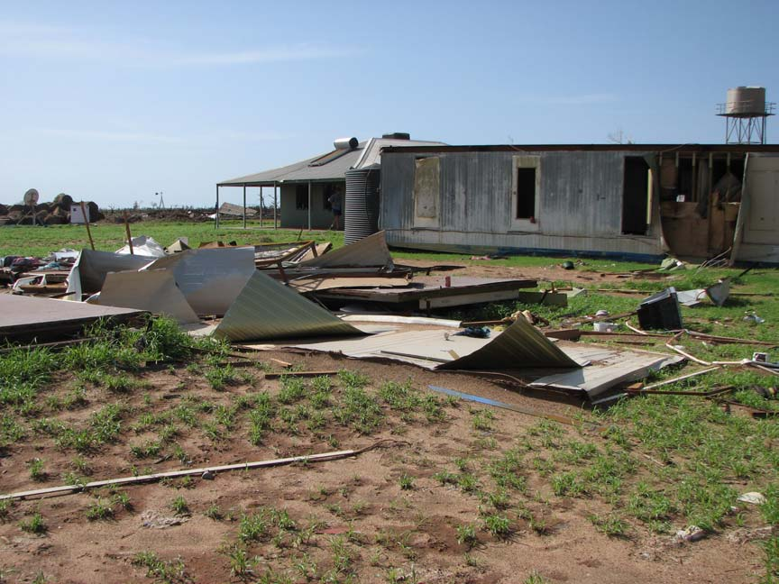
*Figure E3. Damage and debris at De Grey Pastoral Station.*

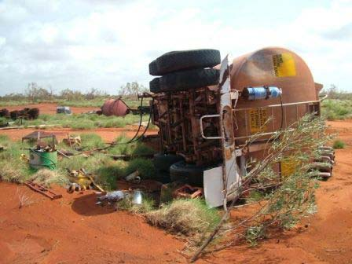
*Figure E4. Overturned tanker at Indee Pastoral Station.*

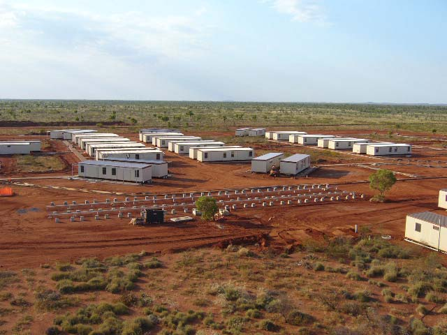
*Figure E5. Fortescue Metals Group Rail Village One (FMG RV1) prior to TC George.*

*Figure E5. Fortescue Metals Group Rail Village One (FMG RV1) prior to TC George.*

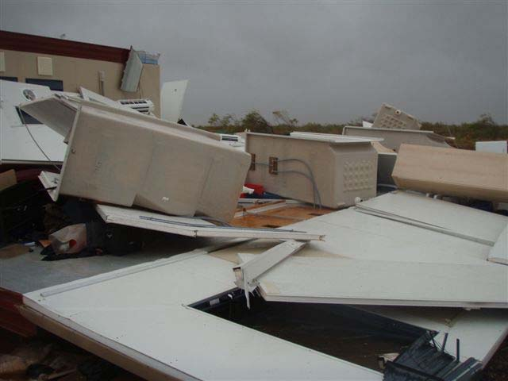
*Figure E6. Damage at FMG RV1 following TC George.*

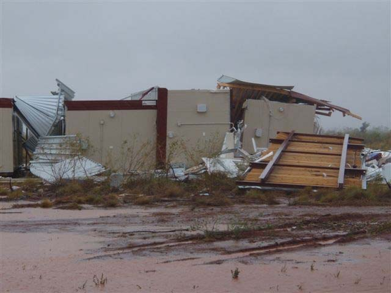
*Figure E7. Damage at FMG RV1 following TC George.*

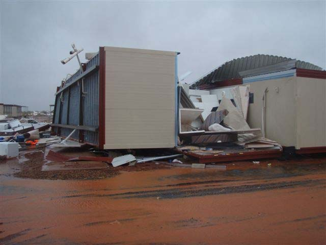
*Figure E8. Damage at FMG RV1 following TC George.*

---

## Appendix F. Definitions and acronyms 

Best Track A set of centre positions, maximum wind speed values and other data that represents the official estimate of the location and intensity of a tropical cyclone.
A best track is prepared for every tropical cyclone, after the fact, using all available data.

CST Central Standard Time (UTC + 9.5 hours)

Destructive winds:
### Wind gusts of between 125 and 165 km per hour typically associated with sustained (10-minute mean) wind speeds of storm force (48-63 knots or 89-118 km/h).

Eye:
The area of lowest pressure at the centre of a tropical cyclone, characterised by light winds and a minimum of cloud cover.

Eye wall:
The dense ring of cloud about 16km high immediately surrounding the eye that marks the belt of strongest winds and heaviest rainfall.

Gales:
Mean wind speeds of 34-47 knots or 63-89 km/h, typically associated with wind gusts of between 90 and 124 km/h.

Tropical Cyclone:
A low pressure system of synoptic scale developing over warm waters having organized convection, a well defined clockwise (in the Southern Hemisphere) wind circulation and a mean wind speed of 34 knots (63 km/h) or greater near the centre, extending more than half-way around the centre and persisting for 6 hours or more.

Tropical Cyclone Advice: Tropical Cyclone Advices are issued whenever a tropical cyclone is expected to cause winds in excess of 62km/h (gale force) over land. A tropical cyclone advice may be a watch and/or a warning, depending on when and where the gales are expected to develop.

Tropical Cyclone Warning: A tropical cyclone warning is issued for communities when the onset of gales is expected within 24 hours, or are already occurring.

Tropical Cyclone Watch:   A tropical cyclone watch is issued for communities when the onset of gales is expected within 48 hours, but not within 24 hours.

UTC:
Coordinated Universal Time

Very destructive winds:
### Wind gusts exceeding 165 km per hour typically associated with sustained (10- minute mean) wind speeds of hurricane force or greater (64 knots or 118 km/h).

WDT:
Western Daylight Savings Time (UTC + 9 hours)

