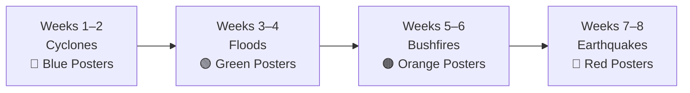

# Learning Wall Poster Analysis
## Year 5 English — Unit 2: Examining, Creating and Sharing Informative Texts

---

> [!NOTE]
> This analysis identifies **14 poster topics** across four categories, mapped to the 8-week teaching sequence. The posters are designed to be introduced progressively — each one going up on the wall as its topic is taught — so the wall grows alongside student understanding.

---

## How the Wall Works

Each category uses a consistent colour band so students can visually track which phase of the unit they are in:

| Colour | Category | Weeks Introduced |
|--------|----------|------------------|
| 🔵 Blue | Text Structure & Organisation | Weeks 1–2 |
| 🟢 Green | Language Features & Grammar | Weeks 3–4 |
| 🟠 Orange | Visual Literacy & Multimodal Features | Weeks 3–4 |
| 🔴 Red | Writing & Presentation Skills | Weeks 5–8 |

---

## Category 1: Text Structure & Organisation 🔵
*Introduced during Sequence 1 (Weeks 1–2) — Cyclone Archive*

---

### Poster 1 — Purpose & Audience of Informative Texts

**Core Content:**
- What is the **purpose** of an informative text? → To inform, explain, describe, report
- Who is the **audience**? → How do we identify who a text is written for?
- Three text types: **Imaginative** vs **Informative** vs **Persuasive** — how do we tell them apart?
- Key question: *"Who wrote this? Who is it for? What is its purpose?"*

**Suggested Visual Elements:**
- A three-column comparison chart (Imaginative / Informative / Persuasive) with key features listed
- Speech bubble with the think-aloud prompt: *"What makes this text 'informative' rather than 'imaginative' or 'persuasive'?"*

**Curriculum Link:** AC9E5LY03, AC9E5LA03

**When to Display:** Week 1, Lesson 1

---

### Poster 2 — Stages of an Information Report

**Core Content:**
- **Classification / General Statement** → Introduces the topic and scope
- **Description** → Provides factual details about the topic
- **Factual Elaboration** → Expands ideas with evidence and examples
- **Summary / Concluding Statement** → Wraps up the key points

**Suggested Visual Elements:**
- A vertical flow diagram showing the four stages as stacked blocks (like a building)
- An annotated excerpt from the Cyclone Archive hub page showing each stage labelled
- Colour-coded highlighting matching each stage

**Curriculum Link:** AC9E5LA03, AC9E5LY03

**When to Display:** Week 1, Lesson 2

---

### Poster 3 — Navigation Features of Informative Texts

**Core Content:**
- **Hub page** → The main entry point (like a table of contents)
- **Sub-pages** → Detailed information on specific subtopics
- **Headings & Subheadings** → Organise information into sections
- **Pull quotes** → Highlight key ideas
- **Internal links / Hyperlinks** → Connect related information
- **Index, Glossary, Table of Contents** → Help readers find specific information
- Key question: *"How do these features help the reader find and understand information?"*

**Suggested Visual Elements:**
- An annotated screenshot or diagram of a website/text showing labelled navigation features
- Arrows pointing to each feature with a one-line explanation of its purpose

**Curriculum Link:** AC9E5LA03

**When to Display:** Week 1, Lesson 3

---

### Poster 4 — Comparing Texts on the Same Topic

**Core Content:**
- The **same topic** can be presented in different text types (e.g., news article vs archive page vs blog post)
- Comparison criteria: purpose, audience, structure, layout, language choices, use of images
- **Formal vs Informal** register
- **Objective vs Subjective** language
- Key prompt: *"How has the language changed? Why?"*

**Suggested Visual Elements:**
- A side-by-side comparison table (e.g., "Archive Page" vs "News Article" vs "Blog Post")
- Examples of formal/objective phrases alongside informal/subjective phrases
- Sorting activity visual: two columns labelled "Formal / Objective" and "Informal / Subjective"

**Curriculum Link:** AC9E5LY01, AC9E5LY03, AC9E5LA01

**When to Display:** Week 2, Lesson 5

---

### Poster 5 — Reading Strategies: Skim, Scan, Confirm

**Core Content:**
- **Skimming** → Reading quickly to get the general idea (eyes move over headings, topic sentences, images)
- **Scanning** → Searching for specific information (keywords, numbers, names)
- **Confirming** → Re-reading carefully to check understanding and accuracy
- When to use each strategy and why

**Suggested Visual Elements:**
- Three icons/symbols representing each strategy (e.g., eye for skim, magnifying glass for scan, tick for confirm)
- Step-by-step "How To" for each strategy
- Example prompts: *"Find three facts about the impacts of Australian cyclones"*

**Curriculum Link:** AC9E5LY04, AC9E5LY05

**When to Display:** Week 2, Lesson 7

---

## Category 2: Language Features & Grammar 🟢
*Introduced during Sequence 2 (Weeks 3–4) — Floods Archive*

---

### Poster 6 — Complex Sentences: Main Clause + Dependent Clause

**Core Content:**
- A **simple sentence** has one clause: *"Floodwaters rose quickly."*
- A **compound sentence** joins two clauses with a coordinating conjunction (and, but, so, or)
- A **complex sentence** has a **main (independent) clause** + one or more **dependent clauses**
- Example: *"Although heavy rainfall had been forecast for days, the floodwaters rose with a speed that caught residents entirely off guard."*
- Dependent clauses show: **reason, time, condition, concession**
- Subordinating conjunctions: although, because, when, if, while, unless, after, before

**Suggested Visual Elements:**
- Sentence anatomy diagram: main clause (one colour) + dependent clause (another colour)
- A "build-a-sentence" scaffold showing how to construct a complex sentence step by step
- Before/after examples from simple → complex

**Curriculum Link:** AC9E5LA05

**When to Display:** Week 3, Lesson 9

---

### Poster 7 — Expanded Noun Groups

**Core Content:**
- A bare noun: *"water"*
- Adding an article: *"the water"*
- Adding a pre-modifier (adjective): *"the murky water"*
- Adding a post-modifier (prepositional phrase): *"the murky water from the river"*
- Full expansion: *"the rapidly rising, sediment-laden floodwaters of the Bremer River"*
- Structure: **Article + Pre-modifier(s) + Noun + Post-modifier(s)**

**Suggested Visual Elements:**
- A "noun group telescope" or expanding accordion diagram showing each layer of expansion
- Colour-coded parts: article (yellow), pre-modifier (blue), noun (red), post-modifier (green)
- Real examples from the Floods Archive

**Curriculum Link:** AC9E5LA06

**When to Display:** Week 3, Lesson 10

---

### Poster 8 — Specialist & Technical Vocabulary

**Core Content:**
- Why do authors choose **precise, specialist words** instead of everyday words?
- Everyday → Specialist examples:
  - "flooding" → **inundation**
  - "riverbanks" → **riparian zone**
  - "shaking" → **seismic activity**
  - "fire" → **combustion**
- Greater precision of meaning — specialist vocabulary removes ambiguity
- Word origins and etymology add depth

**Suggested Visual Elements:**
- A two-column "upgrade your vocabulary" chart: Everyday Word → Specialist/Technical Term
- A "vocabulary notebook" template showing: Word | Definition | Example Sentence | Simpler Synonym
- Topic-specific word walls for each archive (Cyclones, Floods, Bushfires, Earthquakes)

**Curriculum Link:** AC9E5LA08

**When to Display:** Week 3, Lesson 11

---

### Poster 9 — Cohesion: Sentence Starting Points & Text Connectives

**Core Content:**
- The **starting point (theme)** of a sentence controls what is emphasised
- Varying sentence starting points keeps writing cohesive and engaging
- Avoid: *"The bushfire... The bushfire... The bushfire..."*
- Instead, start with:
  - **Circumstantial information:** *"In 1974, the Brisbane River..."*
  - **A text connective:** *"As a result...", "In contrast...", "Despite..."*
  - **A dependent clause:** *"Although the water was rising..."*
- **Text connectives** link ideas across paragraphs: *As a result, In contrast, According to, Despite, Furthermore, However*

**Curriculum Link:** AC9E5LA04

**Suggested Visual Elements:**
- A "sentence starters" wheel or word wall
- Before/after paragraph comparison: monotonous vs varied starting points
- Text connective cards grouped by function (adding, contrasting, cause/effect, sequencing)

**When to Display:** Week 3, Lesson 12

---

## Category 3: Visual Literacy & Multimodal Features 🟠
*Introduced during Sequence 2 (Weeks 3–4) — Floods Archive*

---

### Poster 10 — Image Sequencing & Visual Features

**Core Content:**
- **Image sequencing:** Sequential images show cause/effect, before/after, timelines, procedures, life cycles
- **Visual features in informative texts:**
  - **Framing** → Close-up vs wide shot
  - **Placement** → Left/right, top/bottom positioning
  - **Salience** → What draws the eye first?
  - **Layout & Design** → How text and images work together
- **Captions** → Explain what an image shows and why it was chosen
- Key question: *"The author chose this image because..."*

**Suggested Visual Elements:**
- A labelled example image with arrows pointing to framing, salience, and placement
- A before/after image pair with analysis prompts
- Caption-writing scaffold: *"This image shows... The visual feature of... creates an effect of..."*

**Curriculum Link:** AC9E5LA07

**When to Display:** Week 4, Lesson 13

---

### Poster 11 — Point of View & Authoritative Sources

**Core Content:**
- **Point of view** in informative texts → Authors make choices about what to include, what images to use, and what vocabulary to select — these all reflect a perspective
- **Bare assertion** vs **Supported claim:**
  - ❌ *"Floods are dangerous."*
  - ✅ *"Floods claimed 35 lives in Queensland in 2011, according to the Queensland Government Flood Commission."*
- **What makes a source authoritative?** → Experience, qualifications, publication status
- **Differing perspectives** → Acknowledging that not all sources agree

**Suggested Visual Elements:**
- Side-by-side comparison: "Assertion" column vs "Supported Claim" column
- A checklist: "Is this source authoritative?" (Author credentials? Published by whom? Evidence-based?)
- Sentence frame: *"According to [source], ... However, [alternative perspective] suggests..."*

**Curriculum Link:** AC9E5LA02, AC9E5LE03

**When to Display:** Week 4, Lessons 15–16

---

## Category 4: Writing & Presentation Skills 🔴
*Introduced during Sequences 3–4 (Weeks 5–8) — Bushfires & Earthquakes Archives*

---

### Poster 12 — Planning & Writing an Information Report (TEEL)

**Core Content:**
- **Planning scaffold:** General Statement → Physical Description/Science → Historical Events → Human Impact → Future/Response
- **TEEL paragraph structure:**
  - **T** — Topic Sentence (introduces the paragraph's main idea)
  - **E** — Evidence (facts, data, examples from research)
  - **E** — Explanation (explains why the evidence matters)
  - **L** — Link (connects back to the topic or leads to the next paragraph)
- **Opening paragraph requirements:** classification statement, key vocabulary, complex sentence, expanded noun group
- **Editing checklist prompts:** sentence structure, vocabulary precision, paragraph connectives

**Suggested Visual Elements:**
- A large TEEL scaffold with colour-coded sections and example sentences
- A "Report Structure" flow diagram: Opening → Body Paragraphs (×3) → Conclusion
- An editing checklist with tick boxes

**Curriculum Link:** AC9E5LY06, AC9E5LA05, AC9E5LA06, AC9E5LA08

**When to Display:** Week 5, Lessons 17–19

---

### Poster 13 — Editing & Improving Your Writing

**Core Content:**
- *"Writing is rewriting."*
- **Editing focus areas:**
  1. Replace a **simple noun** with an **expanded noun group**
  2. Vary **sentence starting points** — avoid repetitive openings
  3. Replace a **general word** with a **specialist/technical term**
  4. Add a **text connective** between paragraphs
  5. Check for a **complex sentence** in each paragraph
  6. Ensure **objective language** throughout
- **Peer feedback protocol:** Specific, Kind, Helpful
- **Self-assessment** against marking guide (A / B / C level descriptors)

**Suggested Visual Elements:**
- A "before and after" annotated paragraph showing specific edits
- An editing checklist with clear, student-friendly tick boxes
- Traffic light self-assessment: Red (not yet) → Amber (getting there) → Green (confident)

**Curriculum Link:** AC9E5LY06

**When to Display:** Week 6, Lesson 24

---

### Poster 14 — Presenting a Multimodal Information Report

**Core Content:**
- **Presentation is NOT just reading your written text** — it must be adapted for a spoken audience
- **Features of voice:**
  - **Tone** → Formal, conversational, authoritative
  - **Volume** → Loud enough to be heard, varied for emphasis
  - **Pitch** → High/low to maintain interest
  - **Pace** → Slow for key points, faster for transitions
  - **Pause** → For emphasis and audience processing
- **Adapting written text to spoken text:**
  - Shorter sentences
  - Signposting: *"In today's presentation I will..."*
  - Rhetorical questions: *"But what causes a cyclone to form?"*
  - Pausing for effect
- **Multimodal elements:** Slides, posters, props, video, digital features
- **Presentation formats:** Slideshow, poster + speech, video, roving reporter

**Suggested Visual Elements:**
- A "Features of Voice" dial/meter showing tone, volume, pitch, pace
- A planning template showing: Introduction → 3 Key Ideas → Conclusion → Multimodal Element
- A peer observation checklist for rehearsal feedback

**Curriculum Link:** AC9E5LY07, AC9E5LA01

**When to Display:** Week 8, Lesson 29

---

## Summary: All 14 Posters at a Glance

| # | Poster Title | Category | Week | Key Curriculum Codes |
|---|---|---|---|---|
| 1 | Purpose & Audience of Informative Texts | 🔵 Structure | Wk 1 | AC9E5LY03, AC9E5LA03 |
| 2 | Stages of an Information Report | 🔵 Structure | Wk 1 | AC9E5LA03 |
| 3 | Navigation Features of Informative Texts | 🔵 Structure | Wk 1 | AC9E5LA03 |
| 4 | Comparing Texts on the Same Topic | 🔵 Structure | Wk 2 | AC9E5LY01, AC9E5LA01 |
| 5 | Reading Strategies: Skim, Scan, Confirm | 🔵 Structure | Wk 2 | AC9E5LY04, AC9E5LY05 |
| 6 | Complex Sentences: Main + Dependent Clause | 🟢 Language | Wk 3 | AC9E5LA05 |
| 7 | Expanded Noun Groups | 🟢 Language | Wk 3 | AC9E5LA06 |
| 8 | Specialist & Technical Vocabulary | 🟢 Language | Wk 3 | AC9E5LA08 |
| 9 | Cohesion: Starting Points & Text Connectives | 🟢 Language | Wk 3 | AC9E5LA04 |
| 10 | Image Sequencing & Visual Features | 🟠 Visual | Wk 4 | AC9E5LA07 |
| 11 | Point of View & Authoritative Sources | 🟠 Visual | Wk 4 | AC9E5LA02, AC9E5LE03 |
| 12 | Planning & Writing: TEEL Paragraphs | 🔴 Writing | Wk 5 | AC9E5LY06 |
| 13 | Editing & Improving Your Writing | 🔴 Writing | Wk 6 | AC9E5LY06 |
| 14 | Presenting a Multimodal Information Report | 🔴 Writing | Wk 8 | AC9E5LY07, AC9E5LA01 |

---

## Open Questions for Your Review

> [!IMPORTANT]
> **Poster Format & Size** — Are you thinking A3 printed posters, or larger A2/A1 display boards? This affects how much content each poster can carry.

> [!IMPORTANT]
> **Production Method** — Would you like me to design and generate these posters as printable documents (e.g., using the `canvas-design` or `docx` skill), or is this analysis sufficient for you to create them manually?

> [!IMPORTANT]
> **Anchor Charts vs Reference Posters** — Some of these (e.g., Poster 2: Stages, Poster 7: Expanded Noun Groups) are already referenced in the lesson plans as "anchor charts" to be co-constructed with students. Would you prefer the learning wall posters to be **pre-made reference posters** (teacher-designed, polished), or **templates** that you fill in collaboratively with students during lessons?

> [!TIP]
> **Word Wall Integration** — Poster 8 (Specialist Vocabulary) and Poster 9 (Text Connectives) could double as interactive word walls where new terms are added each week rather than static posters.
