# Lesson Plan: Converting Capacity Measurements

**Year Level:** Year 5  
**Subject:** Mathematics  
**Strand:** Measurement  
**Curriculum Alignment (AC v9):** **AC9M5M01** — Choose appropriate units of measurement for length, area, volume, capacity and mass; calculate conversions between units of length, mass and capacity, using decimals where appropriate.  
**Duration:** 60 Minutes  

---

## 🧠 Pedagogical Contemplation

### 1. Cognitive Goal
Students are learning to perform conversions between metric units of capacity (mL and L) and connect these directly to units of volume (cubic centimetres). This requires understanding the multiplicative relationships (powers of 1000) between L and mL, and the 1-to-1 equivalence between mL and cubic centimetres ($\text{cm}^3$) through fluid displacement. The cognitive demand ranges from recall (appropriate units) to procedural fluency (multiplication/division calculations) and conceptual translation (block models to displacement).

### 2. Interactive Alignment
We align cognitive tasks with interactive digital elements in the slideshow:
- **Ordering Units:** Students sequence units from smallest to largest to reinforce capacity scales.
- **Reading Calibrated Containers:** Students read fluid levels on containers filled by sauce, soft drink, and eucalyptus oil bottles. This makes standard graduations (125 mL, 250 mL, 375 mL, 500 mL) concrete.
- **Interactive Matching & Sorting:** Grouping real-world items (e.g., bath, cup, sink, drink bottle) under mL or L tests their conceptual understanding of capacity scale.
- **Displacement Simulation:** Immersing a 3D block model of ones blocks into a container displays a rising water level, illustrating the physical volume displacement rule ($1\text{ cm}^3 = 1\text{ mL}$).

### 3. Surfacing Student Thinking
- **CFU Whiteboard Option:** Before clicking "Show Answer" on conversions and block models, teachers will ask students to write answers on mini-whiteboards and hold them up. This provides immediate formative assessment data.
- **Error Shake Feedback:** Digital slide interactions use a two-tier feedback model. The first incorrect answer shakes the card to encourage self-correction. The second incorrect attempt displays a targeted hint (e.g., reminding students of the division/multiplication rule by 1000, or the 1-to-1 equivalence rule) to scaffold their thinking.

### 4. Pedagogical vs. Engagement Goal
The engagement goal is to drag colourful cards or tap interactive buttons. The pedagogical goal is to reinforce place value shift (multiplying/dividing by 1000) and establish the physical equivalence of volume and capacity (how space occupied by matter translates to fluid volume).

---

## 🎯 Learning Intention & Success Criteria

### Learning Intention
We are learning to convert between millilitres ($\text{mL}$), litres ($\text{L}$), and cubic centimetres ($\text{cm}^3$) using multiplication, division, and physical displacement models.

### Success Criteria
- **SC1:** I can order metric units of capacity from smallest to largest.
- **SC2:** I can choose the most appropriate unit ($\text{mL}$ or $\text{L}$) to measure the capacity of real-world objects.
- **SC3:** I can convert millilitres to litres by dividing by 1000 (using decimals).
- **SC4:** I can convert litres to millilitres by multiplying by 1000.
- **SC5:** I can convert capacity values written in mixed units (e.g., $1\text{ L } 600\text{ mL}$) into millilitres and vice versa.
- **SC6:** I can convert capacity ($\text{mL}$) into volume (cubic centimetres) using the $1\text{ mL} = 1\text{ cm}^3$ equivalence.
- **SC7:** I can find the volume of a 3D block model and calculate the volume of fluid it displaces.

---

## 🕒 Lesson Sequence

```mermaid
gantt
    title Lesson Timeline (60 Minutes)
    dateFormat  X
    axisFormat %H:%M
    section Warm-up
    Recall & Ordering (SC1)      :active, 0, 10
    section Explicit Instruction
    mL <-> L Conversions (SC2/3/4) : 10, 25
    Mixed L & mL Units (SC5)      : 25, 35
    Displacement & cm³ (SC6/7)    : 35, 45
    section Guided Practice
    Interactive Practice & CFU   : 45, 50
    section Independent Practice
    Handout Worksheet (SC1-SC7)  : 50, 55
    section Consolidation
    Exit Ticket & Reflection     : 55, 60
```

### 1. Introduction / Warm-up (10 Minutes)
- **Activity:** The teacher projects Slides 2, 3, and 4 (Ordering Units for Capacity, Length, and Mass). Students look at the units on each slide and write them in order from smallest to largest on their mini-whiteboards.
  - Slide 2: Capacity ($\text{mL}$, $\text{L}$, $\text{kL}$)
  - Slide 3: Length ($\text{mm}$, $\text{cm}$, $\text{m}$, $\text{km}$)
  - Slide 4: Mass ($\text{mg}$, $\text{g}$, $\text{kg}$)
- **Whole-Class Check:** Students show whiteboards for each check.
- **Digital Interaction:** Teacher calls students to the smartboard to order the digital cards for each slide.
- **Discussion:** Why do we have different units for different dimensions? What would happen if we measured the capacity of a swimming pool in millilitres?

### 2. Explicit Instruction (35 Minutes)
- **Concept 1: Reading Beakers (Slide 5)**
  - Use the custom beakers graphic (Beaker A, B, and C) to show how to read scales with graduations of $125\text{ mL}$ (four equal parts of $500\text{ mL}$).
  - Read: Beaker A = $250\text{ mL}$, Beaker B = $375\text{ mL}$, Beaker C = $125\text{ mL}$. Order from smallest to largest: C $\rightarrow$ A $\rightarrow$ B.
- **Concept 2: Litres to Millilitres (Slide 6)**
  - Explain $1\text{ L} = 1000\text{ mL}$. To convert L to mL, multiply by 1000.
  - Model multiplying by 1000 using place value shifts (moving the decimal point three places to the right).
    - Example: $4\text{ L} \times 1000 = 4000\text{ mL}$.
    - Example: $5.3\text{ L} \times 1000 = 5300\text{ mL}$.
- **Concept 3: Millilitres to Litres (Slide 7)**
  - Explain that to convert mL to L, divide by 1000.
  - Model dividing by 1000 using place value shifts (moving the decimal point three places to the left).
    - Example: $9000\text{ mL} \div 1000 = 9\text{ L}$.
    - Example: $1500\text{ mL} \div 1000 = 1.5\text{ L}$.
- **Concept 4: Mixed Units (Slide 9)**
  - Model converting mixed units (e.g. $1\text{ L } 600\text{ mL}$) into pure millilitres ($1000\text{ mL} + 600\text{ mL} = 1600\text{ mL}$).
  - Model converting millilitres back into litres and millilitres (e.g. $7530\text{ mL} = 7\text{ L } 530\text{ mL}$).
- **Concept 5: Volume, Displacement and Cubic Centimetres (Slide 11)**
  - Introduce the core physical rule: $1\text{ cm}^3 = 1\text{ mL}$.
  - Show the displacement model: when an object is immersed, the amount of water it pushes up equals its volume.
  - Example: A block model with 2 layers of 6 blocks = 12 ones blocks (volume = $12\text{ cm}^3$). When immersed in water, it raises the water level by $12\text{ mL}$ (from $10\text{ mL}$ to $22\text{ mL}$).

### 3. Guided Practice & CFU (5 Minutes)
- **Check for Understanding 1 (Slide 8):** Mixed mL $\leftrightarrow$ L conversions.
- **Check for Understanding 2 (Slide 10):** Mixed unit conversions (1 L 950 mL $\rightarrow$ 1950 mL).
- **Check for Understanding 3 (Slide 12):** Cubic centimetre and millilitre conversions ($42\text{ mL} = 42\text{ cm}^3$).

### 4. Independent Practice (5 Minutes)
- Students complete the **Converting Capacity Measurements Handout**.
  - **Part 1:** Read calibrated beakers A, B, C and order them.
  - **Part 2:** Choose appropriate units ($\text{mL}$ or $\text{L}$) for household items.
  - **Part 3:** Convert litres to millilitres.
  - **Part 4:** Convert millilitres to litres.
  - **Part 5:** Write in millilitres (mixed units).
  - **Part 6:** Write as litres and millilitres.
  - **Part 7:** Volume block displacement calculations.
  - **Part 8:** Convert mL to $\text{cm}^3$ and vice versa.

### 5. Conclusion & Consolidation (5 Minutes)
- **Exit Ticket (Slide 13):** Solve 3 conversion problems:
  - "Convert $5.4\text{ L}$ to millilitres."
  - "Convert $7530\text{ mL}$ to Litres and millilitres."
  - "Convert $138\text{ cm}^3$ to millilitres."

---

## 🗺️ Interactive Design Thinking Matrix

| Core Concept / Learning Moment | Cognitive Demand | Best Interactive Mode | Pedagogical Rationale (Why & How it surfaces thinking) | Scaffolding Hint (Tier 2) | Placement in Lesson |
| :--- | :--- | :--- | :--- | :--- | :--- |
| **Ordering Units** | Recall & sequence | Sequencing (Reorder List) | Exposes students' understanding of relative metric capacity scales. | *"Hint: Think about which unit holds less: a tiny teardrop or a milk carton."* | Warm-up / Review |
| **Beaker scale reading** | Visual scale parsing | Interactive Click/Reveal | Connects visual beaker levels directly to equivalent decimal and millilitre notations. | *"Hint: Look at the tick mark. It divides the 500 mL into four parts of 125 mL."* | Explicit Instruction |
| **Appropriate Units** | Concept application | Categorisation Sort | Verifies that students understand the magnitude of units in real-world contexts. | *"Hint: Litres are used for large volumes (baths), millilitres for small (cups)."* | Guided Practice / CFU |
| **L to mL Conversions** | Fluency calculation | Tap-to-Select Cards | Assesses if students apply the $\times 1000$ shift correctly without arithmetic errors. | *"Hint: Multiplying by 1000 moves the decimal point three places to the right."* | Guided Practice / CFU |
| **Mixed Unit Conversions** | Compound translation | Match Pairs | Assesses if students can decompose and recompose compound units. | *"Hint: 1 L is 1000 mL. Add this to the remaining millilitres."* | Guided Practice / CFU |
| **Displacement & cm³** | Volume-capacity translation | Interactive Model | Illustrates how physical block volume corresponds directly to water displacement. | *"Hint: 1 block = 1 cubic centimetre = 1 mL displacement."* | Guided Practice / CFU |

---

## 🪜 Differentiation

### Support Strategies (Tier 2)
- **Visual Conversion Path:**
  $$\text{L} \xrightarrow{\times 1000} \text{mL} \xrightarrow{\text{1:1}} \text{cm}^3$$
  $$\text{cm}^3 \xrightarrow{\text{1:1}} \text{mL} \xrightarrow{\div 1000} \text{L}$$
- **Graduated Cylinders:** Provide students with tactile centicubes and a plastic measuring cylinder to measure displacement of 10 cubes.

### Extension Strategies (Tier 3)
- **Container Design Challenge:** Challenge students: "If a rectangular juice box is $10\text{ cm} \times 5\text{ cm} \times 20\text{ cm}$, what is its volume in cubic centimetres? What is its capacity in millilitres and litres?"
