# Lesson Plan: Converting Length Measurements

**Year Level:** Year 5  
**Subject:** Mathematics  
**Strand:** Measurement  
**Curriculum Alignment (AC v9):** **AC9M5M01** — Choose appropriate units of measurement for length, area, volume, capacity and mass; calculate conversions between units of length, mass and capacity, using decimals where appropriate.  
**Duration:** 60 Minutes  

---

## 🧠 Pedagogical Contemplation

### 1. Cognitive Goal
Students are learning to perform conversions between metric units of length (mm, cm, m, and km). This requires understanding the multiplicative relationships (powers of 10) between units and applying multiplication or division. The cognitive demand ranges from recall (identifying units) to procedural fluency (applying calculations) and conceptual application (choosing appropriate units and conducting measurements).

### 2. Interactive Alignment
We align cognitive tasks with interactive digital elements in the slideshow:
- **Ordering Units:** Students sequence the units from smallest to largest. This reinforces the relative scale of the metric system.
- **Ruler Simulation:** Clicking on marked letters (A–E) on a digital ruler displays the corresponding millimetre and centimetre values. This helps students visualize that $1\text{ cm} = 10\text{ mm}$ and makes decimal notation meaningful (e.g., $2.6\text{ cm}$ is 2 whole centimetres and 6 tenths).
- **Interactive Matching & Sorting:** Grouping real-world items (e.g., plane, road, river) under their most appropriate unit (mm, cm, m, km) tests their conceptual understanding of scale.

### 3. Surfacing Student Thinking
- **CFU Whiteboard Option:** Before clicking "Show Answer" on quiz or conversion slides, teachers will ask students to write their answers on mini-whiteboards and hold them up. This ensures $100\%$ class participation and gives the teacher immediate formative data on who is confusing multiplication and division.
- **Error Shake Feedback:** The digital slide interactions use a two-tier feedback model. The first incorrect answer shakes the card to encourage self-correction. The second incorrect attempt displays a targeted hint (e.g., reminding students of the division/multiplication rule) to scaffold their thinking without giving away the answer.

### 4. Pedagogical vs. Engagement Goal
The engagement goal is to drag colourful cards or tap interactive buttons. The pedagogical goal is to reinforce place value shift (multiplying/dividing by 10 and 100) and consolidate the physical meaning of length measurements (e.g., why a road is measured in metres, whereas a river is in kilometres).

---

## 🎯 Learning Intention & Success Criteria

### Learning Intention
We are learning to convert between different units of length (millimetres, centimetres, metres, and kilometres) using multiplication and division by powers of 10.

### Success Criteria
- **SC1:** I can order metric units of length from smallest to largest ($\text{mm}$, $\text{cm}$, $\text{m}$, $\text{km}$).
- **SC2:** I can convert millimetres to centimetres by dividing by 10 (using decimals).
- **SC3:** I can convert centimetres to metres by dividing by 100 (using decimals).
- **SC4:** I can convert metres to centimetres by multiplying by 100.
- **SC5:** I can choose the most appropriate unit to measure real-world objects.
- **SC6:** I can measure real-world objects and record their lengths in both millimetres and centimetres.

---

## 🕒 Lesson Sequence

```mermaid
gantt
    title Lesson Timeline (60 Minutes)
    dateFormat  X
    axisFormat %H:%M
    section Warm-up
    Recall & Ordering (SC1)      :active, 0, 10
    section Explicit Instruction
    mm <-> cm Conversions (SC2)   : 10, 20
    cm <-> m Conversions (SC3/4)  : 20, 30
    section Guided Practice
    Interactive Practice & CFU   : 30, 40
    section Independent Practice
    Handout Worksheet (SC1-SC6)  : 40, 55
    section Consolidation
    Exit Ticket & Reflection     : 55, 60
```

### 1. Introduction / Warm-up (10 Minutes)
- **Activity:** The teacher projects Slide 2 (Ordering Units). Students look at the units: $\text{mm}$, $\text{m}$, $\text{km}$, $\text{cm}$ and write them in order from smallest to largest on their mini-whiteboards.
- **Whole-Class Check:** Students show whiteboards. Teacher checks for general understanding.
- **Digital Interaction:** Teacher calls a student to the smartboard to order the digital cards: $\text{mm} \rightarrow \text{cm} \rightarrow \text{m} \rightarrow \text{km}$.
- **Discussion:** Why do we have different units? What would happen if we measured a classroom in millimetres? What if we measured a ladybird in kilometres?

### 2. Explicit Instruction (20 Minutes)
- **Concept 1: Millimetres to Centimetres (Slide 4 & 5)**
  - Explain that $10\text{ mm} = 1\text{ cm}$. Therefore, to convert millimetres to centimetres, we divide by 10.
  - Model dividing by 10 using place value shifts (moving the decimal point one place to the left).
    - Example: $34\text{ mm} \rightarrow 34 \div 10 = 3.4\text{ cm}$.
    - Example: $26\text{ mm} \rightarrow 26 \div 10 = 2.6\text{ cm}$.
  - Use Slide 5 (Ruler Reading) to show letters A, B, C, D, E on a ruler. Focus on how the tick marks correspond to decimals (e.g., point A is at $26\text{ mm}$, which is $2.6\text{ cm}$).
- **Concept 2: Centimetres to Metres (Slide 7)**
  - Explain that $100\text{ cm} = 1\text{ m}$. To convert centimetres to metres, we divide by 100.
  - Model dividing by 100 using place value shifts (moving the decimal point two places to the left).
    - Example: $251\text{ cm} \rightarrow 251 \div 100 = 2.51\text{ m}$.
    - Example: $1165\text{ cm} \rightarrow 1165 \div 100 = 11.65\text{ m}$.
- **Concept 3: Metres to Centimetres (Slide 8)**
  - Explain that to convert metres back to centimetres, we do the inverse operation: multiply by 100.
  - Model multiplying by 100 (moving the decimal point two places to the right).
    - Example: $3.16\text{ m} \rightarrow 3.16 \times 100 = 316\text{ cm}$.
    - Example: $10.75\text{ m} \rightarrow 10.75 \times 100 = 1075\text{ cm}$.

### 3. Guided Practice & CFU (10 Minutes)
- **Check for Understanding 1 (Slide 6):** Project a series of millimetre values (e.g., $49\text{ mm}$, $108\text{ mm}$). Students solve on whiteboards and reveal. Digital slide answers are tapped to confirm.
- **Check for Understanding 2 (Slide 9):** Match mixed conversions (e.g., $3.75\text{ m}$ to $375\text{ cm}$, $829\text{ cm}$ to $8.29\text{ m}$).
- **Check for Understanding 3 (Slide 10):** Sorting real-world objects under their most suitable units. Students defend why "width of a road" is in metres while "length of a river" is in kilometres.

### 4. Independent Practice (15 Minutes)
- Students complete the **Converting Length Measurements Handout**.
- The handout mirrors the structure of the worksheet:
  - **Part 1:** Record ruler lengths (A–E) in both millimetres and centimetres.
  - **Part 2:** Convert millimetres to centimetres (decimal form).
  - **Part 3:** Convert centimetres to metres (decimal form).
  - **Part 4:** Convert metres to centimetres.
  - **Part 5:** Choose the most suitable unit ($\text{mm}$, $\text{cm}$, $\text{m}$, $\text{km}$).
  - **Part 6:** Order units of length.
  - **Part 7 (Hands-on):** Measure classroom objects less than $1\text{ m}$ and record in both $\text{mm}$ and $\text{cm}$.
- Teacher circulates, using the differentiated support prompts below for struggling students.

### 5. Conclusion & Consolidation (5 Minutes)
- **Reflective Exit Ticket:** On a slip of paper or their whiteboards, students answer:
  - "Convert $7.25\text{ m}$ to centimetres."
  - "Convert $82\text{ mm}$ to centimetres."
  - "Why is division used when going from millimetres to centimetres, but multiplication is used when going from metres to centimetres?"
- Review the learning intention and success criteria.

---

## 🗺️ Interactive Design Thinking Matrix

| Core Concept / Learning Moment | Cognitive Demand | Best Interactive Mode | Pedagogical Rationale (Why & How it surfaces thinking) | Scaffolding Hint (Tier 2) | Placement in Lesson |
| :--- | :--- | :--- | :--- | :--- | :--- |
| **Ordering Units** | Recall & sequence | Sequencing (Reorder List) | Exposes students' understanding of the relative scale of metric units. | *"Hint: Think about which unit is used for tiny insects vs. long road trips."* | Warm-up / Review |
| **Ruler Reading & Decimal Values** | Visual mapping & translation | Interactive Click/Reveal | Connects visual ruler measurements directly to equivalent decimal notations. | *"Hint: Count the tiny ticks (millimetres) after the whole centimetre number."* | Explicit Instruction |
| **Conversions: mm to cm** | Fluency calculation | Tap-to-Select Cards | Evaluates if students apply the $\div 10$ place value shift correctly without calculation errors. | *"Hint: Dividing by 10 moves the decimal point one place to the left."* | Guided Practice / CFU |
| **Conversions: Mixed m & cm** | Fluency calculation | Match Pairs | Assesses if students can toggle between $\div 100$ and $\times 100$ conversions. | *"Hint: Check if you are going from small-to-large (divide) or large-to-small (multiply)."* | Guided Practice / CFU |
| **Unit Suitability** | Concept application | Categorisation Sort | Verifies that students understand the magnitude of units in real-world contexts. | *"Hint: A plane fits inside a hangar (metres), but a river flows across a state (kilometres)."* | Guided Practice / CFU |

---

## 🪜 Differentiation

### Support Strategies (Tier 2)
- **Visual Grid Scaffolding:** Provide a place value grid showing units:
  $$\text{km} \xrightarrow{\times 1000} \text{m} \xrightarrow{\times 100} \text{cm} \xrightarrow{\times 10} \text{mm}$$
  $$\text{mm} \xrightarrow{\div 10} \text{cm} \xrightarrow{\div 100} \text{m} \xrightarrow{\div 1000} \text{km}$$
- **Physical Rulers:** Allow students to touch and count ticks on a physical plastic ruler to verify that $10\text{ mm} = 1\text{ cm}$.
- **Differentiated Handout Section:** Provide a visual example next to the first question in each section.

### Extension Strategies (Tier 3)
- **Double Conversion Challenge:** Challenge students to convert millimetres directly to metres (e.g., $2500\text{ mm} = 2.5\text{ m}$) or kilometres to centimetres.
- **Area/Volume Concepts:** Ask students: "If $10\text{ mm} = 1\text{ cm}$, how many square millimetres do you think are in one square centimetre? Draw it to check!"
