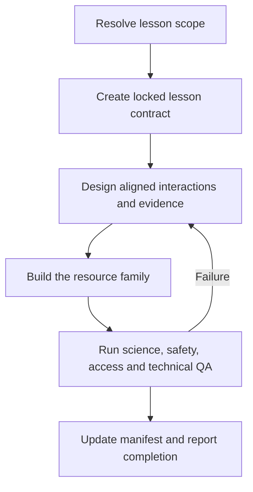

# Agentic Skill Plan: Build the Year 6 Energy and Electricity Unit

## Purpose

This document specifies a new unit-specific agentic skill that will create, update and verify the lesson resources described in the **Year 6 Energy and Electricity Integrated Unit Plan**.

The skill will adapt the strongest parts of the existing generic `lesson-creator` skill while narrowing its freedom. It must remain close to the approved 10-week, 20-lesson sequence and create resources that operate as a connected teaching system:

1. **Instruction:** an interactive HTML teacher presentation, supported by website and selected video content;
2. **Journal:** a OneNote-ready, accessible record of learning and practical evidence; and
3. **Practical task:** a sequenced Tinkercad or physical circuit activity with a task card, support guide, teacher guide and assistance media.

The skill is a **builder and verifier**, not a new unit planner. It may improve examples, scaffolding, interactivity and presentation, but it must not silently replace the unit sequence, curriculum intent, assessment constructs, resource IDs or practical progression.

---

## 1. Recommended skill identity

**Skill name:** `build-electricity-unit-lessons`  
**Recommended location:** `.agent/skills/build-electricity-unit-lessons/`  
**Primary source of truth:** `Year_6_Energy_and_Electricity_Integrated_Unit_Plan.md`  
**Primary build target:** `Lesson_Plans/` and the shared unit website directories  
**Default presentation format:** interactive standalone HTML  
**PowerPoint status:** optional fallback, created only when explicitly requested

### Proposed `SKILL.md` frontmatter

```yaml
---
name: build-electricity-unit-lessons
description: Build, update, audit and verify lesson materials for the approved Year 6 Energy and Electricity integrated unit. Use when creating any of its 20 lessons or its TP, WS, VC, VA, JN, TC, SG, TA or AS resources; producing interactive HTML teacher presentations; creating OneNote-ready journal pages; building Tinkercad and physical-circuit task materials; extending Open Power Quest; or checking unit resource completeness, accessibility, scientific accuracy, safety and assessment alignment. Preserve the integrated unit plan, lesson sequence, resource IDs, practical progression and assessment intent unless the user explicitly approves a plan change.
---
```

The body of `SKILL.md` should remain a concise orchestration guide. The detailed unit map, templates, content rules and validation standards should live in the skill’s `references/`, `scripts/` and `assets/` directories and be loaded only when needed.

---

## 2. What is retained, adapted and removed from `lesson-creator`

| Existing generic preference | Decision for this skill | Unit-specific adaptation |
| --- | --- | --- |
| Lesson plan in Markdown | **Retain** | The plan becomes the per-lesson build contract and must quote or trace every learning intention, success criterion and resource ID to the integrated unit plan. |
| Interactive HTML presentation as default | **Retain and strengthen** | The HTML deck is the normal teacher presentation. It contains teacher-led CFUs, whiteboard tools, pen/highlighter, notes drawer, answer override and image lightbox. It must also bridge explicitly to the website, journal and practical task. |
| PowerPoint presentation | **Retain only as explicit fallback** | Do not create PPTX during normal builds. If requested, create a static companion after the HTML deck has passed validation. |
| Generic DOCX handout | **Replace** | Generate a OneNote-ready journal page in DOCX and Markdown/HTML source, plus a printable equivalent. The journal is a cumulative evidence record, not a disposable worksheet. |
| Microsoft Forms quiz by default | **Remove from core pack** | Use embedded CFUs, website checks, journal evidence, the monitoring tasks and the approved assessment structure. Create a Forms import only when explicitly requested. |
| Pedagogical Contemplation | **Retain** | Focus the contemplation on the lesson’s scientific reasoning, the evidence students must produce, the role of simulation/physical testing and how the interaction exposes misconceptions. |
| Interactive Design Thinking Matrix | **Retain and split** | Create separate rows for teacher-led presentation interactions and student-directed website interactions. Avoid duplicating the same activity in both places. |
| Generic sort, sequence, match, cloze, hotspot, rank and concept-map modes | **Retain selectively** | Add science-specific modes: circuit path tracing, circuit state toggling, energy-chain building, fault diagnosis, variable planning, evidence comparison and scenario decision-making. |
| Per-lesson output folder | **Retain** | Add resource IDs, journal, task cards, guides, teacher notes, media planning and QA reports. Shared website modules remain in central folders rather than being copied into each lesson. |
| Resource discovery from a generic `Resources/` folder | **Strengthen** | Read the canonical unit plan, unit manifest, current resource register and existing files before building. Never recreate a resource simply because it is not present in the current lesson folder. |
| Standard HTML wrapper integrity check | **Retain as a P0 gate** | Continue checking the presentation container, drawing toolbar, whiteboard, teacher-notes drawer, show-answer control and image lightbox. Add keyboard, touch, overflow and science-interaction checks. |

---

## 3. Scope and change control

### 3.1 Locked unit elements

The skill must treat the following as locked unless the user explicitly asks to revise the unit plan:

- the 10-week, 20-lesson sequence;
- each lesson title, learning intention and success criteria;
- the three-part **Instruction–Journal–Practical** structure;
- the TP, WS, VC, VA, JN, TC, SG, TA and AS resource identifiers;
- the progression from prediction to Tinkercad simulation, physical verification, explanation and improvement;
- the central coal, solar, hydro and nuclear generation strand;
- the use of *Open Power Quest* and its town energy-mix simulator;
- conductors and insulators as a monitoring investigation;
- electricity-source comparison as a monitoring investigation;
- the supervised assessment’s circuit-analysis, generation and decision-making constructs;
- Arduino as an extension/control pathway unless the plan is deliberately revised;
- safety rules and the prohibition on student mains-electricity work; and
- the requirement for individual journal evidence during collaborative practical work.

### 3.2 Elements the skill may adapt

The agent may use professional judgement to improve:

- examples, analogies and non-examples;
- the number and order of presentation slides within the lesson;
- the most suitable interactive mode for a stated cognitive goal;
- responsive visual layout, illustration choice and animation;
- scaffolding, vocabulary support and extension questions;
- exact journal formatting while retaining all required evidence fields;
- task-card layout and the distribution of instructions between card, guide and assistance media;
- whether a short concept is explained through teacher demonstration, animation or a current captioned video;
- technical implementation of website modules; and
- the granularity of automated tests.

### 3.3 Changes requiring an explicit variation record

If the user requests a change to a locked element, the skill must create a short variation record before building:

| Field | Required entry |
| --- | --- |
| Requested change | What will differ from the integrated plan. |
| Affected lessons/resources | Lesson numbers and resource IDs. |
| Curriculum/assessment effect | Whether the change alters taught or assessed knowledge. |
| Dependency effect | Website, journal, practical or later lesson resources that must also change. |
| Safety/accessibility effect | Any new risk or access requirement. |
| Approval | User instruction that authorises the variation. |

This prevents a small resource edit from accidentally creating drift across the unit.

---

## 4. Agentic operating model

The skill should behave as an orchestrated workflow rather than a single generation prompt. The “roles” below are specialist passes. They may run within one agent or be delegated where the environment supports independent agents.



### 4.1 Specialist passes

| Pass | Responsibility | Must not do |
| --- | --- | --- |
| **Scope Resolver** | Interpret week/lesson/resource request; load the integrated plan and manifest; identify dependencies and existing resources. | Guess the lesson or silently broaden the build. |
| **Curriculum and Pedagogy Architect** | Produce the lesson contract, contemplation and interaction matrix; align instruction, journal evidence and practical work. | Change the curriculum target or add disconnected “engagement”. |
| **Science and Evidence Reviewer** | Check circuit explanations, transformations, source comparisons, misconceptions, source dates and model boundaries. | Turn trade-offs into unsupported absolutes or overstate a simulation. |
| **Presentation and Interaction Builder** | Compile the interactive HTML teacher deck from the standard wrapper and implement teacher-led CFUs. | Replace the wrapper or duplicate a student website activity without a teaching reason. |
| **Website Module Builder** | Create or update individual/pair interactive content in Circuit Lab, Open Power Quest, Engineering Workshop or Assessment Review. | Place secure assessment answers in public review content. |
| **Journal and Print Builder** | Produce OneNote-ready and printable journal pages with accessible evidence fields. | Reduce the journal to fill-in-the-blank notes with no practical evidence. |
| **Practical Resource Builder** | Produce Tinkercad/physical task cards, student guide, teacher guide, troubleshooting and media support. | Build unsafe tasks or assume Tinkercad represents the complete generation system. |
| **Verifier** | Run deterministic completeness, wrapper, interaction, accessibility, visual, link, safety and content checks. | Mark a pack complete because files merely exist. |

### 4.2 Safe use of concurrency

Independent planning, content review and generation of lesson-local files may occur in parallel. Writes to shared resources must be serialised:

- the unit manifest and status register;
- shared CSS/JavaScript;
- the Circuit Lab website;
- *Open Power Quest*;
- the Engineering Workshop;
- the Assessment Review area; and
- shared templates.

Each builder should write to its lesson folder or a temporary branch/directory, then the orchestrator should validate and merge the result into the shared unit resource.

---

## 5. Required inputs and scope resolution

### 5.1 Minimum request

The user may request a whole lesson, a resource subset, a week or an audit. Valid examples include:

- “Build the complete pack for Week 2, Lesson 4.”
- “Create TP10, JN10 and TC10.”
- “Build the coal lesson from the integrated unit plan.”
- “Update the town energy-mix simulator for Lesson 15.”
- “Audit Weeks 1–3 and build anything missing.”
- “Create only the OneNote journal pages for Week 6.”
- “Add a PowerPoint fallback for Lesson 9.”

### 5.2 Scope resolver procedure

Before generation, the skill must:

1. locate and read the canonical integrated unit plan;
2. locate the requested lesson in `references/lesson-contracts.yaml`;
3. read `Unit_Resources/manifest.yaml` or the current resource inventory;
4. inspect the target lesson folder and shared website modules;
5. classify requested outputs as **create**, **update**, **reuse**, **link** or **blocked**;
6. identify earlier knowledge and later dependencies;
7. state any missing source, equipment, secure-assessment or media dependency; and
8. produce a compact build list before writing files.

The agent should proceed without further questions when the scope is unambiguous and the build does not change locked unit elements.

---

## 6. Per-lesson build contract

Before creating materials, generate a machine-readable and human-readable contract containing:

```yaml
lesson_id: "1.2"
week: 1
lesson: 2
title: "Components, safety and a first circuit"
lesson_question: "How can energy move through a system and cause an observable change?"
learning_intention: "Identify common circuit components and construct a simple complete circuit safely."
success_criteria:
  - "Name the source, conducting path and output."
  - "Make the output operate."
  - "Explain why a complete path is necessary."
resource_ids: [TP02, WS02, VC02, VA02, JN02, TC02, SG02, TA02]
prior_knowledge: ["energy source and form", "basic safety routine"]
misconceptions: ["any two contacts will make a device work"]
practical_mode: ["Tinkercad", "low-voltage physical kit"]
assessment_role: "diagnostic/formative"
locked: true
```

The contract is then used by every builder. No builder should infer its own version of the lesson intention or success criteria.

### 6.1 Alignment test

Every lesson contract must answer these four questions:

| Question | Required answer |
| --- | --- |
| What thinking is taught? | The scientific concept and reasoning in the learning intention. |
| What thinking becomes visible? | The CFU, website response, journal entry or practical observation that exposes understanding. |
| What is built or tested? | The exact Tinkercad, physical, investigation or decision task. |
| What evidence is retained? | The individual journal artefact and any monitoring or assessment evidence. |

If the presentation, journal and practical answers point to different learning goals, the skill must redesign the pack before generation.

---

## 7. Default lesson-pack outputs

### 7.1 Full pack

A full lesson build should normally create or update:

| Output | Format | Purpose |
| --- | --- | --- |
| Lesson plan | Markdown | Records the contract, lesson sequence, Pedagogical Contemplation, interaction matrix, differentiation, safety, resources and timing. |
| Interactive teacher presentation | Standalone HTML | Teacher-led instruction, CFUs, modelling, website bridge, practical briefing, journal prompts and exit check. |
| Website module | Shared HTML/CSS/JS application or module | Student-paced investigation, simulation, practice or feedback linked to the relevant WS ID. Reuse an existing module when the lesson only consumes it. |
| Journal master | DOCX plus Markdown/HTML source | OneNote-ready page and printable alternative containing prediction, notes/organiser, practical plan, evidence, explanation, debugging/improvement and reflection. |
| Practical task card | DOCX plus source data | Concise student-facing build/investigation sequence with purpose, equipment, safety, steps, evidence and pack-up. |
| Student support guide | Accessible HTML or DOCX | Screenshot-rich instructions, common errors and recovery. Create only when the unit plan assigns an SG resource or the build genuinely requires it. |
| Assistance media | Short captioned clip when feasible, otherwise production-ready script/storyboard and transcript | Demonstrates the interface or physical technique without revealing the entire reasoning task. |
| Teacher guide | Markdown or DOCX | Expected model, likely responses, misconceptions, questions, safety notes, troubleshooting and answers. |
| Build script | Node.js ES module | Deterministically regenerates the lesson-local documents and presentation from structured content. |
| QA report | JSON plus concise Markdown summary | Records checks, failures, approved exceptions and resource versions. |

### 7.2 Outputs that are not automatic

- Do not create a PowerPoint unless explicitly requested.
- Do not create a Microsoft Forms quiz unless explicitly requested.
- Do not create a new concept video when an accurate, licensed and accessible existing video already meets the lesson purpose.
- Do not duplicate a shared website module inside a lesson folder.
- Do not expose secure assessment questions or model answers in a student website, presentation or revision module.

---

## 8. Three-element resource contract

### 8.1 Instruction

The instruction build must include:

- approximately 12–18 purposeful HTML slides;
- retrieval linked to the previous lesson;
- lesson question, learning intention and success criteria;
- no more than three new ideas in one teaching chunk;
- worked visual models and non-examples;
- predict–vote–explain opportunities;
- a dedicated CFU at each major transition;
- explicit misconception checking;
- selected website and video integration with a viewing/interaction purpose;
- practical purpose, safety and success criteria;
- journal evidence reminders; and
- an exit response with teacher notes and answer guidance.

### 8.2 Journal

Every JN resource must contain:

1. lesson question and success criteria;
2. retrieval or prediction;
3. a partially completed organiser or representation rather than copying-heavy notes;
4. practical plan, variables or proposed circuit;
5. risk/safety check where relevant;
6. screenshot, photograph, data table or conventional circuit diagram field;
7. scientific explanation using claim–evidence–reasoning or an equivalent structure;
8. debugging, limitation or improvement field;
9. exit reflection;
10. accessible response choices for formative evidence; and
11. one extension that deepens reasoning.

### 8.3 Practical task

Every practical resource family must define:

- why the task is being completed;
- Tinkercad, physical or combined mode;
- components/equipment and prerequisite setup;
- safety rules and a teacher checkpoint;
- a prediction before simulation or power;
- numbered steps that do not do the scientific thinking for the student;
- success tests and evidence to capture;
- model boundaries, particularly for generation-system representations;
- a systematic troubleshooting routine;
- extension by deeper reasoning rather than component quantity;
- pack-up and inventory; and
- the matching teacher solution and observation prompts.

---

---

## 9. Interactive HTML presentation standard

### 9.1 Presentation is the teacher’s live control surface

The HTML deck is not a web worksheet projected on a board. It is designed for teacher-led explanation, class discussion, mini-whiteboard responses, modelling and whole-class feedback. Student-directed investigation belongs in the WS website module.

The presentation should use a stable pattern:

| Slide function | Typical content |
| --- | --- |
| Launch | Lesson question, striking phenomenon or retrieval prompt. |
| Connect | Prior-learning diagram or three-question retrieval. |
| Teach chunk 1 | Concise explanation, visual model and vocabulary. |
| CFU 1 | All-student response before answer reveal. |
| Teach chunk 2 | Worked example, non-example or demonstration. |
| Interactive reasoning | Sort, sequence, trace, diagnose, compare or predict. |
| CFU 2 | Hinge question determining readiness for independent/practical work. |
| Website/video bridge | Exact purpose, focus question, link/launch and follow-up response. |
| Practical briefing | Purpose, components, constraints, safety and success tests. |
| Journal evidence | What must be captured and explained. |
| Exit | Independent response aligned with the success criteria. |

Not every lesson needs exactly 11 slides. More complex content may split a function across several slides, but the deck should remain within the planned 12–18 slide range unless a documented reason justifies otherwise.

### 9.2 Required wrapper capabilities

The skill should inherit the standard wrapper from the generic lesson creator and preserve:

- `presentationContainer`;
- `masterToolbar` with cursor, pen and highlighter;
- whiteboard overlay and canvas;
- teacher-notes drawer;
- teacher **Show Answer** override;
- image lightbox and annotation canvas;
- slide navigation, dots and keyboard controls;
- responsive smartboard layout; and
- per-slide `<div class="teacher-notes">` content.

The unit-specific wrapper should add:

- a persistent lesson/resource identifier in metadata;
- a visible CFU badge and mini-whiteboard cue;
- a **Reset interaction** control;
- a **Student website** launch control when a WS module is required;
- an optional **Open journal prompt** link or QR code;
- touch targets suitable for an interactive panel;
- reduced-motion support; and
- a print-to-PDF mode for emergency teacher use.

### 9.3 Two-tier feedback

For interactions with defined answers:

1. **First incorrect attempt:** show a local visual response such as a shake, outline or “check this connection” message without giving the answer.
2. **Second incorrect attempt:** reveal a targeted scientific hint tied to the misconception.
3. **Teacher override:** `show-answer` completes the activity, locks the result and exposes an explanation in the notes drawer.

For evidence-based decisions with several defensible answers, do not fake a single correct response. Validate whether the response satisfies the stated criteria, then provide feedback about unmet constraints and evidence quality.

### 9.4 Presentation visual rules

- Use a clean science-laboratory visual language rather than decorative “electric bolt” clutter.
- Use conventional circuit symbols consistently.
- Do not use colour alone for terminals, current paths, correct states or energy categories.
- Keep core text readable from the back of a primary classroom.
- Use diagrams and animation to show relationships or processes, not to fill space.
- Keep controls at least touch-friendly size and away from navigation edges.
- Use Australian English.
- Place scientific source/date notes in teacher notes rather than crowding the slide.

---

## 10. Science-specific interaction library

The generic interactive modes remain available, but the following unit-specific modes should be added to the shared HTML interaction library.

| Mode | Cognitive purpose | Presentation use | Website use | Validation behaviour |
| --- | --- | --- | --- | --- |
| **Source–Form Sorter** | Distinguish an energy source from an energy form. | Whole-class classification with mini-whiteboards before reveal. | Individual card sort with explanatory feedback. | Checks category and explains why common distractors differ. |
| **Circuit Path Tracer** | Analyse whether a closed conducting path exists. | Teacher/student taps successive components or connections on a diagram. | Student traces a path and receives fault-location feedback. | Requires a continuous valid route through correct terminals. |
| **Circuit State Toggle** | Predict the effect of opening/closing a switch or breaking a branch. | Toggle before revealing lamp/buzzer/motor state. | Student changes switch/branch state and records observations. | State logic, reset and keyboard operation are tested. |
| **Component–Symbol Matcher** | Connect physical components, functions and conventional symbols. | Class matching and discussion. | Individual match pairs with hints. | Accepts correct mappings and exposes symbol misconceptions. |
| **Energy Chain Builder** | Sequence source, energy forms, turbine/generator or PV, grid and device. | Class sequence with labelled transformations. | Coal, solar, hydro and nuclear station challenges. | Tests both stage order and energy-form labels. |
| **Fault Finder** | Diagnose rather than randomly rebuild. | Reveal one observation at a time and select the next test. | Branching diagnostic task. | Rewards evidence-led tests; rejects unsupported repair choices. |
| **Fair-Test Planner** | Identify changed, observed/measured and controlled variables. | Drag labels onto the investigation plan. | Student creates a method and receives prompts about missing controls. | Ensures variables and control check match the conductivity investigation. |
| **Diagram Translator** | Connect layout, conventional diagram and explanation. | Choose or annotate the matching diagram. | Three-representation activity. | Validates connections rather than physical scale or appearance. |
| **Evidence Comparator** | Compare coal, solar, hydro and nuclear using common criteria. | Teacher reveals one criterion at a time. | Filterable accessible data table and evidence-selection task. | Ensures criteria are applied consistently across sources. |
| **Scenario Decision Board** | Design and revise an energy mix for a purpose. | Class predicts the effect of an event card. | Town energy-mix simulator with several defensible solutions. | Tests constraints, trade-off acknowledgement and evidence, not one fixed answer. |
| **Input–Control–Output Mapper** | Represent a switch/sensor, control and response. | Label a block diagram. | Build or match a control-system model. | Checks the logic of the relationship, not coding sophistication. |
| **Risk–Control Matcher** | Link a hazard to possible harm and an appropriate control. | Whole-class safety CFU. | Safety hotspot/list alternative. | Rejects responses encouraging students to investigate mains equipment. |

### 10.1 Interaction-selection rule

Before adding any interaction, the lesson plan must record:

1. the cognitive action students perform;
2. why the chosen mode is better than questioning or a static diagram;
3. how it exposes student thinking to the teacher;
4. the misconception or decision rule it tests;
5. its Tier 2 hint; and
6. whether the interaction belongs in the teacher deck, student website or both for different purposes.

An interaction that exists only to create motion or competition must be removed.

---

## 11. Authoritative 20-lesson manifest

The skill’s `references/lesson-contracts.yaml` should encode the following mapping. The integrated plan remains the authority for full descriptions.

| Lesson | Title | Required resource IDs | Principal build emphasis |
| --- | --- | --- | --- |
| 1.1 | Energy all around us | TP01, WS01, VC01, JN01, TC01, TA01 | Source/form sorter, transformation chains and energy stations. |
| 1.2 | Components, safety and a first circuit | TP02, WS02, VC02, VA02, JN02, TC02, SG02, TA02 | Component explorer; first Tinkercad and physical one-output circuit. |
| 2.1 | Complete and incomplete circuits | TP03, WS03, VC03, JN03, TC03, SG03, TA03 | Complete-path analysis and repair of faulty circuits. |
| 2.2 | Switches and circuit diagrams | TP04, WS04, VC04, VA04, JN04, TC04, SG04, TA04 | Switch behaviour and layout-to-diagram translation. |
| 3.1 | Plan a conductivity investigation | TP05, WS05, VC05, VA05, JN05, TC05, SG05, TA05 | Prediction, fair-test plan and conductivity tester setup. |
| 3.2 | Conductors and insulators monitoring investigation | TP06, VC06, JN06, AS-M1, TC06, TA06 | Safe physical testing, results, CER conclusion and evaluation. |
| 4.1 | Comparing series and parallel arrangements | TP07, WS07, VC07, VA07, JN07, TC07, SG07, TA07 | Multi-output paths and disconnection test. |
| 4.2 | Circuit detectives and safety decisions | TP08, WS08, VC08, JN08, TC08, SG08, TA08 | Evidence-led debugging and household electrical-safety decisions. |
| 5.1 | Source to turbine, generator, grid and device | TP09, WS09, VC09, JN09, TC09, TA09 | Generic generation system and model boundaries. |
| 5.2 | Coal-fired electricity | TP10, WS10, VC10, JN10, TC10, SG10, TA10 | Coal energy chain, balanced evidence and community loads. |
| 6.1 | Solar photovoltaic electricity | TP11, WS11, VC11, JN11, TC11, SG11, VA11, TA11 | Direct light-to-electrical transformation and light-responsive extension. |
| 6.2 | Hydroelectric electricity | TP12, WS12, VC12, JN12, TC12, TA12 | Potential/movement/electrical chain and changing water conditions. |
| 7.1 | Nuclear electricity | TP13, WS13, VC13, JN13, TC13, SG13, VA13, TA13 | Neutral nuclear process comparison and monitoring/warning model. |
| 7.2 | Alternative sources and four-source comparison | TP14, WS14, VC14, JN14, AS-M2, TC14, TA14 | Bagasse bridge, common comparison criteria and decision cards. |
| 8.1 | Town energy-mix simulator | TP15, WS15, VC15, JN15, TC15, TA15 | Scenario constraints, revision and evidence-based recommendation. |
| 8.2 | From uncontrolled circuits to control systems | TP16, WS16, VC16, VA16, JN16, TC16, SG16, TA16 | Input–control–output and tiered core/Arduino pathways. |
| 9.1 | Prototype, test and troubleshoot | TP17, WS17, VC17, JN17, TC17, SG17, TA17 | Approved brief, versioned Tinkercad prototype and systematic tests. |
| 9.2 | Physical verification and evaluation | TP18, VC18, VA18, JN18, TC18, SG18, TA18 | Safe transfer, physical evidence and digital/physical comparison. |
| 10.1 | Review and supervised assessment | TP19, WS19, JN19, AS01, AS02, AS03 | Fresh review stimuli, secure assessment and equipment equivalence. |
| 10.2 | Science communication showcase | TP20, WS20, VC20, JN20, TC20, TA20 | Safety or energy message, fact checking, audience and reflection. |

### 11.1 Manifest fields

Each lesson entry should also store:

- lesson question, learning intention and success criteria;
- prerequisite lessons;
- assessment role;
- practical complexity level;
- Tinkercad, physical and optional Arduino modes;
- expected journal evidence;
- assigned interaction modes;
- specific misconceptions;
- safety controls;
- required equipment;
- shared website dependencies;
- locked and adaptable fields; and
- completion and review status for each resource ID.

---

## 12. Proposed `.agent` skill structure

```text
.agent/
└── skills/
    └── build-electricity-unit-lessons/
        ├── SKILL.md
        ├── references/
        │   ├── lesson-contracts.yaml
        │   ├── resource-output-contracts.md
        │   ├── presentation-and-interactions.md
        │   ├── journal-and-accessibility.md
        │   ├── tinkercad-and-practical-progression.md
        │   ├── science-content-and-misconceptions.md
        │   ├── safety-and-risk-controls.md
        │   ├── website-module-contracts.md
        │   └── assessment-and-security.md
        ├── scripts/
        │   ├── scaffold_lesson.mjs
        │   ├── build_lesson_pack.mjs
        │   ├── build_presentation.mjs
        │   ├── build_journal.mjs
        │   ├── build_practical_pack.mjs
        │   ├── build_static_pptx.mjs
        │   ├── validate_lesson_pack.mjs
        │   ├── validate_presentation.mjs
        │   ├── validate_accessibility.mjs
        │   ├── validate_unit_manifest.mjs
        │   └── capture_visual_qa.mjs
        └── assets/
            ├── presentation_template.html
            ├── shared-presentation.css
            ├── shared-interactions.js
            ├── journal-template.json
            ├── task-card-template.json
            ├── teacher-guide-template.md
            ├── website-module-template/
            └── circuit-symbols/
```

### 12.1 Progressive disclosure

`SKILL.md` should instruct the agent to load references conditionally:

| Build request | References to load |
| --- | --- |
| Any lesson | `lesson-contracts.yaml`, `resource-output-contracts.md` and the canonical integrated unit plan. |
| Teacher presentation | `presentation-and-interactions.md`. |
| Journal or print resource | `journal-and-accessibility.md`. |
| Tinkercad/physical task | `tinkercad-and-practical-progression.md`, `safety-and-risk-controls.md`. |
| Coal/solar/hydro/nuclear content | `science-content-and-misconceptions.md`, plus current source records. |
| Website work | `website-module-contracts.md`, presentation rules only where shared components are reused. |
| Monitoring or supervised assessment | `assessment-and-security.md`. |

This keeps the core skill concise and prevents every resource build from loading all unit detail.

---

## 13. Proposed project output structure

```text
Lesson_Plans/
├── Lesson_1.1/
│   ├── Lesson_1.1_Plan.md
│   ├── TP01_Presentation.html
│   ├── JN01_OneNote_Journal.docx
│   ├── JN01_OneNote_Journal.md
│   ├── TC01_Task_Card.docx
│   ├── TA01_Teacher_Guide.md
│   ├── media/
│   │   └── VC01_Transcript_and_Cue_Sheet.md
│   ├── scripts/
│   │   └── build_lesson_1.1.mjs
│   └── qa/
│       ├── validation.json
│       └── visual-checks/
└── ...

Unit_Resources/
├── manifest.yaml
├── shared/
│   ├── circuit-symbols/
│   ├── component-images/
│   ├── source-evidence/
│   └── video-register.yaml
└── website/
    ├── circuit-lab/
    ├── open-power-quest/
    ├── engineering-workshop/
    └── assessment-review/
```

Only resources assigned to a lesson are created in its folder. Shared website modules and evidence sets remain central and are linked from the lesson plan, presentation and OneNote page.

---

## 14. Build stack and reusable scripts

### 14.1 Recommended technology choices

| Need | Preferred technology | Reason |
| --- | --- | --- |
| Interactive teacher decks | Semantic HTML, CSS and vanilla JavaScript compiled into one standalone file | Reliable offline classroom use; transparent source; touch and keyboard control; no slide software dependency. |
| Student website modules | Existing site stack where one is established; otherwise modular HTML/CSS/JavaScript | Preserves *Open Power Quest* and avoids creating a second site architecture. |
| Orchestration and generation | Node.js ES modules | Matches the generic skill, supports `docx`, browser testing and shared structured lesson data. |
| Journal and task-card DOCX | `docx`/docx-js | Produces Word files suitable for teacher editing, printing and transfer into OneNote. |
| Structured contracts | YAML for human-edited manifests; JSON for build and QA output | YAML supports planning; JSON supports deterministic validation. |
| Browser and visual QA | Playwright or the project’s existing browser-test framework | Tests presentation controls, interactions, keyboard use, touch-sized elements and common screen sizes. |
| Static PowerPoint fallback | Existing static-slide HTML plus `html2pptx` | Used only when explicitly requested; content derives from the validated HTML deck. |
| Assistance clips | Screen recording/capture tool plus FFmpeg only when footage can be produced reliably | Allows captioned short clips while keeping storyboard/transcript as the minimum guaranteed output. |

Do not introduce a framework solely because it is fashionable. If *Open Power Quest* already uses a framework, use that framework for its modules and retain the same state/progress conventions.

### 14.2 Script responsibilities

| Script | Responsibility | Required behaviour |
| --- | --- | --- |
| `scaffold_lesson.mjs` | Create the lesson-local directory and initial structured content file. | Resolve IDs from the manifest; refuse unknown lesson/resource IDs; do not overwrite completed resources without an update flag. |
| `build_lesson_pack.mjs` | Orchestrate all requested builders in dependency order. | Support full lesson, selected resources, week range and audit/rebuild modes. |
| `build_presentation.mjs` | Inject validated slide blocks into the standard wrapper. | Never construct a replacement wrapper; embed teacher notes and interaction scripts; create standalone HTML. |
| `build_journal.mjs` | Generate OneNote-ready DOCX and Markdown/HTML source. | Preserve accessible headings, editable response fields, evidence placeholders and printable layout. |
| `build_practical_pack.mjs` | Generate task card, support guide and teacher guide. | Pull components, safety, checkpoints, tests and troubleshooting from the lesson contract. |
| `build_static_pptx.mjs` | Produce optional static slides and PPTX. | Run only after explicit request and successful HTML validation. |
| `validate_lesson_pack.mjs` | Check required resources, IDs, links and cross-resource alignment. | Fail on missing required outputs or inconsistent learning intentions. |
| `validate_presentation.mjs` | Check wrapper integrity, slide structure, notes, interactive handlers and reset/show-answer behaviour. | Treat missing wrapper IDs or broken interaction controls as P0 failures. |
| `validate_accessibility.mjs` | Check headings, labels, keyboard access, contrast flags, alt text and transcript presence. | Produce failures and human-review warnings separately. |
| `validate_unit_manifest.mjs` | Compare current outputs with the 20-lesson contract. | Report missing, stale, duplicated, orphaned and unreviewed resources. |
| `capture_visual_qa.mjs` | Capture key slides/pages at common classroom sizes. | Test at least 1920 × 1080 and 1366 × 768, plus a touch-oriented viewport; detect clipping and overflow. |

### 14.3 Structured content before formatted output

All builders should consume one lesson content object rather than re-reading prose and inventing content independently. A recommended intermediate file is:

```text
Lesson_Plans/Lesson_1.2/source/lesson_1.2.content.yaml
```

It should contain:

- the locked lesson contract;
- slide content and teacher notes;
- website-module references or change set;
- journal blocks;
- practical steps, equipment, safety and evidence;
- student support and teacher solutions;
- video/media metadata;
- vocabulary and misconceptions; and
- citations or source records where current factual claims are used.

This source object prevents the presentation, journal and task card from developing different terminology or instructions.

---

## 15. End-to-end skill workflow

### Step 1 — Resolve and freeze the lesson scope

- Parse the requested week, lesson and resource IDs.
- Load the canonical integrated plan and lesson contract.
- Inspect the unit manifest and current lesson/shared resources.
- Produce the build list and dependency list.
- Create a variation record only when the request changes a locked element.

### Step 2 — Conduct the pedagogical contemplation

Record, in the lesson plan:

1. **Cognitive goal:** the exact scientific thinking students practise;
2. **Interactive alignment:** why the chosen presentation or website mode supports that thinking;
3. **Visible thinking:** what the teacher can observe or collect;
4. **Pedagogical versus engagement purpose:** what is learned and how the design supports participation;
5. **Simulation/physical relationship:** what Tinkercad represents and what physical evidence adds; and
6. **retained evidence:** what every student places in the journal.

### Step 3 — Build the interaction matrix

Use one row for each major learning moment:

| Learning moment | Cognitive demand | Teacher-deck mode | Student website mode | Journal evidence | Practical evidence | Misconception / Tier 2 hint |
| --- | --- | --- | --- | --- | --- | --- |
| Example: trace a complete circuit | Analyse connections | Circuit Path Tracer with mini-whiteboard prediction | Individual complete/incomplete analyser | Annotated screenshot and explanation | Repaired Tinkercad circuit | “Trace from one battery terminal through every component and back.” |

The matrix must show complementary roles. A teacher-led prediction followed by an individual simulation may be justified; identical sorting activities in both locations are not.

### Step 4 — Develop or verify the common scientific content

- Establish the vocabulary, diagrams, model and evidence used across resources.
- Check the unit misconceptions reference.
- Check current factual claims and record sources when the content could change.
- Define the boundaries of any simplified model.
- For source comparison, use the same criteria across coal, solar, hydro and nuclear.

### Step 5 — Build resources in dependency order

1. lesson plan and structured content object;
2. shared scientific diagrams/data required by all outputs;
3. interactive HTML teacher presentation;
4. create, update or link the WS website module;
5. OneNote-ready journal master and printable version;
6. practical task card, student guide and teacher guide;
7. assistance clip or production-ready storyboard/transcript;
8. optional PowerPoint/Forms resources only if requested; and
9. QA report and manifest update.

### Step 6 — Verify as a connected pack

The verifier must open and use the outputs, not only inspect filenames. It should answer:

- Does the deck teach what the journal asks students to explain?
- Does the website interaction prepare for or extend the practical task?
- Can the practical task generate the evidence required by the journal?
- Do teacher answers match student resources?
- Do all resources use the same circuit, vocabulary, success criteria and safety instructions?
- Does the exit response test the lesson intention rather than a minor fact?

### Step 7 — Update the unit manifest and report

Record for each resource:

- status: planned, drafted, validated or approved;
- file location;
- builder/version information;
- last content review;
- last technical review;
- dependencies;
- source/data review date where relevant;
- exceptions or approved variations; and
- next required action.

The user-facing completion report should list what was built, what was reused, what was not created and any remaining teacher action such as capturing a Tinkercad assistance clip.

---

## 16. Validation gates

A lesson pack is complete only when every applicable gate passes.

### 16.1 P0 — Build integrity

- Correct lesson and resource IDs.
- No missing required files.
- HTML deck compiled from the approved wrapper.
- Required wrapper components and IDs present.
- No JavaScript console errors during normal interaction.
- Navigation, reset, teacher notes and show-answer controls work.
- DOCX files open and render.
- Links resolve to the intended local/shared resource.

Any P0 failure blocks completion.

### 16.2 P1 — Curriculum and alignment

- Learning intention and success criteria match the integrated plan.
- Instruction, journal and practical task address the same scientific thinking.
- The practical challenge is at the correct level in the unit progression.
- Assessment preparation uses parallel examples and preserves secure content.
- Extension deepens reasoning and does not replace core science with coding complexity.

### 16.3 P1 — Scientific accuracy

- Energy source and energy form are distinguished correctly.
- A complete circuit is represented as a continuous conducting path.
- Circuit diagrams communicate connections and are not treated as scale drawings.
- Turbine and generator roles are distinguished.
- Solar PV is represented as direct light-to-electrical transformation.
- Coal, hydro and nuclear process chains are correct at the intended Year 6 level.
- Source comparisons use balanced, relevant evidence and acknowledge trade-offs.
- Tinkercad or classroom circuits are not described as complete power-station simulations.

### 16.4 P1 — Safety

- Only approved low-voltage classroom circuits are instructed.
- Power is disconnected before physical circuit changes.
- No student is instructed to touch, test, unplug, open or repair mains equipment.
- Component-specific risks, teacher checkpoints and pack-up are present.
- Safety communication tells children to keep clear and notify a responsible adult.

### 16.5 P1 — Accessibility

- Presentation and website controls are keyboard operable.
- Essential interactions have non-drag alternatives.
- Colour is not the sole carrier of meaning.
- Images and diagrams have meaningful alternative text where appropriate.
- Videos have captions and transcripts.
- OneNote/DOCX resources use headings, short directions and accessible tables.
- Printable or low-bandwidth alternatives exist for essential website activities.
- Formative response choices do not reduce the scientific demand.

### 16.6 P2 — Classroom usability and visual QA

- Slides are legible at the target classroom viewports.
- No content or controls overflow or sit beneath navigation/toolbars.
- Touch targets are practical on an interactive panel.
- The teacher can operate interactions without leaving presentation mode.
- Teacher notes include expected responses, misconceptions and transition cues.
- Task cards can be used at the practical bench without constant screen scrolling.
- Journal evidence fields are large enough for realistic student responses.

P2 problems should be corrected before approval unless the QA report records an explicit, minor exception.

---

## 17. Special rules for assessment and evidence

### 17.1 Monitoring tasks

For Lessons 6 and 14, the skill must preserve the distinction between learning support and assessed evidence:

- presentation and website content may teach the required method and concepts;
- teacher guides may contain expected evidence;
- the student monitoring page must require the student’s own prediction, result or recommendation; and
- answer-reveal controls must not remain available during the monitored evidence collection.

### 17.2 Supervised assessment

For Lesson 19:

- store AS01–AS03 separately from public/student review resources;
- build WS19 with parallel, non-secure examples;
- prevent secure stimuli or model answers from being injected into TP19, WS19 or JN19;
- ensure physical observations/data are equivalent across students;
- record approved accessibility adjustments without changing the assessed construct; and
- require a human moderation check before release.

### 17.3 Individual evidence

When students work in pairs, the resources must still prompt each student to retain:

- an individual prediction;
- their own screenshot, photograph or labelled diagram;
- an individual scientific explanation;
- their role and contribution;
- a personal debugging or evaluation reflection; and
- any required assessment response.

---

## 18. Implementation roadmap

### Phase 1 — Establish the skill foundation

1. Create `.agent/skills/build-electricity-unit-lessons/`.
2. Write the concise `SKILL.md` orchestration instructions.
3. Create `lesson-contracts.yaml` for all 20 lessons.
4. Move unit-specific detail into the planned reference files.
5. Adapt the existing interactive presentation wrapper rather than rebuilding it.
6. Create the shared structured-content schema.
7. Implement scaffold, presentation, journal, practical and validation scripts.
8. Establish `Unit_Resources/manifest.yaml`.

**Exit condition:** the skill validates structurally and can resolve every lesson/resource ID without building resources.

### Phase 2 — Pilot three representative lessons

Build three lessons that exercise different branches:

| Pilot | Why it is selected | Capabilities tested |
| --- | --- | --- |
| **Lesson 1.2 — First circuit** | Foundation practical lesson with both Tinkercad and physical components. | Wrapper, component/symbol interaction, journal, task card, assistance clip and physical safety. |
| **Lesson 5.2 — Coal-fired electricity** | Content, website and evidence-heavy generation lesson. | Open Power Quest integration, energy-chain builder, balanced source evidence and model boundary. |
| **Lesson 8.1 — Town energy-mix simulator** | Open-ended decision task with several defensible solutions. | Scenario logic, constraint-based feedback, recommendation journal and non-binary validation. |

**Exit condition:** the three packs pass all applicable gates and demonstrate that the skill can handle circuit, generation and decision lessons.

### Phase 3 — Build the circuit strand

Build Lessons 1–8 in sequence, reusing and improving shared circuit symbols, interaction components, task-card patterns and troubleshooting logic.

**Exit condition:** students can progress from component recognition to complete paths, switches, diagrams, conductivity, multiple paths, debugging and safety without unexplained jumps.

### Phase 4 — Build the generation strand

Build Lessons 9–15 and the shared coal, solar, hydro, nuclear, alternative-source and energy-mix modules.

**Exit condition:** all station modules use consistent transformation language and comparison criteria, with reviewed evidence and accessible alternatives.

### Phase 5 — Build control, design and communication

Build Lessons 16–18 and 20, including core switch-based pathways, optional Arduino extensions, prototype/version logs, physical verification and showcase resources.

**Exit condition:** the design sequence produces assessable science evidence and remains practical with the selected classroom kits.

### Phase 6 — Secure assessment and whole-unit audit

Build Lesson 19’s public review resources and separately prepare/verify AS01–AS03. Run a whole-unit manifest, accessibility, link, safety, terminology and dependency audit.

**Exit condition:** the unit has no unexplained missing resources, public assessment leakage, broken shared links or inconsistent resource IDs.

---

## 19. Forward-testing plan

After implementation, test the skill with fresh agent contexts using realistic instructions rather than “review this skill” prompts.

| Test prompt | What success demonstrates |
| --- | --- |
| “Use the electricity lesson skill to build the complete Week 1 Lesson 2 pack.” | Correct scope, full output family, basic circuit accuracy and HTML wrapper compliance. |
| “Create only TP10 and JN10 for the coal lesson; reuse anything already built.” | Resource subset handling, manifest inspection and no unnecessary recreation. |
| “Update the Lesson 15 simulator so a drought affects hydro, but preserve several defensible solutions.” | Shared-site update discipline and constraint-based rather than fixed-answer feedback. |
| “Audit Lesson 6 and fix missing support for students who cannot use drag interactions.” | Accessibility audit and equivalent non-drag pathway. |
| “Build the Lesson 19 review pack.” | Secure/public separation and parallel-example generation. |
| “Create a static PowerPoint companion for Lesson 9.” | Explicit fallback only, derived from the validated interactive deck. |

Validation agents should receive the skill and task, not the expected solution. Their output, logs, screenshots and files should be checked against the lesson contract and automated QA report.

---

## 20. Acceptance criteria for the finished skill

The new skill is ready for use when:

- [ ] it triggers for unit-specific lesson, resource, website, Tinkercad and audit requests;
- [ ] it does not trigger as the primary builder for unrelated generic lessons;
- [ ] it resolves all 20 lessons and all planned resource IDs;
- [ ] it treats the integrated unit plan as authoritative;
- [ ] it creates interactive HTML presentations by default and PowerPoint only on request;
- [ ] it produces OneNote-ready journal evidence rather than a generic worksheet;
- [ ] it builds or links the correct website module without duplication;
- [ ] it builds practical cards, guides, teacher support and assistance media appropriate to the lesson;
- [ ] it distinguishes teacher-led presentation interactions from student-directed website interactions;
- [ ] it preserves the Tinkercad-to-physical progression and states model boundaries;
- [ ] it enforces safety, accessibility, science-accuracy and assessment-security gates;
- [ ] it uses structured content and deterministic scripts so resources can be regenerated consistently;
- [ ] it audits actual behaviour and visual output rather than checking only file existence;
- [ ] it updates the unit manifest after successful builds;
- [ ] it refuses or records changes that would cause silent unit-plan drift; and
- [ ] the three representative pilot lessons pass forward-testing in fresh contexts.

---

## 21. Recommended implementation decision

Build this as a **new unit-specific skill**, not as a large edit to the generic `lesson-creator` skill.

The generic skill should remain useful for unrelated subjects and units. The electricity skill may reuse or copy its stable HTML wrapper, interaction patterns and document-generation approach, but it needs its own:

- locked 20-lesson manifest;
- resource-ID system;
- Instruction–Journal–Practical orchestration;
- science interaction library;
- Tinkercad and physical-build progression;
- OneNote journal contract;
- central website integration rules;
- electricity misconceptions and safety controls; and
- monitoring/assessment security rules.

This separation will make the unit builder more reliable and easier to improve without making every generic lesson request load a large amount of electricity-specific context.

