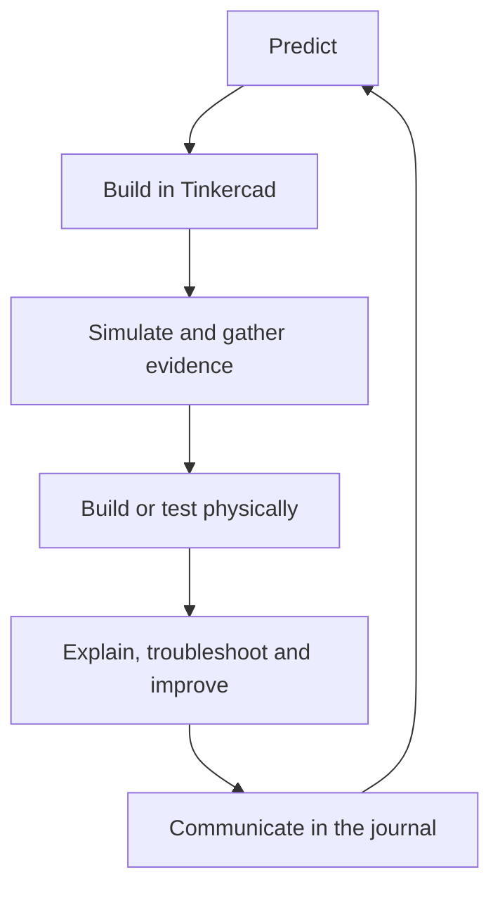
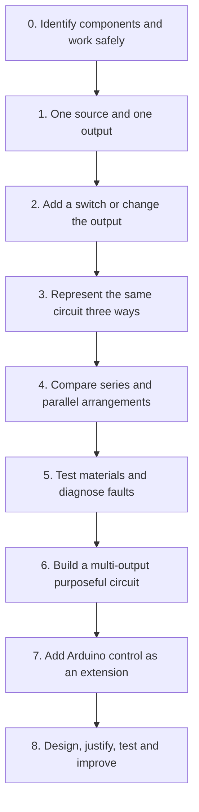

# Year 6 Energy and Electricity

## Integrated 10-week unit and resource development plan

**Year level:** Year 6  
**Duration:** 10 weeks; 20 lessons of approximately 60 minutes  
**Learning area:** Science — Physical sciences, Science Inquiry and Science as a Human Endeavour  
**Curriculum basis:** Existing Queensland Year 6 Version 8 unit plan, centred on ACSSU097 and the associated Year 6 inquiry and human-endeavour descriptors  
**Digital platforms:** Tinkercad Circuits, the class electricity website (including *Open Power Quest*), and OneNote Class Notebook  
**Document purpose:** This is a production blueprint. It defines the lesson sequence and describes every presentation, website module, video, journal page, task card, guide and assessment support that will be required. It does not contain the finished resources.

---

## 1. Unit rationale

Students investigate electricity at three connected scales:

1. **Inside a circuit:** What must be present for electrical energy to be transferred and transformed?
2. **Inside an electrical system:** How can components be arranged, controlled, tested and improved to perform a purpose?
3. **Across an electricity network:** How is electricity generated from different sources, and how can evidence inform decisions about the best mix of sources for a community?

The revised unit retains the intent of the existing *Energy and electricity* unit while giving the practical work a stronger engineering progression. Tinkercad is used first as a safe place to predict, prototype, simulate and diagnose. Students then transfer their understanding to low-voltage physical components, photograph or record their evidence, and explain any differences between the simulation and the physical result.

The recurring learning cycle is:

This structure ensures that the website, teacher instruction, journal and practical work do not operate as separate activities. Each contributes a different kind of evidence to the same learning goal.

---

## 2. Unit learning intentions

By the end of the unit, students will be able to:

- distinguish an **energy source** from an **energy form**;
- identify examples of energy transfer and transformation in everyday systems;
- explain that a complete, closed conducting path and a suitable energy source are required for a circuit to operate;
- identify the function of cells or batteries, wires, lamps or LEDs, buzzers, motors and switches;
- construct, simulate and represent circuits using physical layouts, Tinkercad models and conventional circuit diagrams;
- predict, test and classify materials as electrical conductors or insulators;
- diagnose common circuit faults and justify a repair using evidence;
- identify safety hazards and explain appropriate controls for low-voltage classroom circuits and household electricity;
- describe energy transformations used to generate electricity from coal, solar, hydroelectric and nuclear sources;
- compare electricity sources using evidence about reliability, emissions, renewability, cost, resource availability, waste and environmental or community effects;
- use scientific knowledge and evidence to recommend an electricity mix for a stated community purpose;
- plan, create, test and improve a circuit-based solution; and
- communicate predictions, circuit diagrams, observations, data, explanations and evaluations in a multimodal scientific journal.

---

## 3. Curriculum alignment

### 3.1 Primary curriculum connections from the existing unit

| Curriculum strand | Existing descriptor | How the redesigned unit addresses it |
| --- | --- | --- |
| Science Understanding — Physical sciences | Electrical energy can be transferred and transformed in electrical circuits and can be generated from a range of sources (ACSSU097). | Tinkercad and physical circuit investigations; circuit diagrams; energy-transformation chains; source comparison; town energy-mix challenge. |
| Science as a Human Endeavour — Nature and development | Science involves testing predictions by gathering data and using evidence to develop explanations and reflects historical and cultural contributions (ACSHE098). | Predict–test–explain routines; conductor investigation; circuit debugging; comparison of simulation and physical results; examination of changing electricity technologies. |
| Science as a Human Endeavour — Use and influence | Scientific knowledge is used to solve problems and inform personal and community decisions (ACSHE100). | Electrical safety decisions; selection of circuit designs; community electricity-source recommendation; safety awareness communication. |
| Science Inquiry — Questioning and predicting | With guidance, pose clarifying questions and make predictions about scientific investigations (ACSIS232). | Circuit predictions, conductor/insulator hypotheses, source-performance predictions and design questions. |
| Science Inquiry — Planning and conducting | Identify, plan and apply elements of investigations using equipment safely and identifying risks (ACSIS103). | Investigation planner, risk check, fair tests, safe low-voltage construction and design challenge. |
| Science Inquiry — Processing and analysing | Construct and use representations, including tables and graphs, to describe observations, patterns and relationships (ACSIS107). | Results tables, source-comparison matrix, screenshots, labelled circuit diagrams, simple graphs and claim–evidence explanations. |
| Science Inquiry — Communicating | Communicate ideas, explanations and processes using scientific representations and multimodal texts (ACSIS110). | OneNote journal, annotated screenshots, circuit diagrams, audio explanation options, final recommendation and safety communication product. |

### 3.2 Achievement-standard evidence targeted

The unit deliberately collects evidence that students can:

- **analyse the requirements for the transfer of electricity** in a circuit;
- **describe energy transformations** involved in generating electricity;
- **explain how scientific knowledge informs decisions** about energy sources and safety;
- plan and conduct a simple cause-and-effect investigation safely;
- collect, organise, interpret and evaluate data; and
- communicate scientific ideas using appropriate representations and multimodal forms.

### 3.3 General capabilities

| Capability | Planned application |
| --- | --- |
| Literacy | Scientific vocabulary; explanation writing; interpreting diagrams, videos and website text; evidence-based recommendation. |
| Numeracy | Reading component values; organising results; interpreting source data; comparing scores in the energy-mix simulator. |
| Digital literacy / ICT capability | Tinkercad modelling, screenshots, OneNote evidence, website interactives, responsible file and version management. |
| Critical and creative thinking | Predicting, fault finding, comparing evidence, generating solutions, testing and improving designs. |
| Personal and social capability | Partner roles, safe equipment management, constructive troubleshooting and collaborative decision-making. |
| Ethical understanding | Considering benefits, drawbacks, trade-offs and affected communities when judging energy choices. |

---

## 4. The three-part lesson architecture

Every lesson uses the same three elements. The time allocation may vary, but no element is optional.

| Element | Normal allocation | Purpose | Non-negotiable features |
| --- | ---: | --- | --- |
| **Instruction** | 15–25 min | Establish or connect the scientific concept before students apply it. | Teacher presentation; selected website interaction; short captioned video where it adds explanatory value; at least two checks for understanding; explicit vocabulary and misconception check. |
| **Journal** | 10–20 min across the lesson | Create a cumulative, accessible record of learning and evidence. | Learning intention; prediction or retrieval response; notes or organiser; practical record; screenshot/photo/diagram; explanation; reflection or exit response. |
| **Practical task** | 25–40 min | Allow students to model, test, build, diagnose or improve a system. | Task card; success criteria; safety box; Tinkercad or physical build; support guide; short assistance video or animated demonstration; evidence captured in OneNote. |

### 4.1 Recommended lesson rhythm

| Time | Teaching move | Student action |
| ---: | --- | --- |
| 0–5 min | Retrieval prompt or discrepant event | Respond in OneNote, on a mini-whiteboard or through a class vote. |
| 5–15 min | Explain and model one concept | Listen, annotate and answer a hinge question. |
| 15–20 min | Website or video input | Complete a focused interaction, not passive viewing. |
| 20–25 min | Practical briefing and safety check | Rephrase the task, allocate partner roles and make a prediction. |
| 25–50 min | Practical investigation or design | Build, simulate, test, collect evidence and troubleshoot. |
| 50–57 min | Journal explanation | Add evidence and explain the result using scientific vocabulary. |
| 57–60 min | Exit check | Answer the lesson question; teacher identifies next-step groups. |

---

## 5. Resource system to be developed

### 5.1 Resource families and naming

| Code | Resource type | Required design |
| --- | --- | --- |
| **TP** | Teacher presentation | Approximately 12–18 purposeful slides; presenter notes; answers; vocabulary; misconception alerts; interactive checks every 5–7 minutes; clear hand-off to website, journal and practical task. |
| **WS** | Website module | Short reading blocks, labelled visuals, interactive sequence/classification/decision activity, immediate feedback, accessible controls, progress indicator and teacher summary. |
| **VC** | Video content | Usually 2–5 minutes; captions and transcript; pause points; one focus question before viewing and two response prompts after viewing. Existing longer videos should be excerpted or chaptered. |
| **JN** | OneNote journal page | Preformatted student page with accessible headings, learning intention, vocabulary, response spaces, evidence placeholders, sentence starters and extension prompt. |
| **TC** | Practical task card | One or two pages: purpose, equipment/components, safety, circuit or build goal, numbered steps, evidence to collect, success criteria, troubleshooting prompts and pack-up check. |
| **SG** | Student support guide | Screenshot-rich how-to guide for the Tinkercad feature or practical technique; includes common errors and how to recover. |
| **VA** | Video assistance | A silent or narrated 30–90 second demonstration of the build process; captions; chapters if longer; shows the interface or hands, not just a finished product. |
| **TA** | Teacher answer/support resource | Expected circuit, suggested responses, likely misconceptions, observable success indicators, safety notes and questions for conferencing. |
| **AS** | Assessment support | Task sheet, stimulus, planning organiser, annotated model, standards guide, teacher notes and accessibility arrangements that do not change the assessed knowledge. |

### 5.2 Teacher presentation design rules

Each presentation will contain:

1. a retrieval question linked to the previous lesson;
2. a student-friendly learning intention and success criteria;
3. no more than three new scientific ideas in one teaching chunk;
4. a visual model, diagram or worked example;
5. a **predict–vote–explain** question before the answer is revealed;
6. a hinge question that determines whether the class is ready for the practical task;
7. a deliberate misconception check;
8. the practical purpose, constraints and safety requirements;
9. a journal evidence reminder; and
10. an exit question with an answer guide in the presenter notes.

Interactive checks should rotate across mini-whiteboard sketches, multiple-choice hinge questions, component matching, error spotting, sequencing, partner explanation, class voting and short Tinkercad demonstrations.

### 5.3 Website structure

The class website should become a stable hub with two connected strands.

| Website area | Modules and intended contents |
| --- | --- |
| **Circuit Lab** | Components and symbols; complete/ incomplete circuit interactive; switch animation; series and parallel visual comparison; conductor/insulator prediction sorter; circuit fault finder; safety hazard hotspot; circuit glossary. |
| **Open Power Quest** | Coal, solar, hydro and nuclear station pages; animated energy-transformation chains; source-specific knowledge checks; comparison matrix; scenario cards; town energy-mix simulator; saved student progress; teacher notes. |
| **Engineering Workshop** | Tinkercad launch links; challenge ladder; downloadable or printable task cards; assistance clips; troubleshooting library; design brief; submission checklist. |
| **Assessment Review** | Retrieval quizzes; energy-chain builder; circuit analyser; vocabulary review; sample source-comparison question; no direct copies of secure assessment questions. |

Website accessibility requirements:

- alt text for meaningful images and diagrams;
- adequate colour contrast, with labels or patterns as well as colour;
- uncluttered screens with a clear **Back**, **Next** and **Reset** function;
- immediate explanatory feedback rather than only “correct/incorrect”;
- printable or low-bandwidth alternatives for every essential activity; and
- Australian English and a Year 6 reading level, with glossary support for technical terms.

### 5.4 Video content rules

Videos are included only when movement, scale, an inaccessible location or a process over time is easier to understand through video. Each video resource will specify:

- the exact concept and recommended duration;
- whether it is teacher-created, locally stored or externally sourced;
- a captioned transcript and still-image alternative;
- a “watch for” question;
- planned pause points for prediction or explanation; and
- a follow-up journal prompt.

Long legacy clips from the existing unit should be reviewed for currency, licensing, accessibility and availability before use. Flash or obsolete learning objects should be replaced with native website interactions.

---

## 6. OneNote science and engineering journal

### 6.1 Notebook structure

| Section | Pages and purpose |
| --- | --- |
| **00 Start Here** | Unit overview; safety agreement; how to capture a Tinkercad screenshot; how to label a circuit diagram; partner-role expectations; glossary link. |
| **01 Weekly Learning** | One pre-distributed page for each lesson, grouped by week. These are the primary record of instruction and reflection. |
| **02 Circuit Engineering Log** | Tinkercad challenge tracker; circuit versions; debugging log; final design folio. |
| **03 Electricity Generation** | Coal, solar, hydro and nuclear station notes; energy-chain diagrams; source comparison; town energy-mix recommendation. |
| **04 Assessment Preparation** | Retrieval grids; practice stimulus; self-assessment checklist; feedback response page. |
| **05 Vocabulary and Help** | Illustrated vocabulary bank; sentence stems; symbol chart; troubleshooting decision tree; links to assistance videos. |

### 6.2 Standard lesson-page template

Every JN page will include:

1. **Lesson question** and “I can” success criteria.
2. **Retrieve or predict:** one short response completed before teaching.
3. **Key learning:** a partially completed diagram, table or organiser rather than large amounts of copying.
4. **My practical plan:** prediction, variables or proposed circuit, and safety check.
5. **Evidence:** space for a screenshot, photo, results table or labelled circuit diagram.
6. **Explain:** a claim–evidence–reasoning response or lesson-specific sentence frame.
7. **Debug and improve:** what failed, evidence used to locate the problem, change made and result.
8. **Exit reflection:** a short answer aligned with the success criteria.
9. **Accessibility choices:** type, draw, insert a photo, or record a brief audio explanation where the response mode is not itself being assessed.
10. **Extension:** one transfer or design question that cannot be answered by copying the notes.

### 6.3 Accessible journal design

- Use built-in heading styles so Immersive Reader and navigation work correctly.
- Use short directions, one action per line and consistent icons with text labels.
- Provide vocabulary banks and optional sentence frames without reducing the scientific demand.
- Include enlarged circuit symbols and pre-drawn tables where fine motor or spatial organisation is a barrier.
- Allow photographs, annotated screenshots and audio explanations for formative evidence.
- Never use colour alone to show positive/negative terminals, current paths, energy-source categories or success states.
- Provide a printable equivalent with the same page sequence.
- Pre-distribute pages before each lesson and lock teacher instructions while leaving response areas editable.

---

## 7. Practical learning progression

### 7.1 Tinkercad and physical-build complexity ladder

### 7.2 Three-representation routine

For every significant circuit, students must connect:

| Representation | What students record | Why it matters |
| --- | --- | --- |
| Physical or Tinkercad layout | Screenshot or photograph with component labels. | Shows what was actually connected. |
| Conventional circuit diagram | Correct symbols and connection lines; layout does not need to be to scale. | Communicates the electrical relationships clearly. |
| Scientific explanation | Source, complete path, component function and energy transformation. | Demonstrates conceptual understanding rather than successful assembly alone. |

### 7.3 Core classroom equipment

The practical plan assumes approximately one circuit kit per group. The selected classroom kit model contains:

- 2 batteries;
- 1 battery holder with crocodile/alligator clips;
- 1 storage box;
- 1 flashing LED bulb;
- 1 2.5 V light bulb and plastic bulb holder;
- 1 motor, pulley and holder;
- 3 switch types: rocker, push-to-make and latching push switch;
- 1 buzzer;
- 2 lengths of wire, approximately 1 m each, red and black; and
- 2 crocodile/alligator clip leads.

Additional shared items required:

- computers with student Tinkercad access and a teacher demonstration account;
- headphones for assistance videos;
- spare batteries, low-voltage lamps/LEDs and clip leads;
- a range of safe test materials: paperclip, aluminium foil, coin, graphite pencil lead/mark, rubber, plastic, dry timber, fabric and cardboard;
- mini-whiteboards and markers;
- printed task cards in reusable sleeves;
- component and circuit-symbol cards;
- safety glasses if required by the school risk assessment;
- optional small solar cells, hand generators or demonstration turbine models; and
- optional Arduino starter kits for the extension/control-system pathway.

---

## 8. Assessment plan

### 8.1 Assessment architecture

| Assessment | Timing | Evidence | Intended use |
| --- | --- | --- | --- |
| Diagnostic concept check | Week 1 | Energy-source/form sort, initial circuit drawing and explanation. | Identify prior knowledge and misconceptions; form support groups. |
| Circuit journal checks | Weeks 1–4 | Screenshots, diagrams, explanations, fault-finding records and exit responses. | Formative feedback on circuit concepts and representations. |
| Monitoring investigation: conductors and insulators | Week 3 | Prediction, fair-test plan, safe construction, results table and evidence-based conclusion. | Retains the existing unit monitoring task and adds digital/physical comparison. |
| Monitoring investigation: electricity sources | Weeks 5–7 | Energy chains and source-comparison matrix covering coal, solar, hydro and nuclear. | Check transformation knowledge and evidence-based comparison. |
| Design challenge folio | Weeks 8–9 | Need/brief, circuit diagram, Tinkercad prototype, test data, debugging record, physical build or justified digital solution and evaluation. | Authentic application and rich formative evidence; may support but should not replace the supervised assessment. |
| Supervised assessment: Exploring energy and electricity | Week 10 | Circuit analysis, generation transformation and evidence-based source recommendation. | Summative achievement-standard judgement. |
| Communication product | Week 10 | Electrical safety or community-energy multimodal product and oral explanation. | Evidence of scientific communication and application to a real audience. |

### 8.2 Proposed supervised assessment structure

The secure task should retain the intent of the existing assessment while using a coherent scenario.

| Part | Student demand | Suggested stimulus |
| --- | --- | --- |
| **A. Analyse a circuit** | Identify whether electricity will transfer; trace the complete path; identify a fault; recommend and justify a repair; state transformations at the output component. | One functioning and one faulty circuit represented through a diagram or Tinkercad-style image. |
| **B. Explain generation** | Construct or complete an energy-transformation chain and explain how a selected source produces electricity. | Diagram of a coal, hydro or nuclear turbine-generator system and a solar photovoltaic system. |
| **C. Inform a decision** | Compare relevant benefits and drawbacks; select a source or mix for a community purpose; make a claim supported by stimulus evidence; acknowledge a trade-off. | Fictional community profile and a carefully simplified data table for coal, solar, hydro and nuclear. |
| **D. Inquiry and communication** | Interpret results, identify a relationship or limitation, and use scientific representations and vocabulary accurately. | Short circuit-test or source-performance dataset. |

### 8.3 Evidence-to-standard map

| Assessed understanding or skill | Strong evidence will show |
| --- | --- |
| Requirements for transfer in a circuit | Analysis of a closed conducting path, suitable source and correct component connections; reasoning applied to an unfamiliar circuit. |
| Energy transformation | Correct sequence of energy forms and an explanation of the role of the generator, turbine or photovoltaic cell. |
| Science informing decisions | A recommendation that uses relevant evidence, explains why it suits the stated purpose and recognises a drawback or trade-off. |
| Inquiry | A testable question or prediction, relevant variables, safe method, organised data and a conclusion connected to evidence. |
| Evaluation | Identification of an error, limitation or improvement with a reason it would improve the result or design. |
| Communication | Accurate scientific vocabulary, conventional representations and a logically organised multimodal response. |

### 8.4 Feedback cycle

- **Live practical feedback:** prompts such as “What evidence tells you where the circuit stops working?” rather than repairing the circuit for the student.
- **Journal feedback:** one strength linked to a success criterion and one specific next step.
- **Whole-class feedback:** anonymous error examples from circuit diagrams and energy chains.
- **Peer feedback:** “clear connection”, “question” and “suggested test” protocol during design work.
- **Assessment preparation:** practice with parallel concepts and fresh stimuli, not rehearsal of secure questions.
- **Post-assessment:** students respond to feedback and correct one circuit explanation and one energy-source claim.

---

## 9. Sequence overview

| Week | Conceptual focus | Tinkercad / practical progression | Major evidence |
| ---: | --- | --- | --- |
| 1 | Energy forms, sources, transfer and transformation; safe circuit work | Component orientation; first one-source/one-output circuit | Diagnostic responses and first three-representation record |
| 2 | Complete circuits, switches and circuit diagrams | Change outputs; add and compare switches; build digitally then physically | Annotated circuit screenshot, conventional diagram and explanation |
| 3 | Conductors, insulators and fair testing | Create and use a conductivity tester; compare predicted, simulated and physical results | Monitoring investigation |
| 4 | Series/parallel ideas, fault finding and electrical safety | Compare multi-output arrangements; diagnose broken circuits | Circuit detective log and safety explanation |
| 5 | How electricity is generated; turbine-generator systems; coal | Model transformations; explore coal station in *Open Power Quest* | Coal energy chain and source evidence card |
| 6 | Solar and hydroelectric generation | Explore photovoltaic and turbine-generator differences; apply source scenarios | Solar and hydro energy chains; comparison responses |
| 7 | Nuclear, alternative sources and source trade-offs | Nuclear station sequence; bioenergy/bagasse extension; source comparison | Completed four-source matrix and monitoring response |
| 8 | Community decisions and controlled circuits | Town energy-mix simulator; purposeful multi-output circuit; optional Arduino introduction | Evidence-based recommendation and design brief |
| 9 | Engineering design challenge | Prototype, simulate, diagnose, build or verify, test and improve | Design folio and final practical demonstration |
| 10 | Consolidation, supervised assessment and communication | Assessment circuit analysis; safety/energy communication showcase | Summative task, communication product and reflection |

---

## 10. Detailed weekly lesson and resource sequence

### Week 1 — Energy and the first complete circuit

#### Weekly learning question

How can energy move through a system and cause an observable change?

#### Lesson 1 — Energy all around us

**Learning intention:** Distinguish energy sources from energy forms and identify transfers and transformations in familiar systems.  
**Success criteria:** Students can correctly classify examples and describe at least one energy transformation using “from … to …”.

| Phase | Lesson sequence |
| --- | --- |
| **Instruction** | Begin with three demonstrations or images: a torch, a falling object and a fan. Students predict the energy source and observable form. TP01 explicitly separates **source**, **form**, **transfer** and **transformation**. Students complete the WS01 source-or-form sorter and watch VC01, pausing before each transformation is revealed. Checks: mini-whiteboard classification; hinge question comparing “the Sun” with “light energy”; partner explanation of one transformation chain. |
| **Journal** | JN01 captures the diagnostic energy sort, a partially completed concept map, two energy chains and the initial unit vocabulary. Students photograph or sketch one energy demonstration and record what changed. Exit response: “The source is not the same as the form because …”. |
| **Practical** | TC01 uses four short energy stations such as elastic potential to movement, battery to light, movement to sound and sunlight to heat. Groups predict, observe and describe each chain. Students rotate roles: equipment manager, recorder, reporter and safety checker. No numerical measurement is required; the focus is careful observation and correct language. |

##### Lesson 1 resource package

| ID | Resource | What it will contain |
| --- | --- | --- |
| TP01 | *Energy: source, form, transfer and transformation* | Demonstration images; explicit definitions; worked energy-chain notation; source/form non-examples; four class-vote questions; misconception alert; station briefing; answers in notes. |
| WS01 | *Energy Sorter* | Accessible card sort with everyday objects and processes; separate source/form columns; immediate explanatory feedback; text-button alternative to dragging; printable card set. |
| VC01 | *Follow the Energy* | 3-minute captioned explainer showing energy changing through a torch, speaker and moving toy; prediction pauses at approximately 40 seconds and 2 minutes; transcript and six still frames. |
| JN01 | *Energy all around us* | Diagnostic sort; concept map; energy-chain frames; demonstration evidence box; vocabulary bank; audio-response option; exit ticket. |
| TC01 / TA01 | *Energy Detective Stations* | Four station cards, equipment list, safety prompts, prediction/observation table and expected transformation chains. |

#### Lesson 2 — Components, safety and a first circuit

**Learning intention:** Identify common circuit components and construct a simple complete circuit safely.  
**Success criteria:** Students can name the source, conducting path and output; make the output operate; and explain why a complete path is necessary.

| Phase | Lesson sequence |
| --- | --- |
| **Instruction** | TP02 introduces battery/cell, wires, lamp or LED, buzzer, motor and switch through real components and matching symbols. The teacher models the safe handling routine: inspect, plan with power disconnected, connect, check and then power. WS02 allows students to explore the component gallery. VC02 shows how to navigate Tinkercad, place components, connect wires and start/stop a simulation. Checks: component-symbol match; identify the unsafe action; predict whether three pictured circuits will operate. |
| **Journal** | JN02 records component names/functions, the safety agreement and a prediction for the first circuit. Students insert a Tinkercad screenshot and a photograph if a physical build is completed, draw the conventional diagram and explain the role of the complete path. |
| **Practical** | TC02 Challenge 1: construct one source–one lamp circuit in Tinkercad, test it, then reconstruct it using the physical kit. Students compare the virtual and real layouts. Extension: replace the lamp with the buzzer or motor and explain what changed and what remained the same. |

##### Lesson 2 resource package

| ID | Resource | What it will contain |
| --- | --- | --- |
| TP02 | *Meet the circuit* | Photographs and symbols; component functions; low-voltage classroom safety; complete/incomplete examples; predict–vote–explain questions; practical release check. |
| WS02 | *Circuit Component Explorer* | Clickable components with name, symbol, purpose, terminal information and short animation; five-question knowledge check; printable symbol chart. |
| VC02 / VA02 | *Tinkercad Circuits: first build* | 4-minute orientation plus a 60-second just-in-time build clip; captions; keyboard/mouse directions; how to undo, delete, zoom and stop a simulation. |
| JN02 | *My first complete circuit* | Component/function table; safety checklist; prediction; screenshot/photo placeholders; diagram frame; claim–evidence explanation; challenge tracker. |
| TC02 / SG02 / TA02 | *Challenge 1 — Make it work* | Required components, numbered digital and physical steps, success criteria, evidence checklist, lamp/buzzer/motor extensions, common errors and teacher expected circuits. |

#### Week 1 evidence and teacher decision

- Review the diagnostic sort, circuit explanation and exit responses.
- Create a short reteaching group for students who still treat energy sources and forms as interchangeable.
- Do not advance a student to independent physical building until the safe connect–check–power routine is demonstrated.

---

### Week 2 — Complete paths, switches and scientific representations

#### Weekly learning question

How do connections and switches control what happens in a circuit?

#### Lesson 3 — Complete and incomplete circuits

**Learning intention:** Analyse circuit connections and explain why a component does or does not operate.  
**Success criteria:** Students can trace a closed path, locate a break or unsuitable connection and justify a repair.

| Phase | Lesson sequence |
| --- | --- |
| **Instruction** | TP03 uses deliberately varied layouts to show that appearance and wire length are less important than electrical connections. Students trace paths with fingers or annotation. WS03 presents a complete/incomplete circuit analyser. VC03 animates a continuous path without presenting electricity as material that is “used up”. Checks: hold up C/I cards; annotate the point at which each faulty circuit is open; explain why moving one lead fixes the circuit. |
| **Journal** | JN03 contains four circuit predictions, an annotated continuous-path diagram and before/after screenshots of a repaired circuit. Students complete: “The circuit did not work because … I changed … The evidence that it now works is …”. |
| **Practical** | TC03 Challenge 2: students receive four Tinkercad circuits—two working and two incomplete. They test predictions, repair the faults and create one additional faulty circuit for a partner to diagnose. If teacher-created share links are impractical, screenshots and component lists allow students to recreate each case. |

##### Lesson 3 resource package

| ID | Resource | What it will contain |
| --- | --- | --- |
| TP03 | *Follow the complete path* | Six functioning/non-functioning examples; trace-the-path animation; connection versus appearance comparison; hinge question; misconception note; answers. |
| WS03 | *Will It Work?* | Progressive circuit analyser with revealable path tracing, explanation feedback and an accessible multiple-choice mode. |
| VC03 | *A complete circuit* | 2-minute visual explanation of source, path and output; no inaccurate “water gets used up” analogy; transcript and labelled still. |
| JN03 | *Circuit analyser* | Prediction grid; digital annotation space; repair evidence; conventional diagram; claim–evidence–reasoning frame. |
| TC03 / SG03 / TA03 | *Challenge 2 — Complete the path* | Four fault cases, test/repair sequence, partner-created fault instructions, diagnostic decision tree and solutions. |

#### Lesson 4 — Switches and circuit diagrams

**Learning intention:** Explain how a switch controls a circuit and represent connections using conventional circuit symbols.  
**Success criteria:** Students can build a switched circuit, describe open and closed switch states and draw an accurate circuit diagram.

| Phase | Lesson sequence |
| --- | --- |
| **Instruction** | TP04 models a switch as a controlled break in a conducting path. Real rocker, push-to-make and latching switches are compared by behaviour. The teacher transforms a photograph into a simplified circuit diagram while thinking aloud. WS04 provides a symbol and diagram practice tool. Checks: students physically model open/closed states; choose the correct diagram for a layout; repair a diagram with a missing connection. |
| **Journal** | JN04 includes a switch-type comparison table, open/closed definitions, Tinkercad screenshot, conventional diagram and explanation. Students must state that circuit diagrams communicate connections and are not drawn to scale. |
| **Practical** | TC04 Challenge 3: add a switch to control a lamp in Tinkercad, then reproduce the circuit physically using at least two switch types. Students compare momentary and maintained control. Extension: design a circuit in which one switch can conveniently control a buzzer warning. |

##### Lesson 4 resource package

| ID | Resource | What it will contain |
| --- | --- | --- |
| TP04 | *Control the circuit* | Switch cutaway or contact animation; switch-type demonstration; layout-to-diagram worked example; symbol checks; misconception alert about scale. |
| WS04 | *Circuit Symbol Studio* | Symbol matching, layout-to-diagram questions, open/closed switch animation and printable symbol reference. |
| VC04 / VA04 | *From build to diagram* | 3-minute worked example plus 45-second switch-connection clip; captions and pause-to-draw prompt. |
| JN04 | *Switches and representations* | Switch comparison; screenshot; diagram grid; explanation frame; self-check against diagram conventions. |
| TC04 / SG04 / TA04 | *Challenge 3 — Take control* | Tinkercad and physical build steps; switch-choice table; expected circuits; troubleshooting for poor contacts and incorrect switch terminals. |

#### Week 2 evidence and teacher decision

- Use the Lesson 3 explanation to identify students who can repair by trial and error but cannot explain the complete path.
- Check Lesson 4 diagrams for correct symbols and connections rather than artistic similarity to the physical layout.
- Provide a circuit-symbol mat during future practical work for students who need retrieval support.

---

### Week 3 — Conductors, insulators and fair testing

#### Weekly learning question

Which materials allow a circuit to be completed, and how can we test them fairly?

#### Lesson 5 — Plan a conductivity investigation

**Learning intention:** Predict whether materials are conductors or insulators and plan a safe, fair test.  
**Success criteria:** Students can identify what will be changed, measured or observed and kept the same, and explain how a test circuit will produce evidence.

| Phase | Lesson sequence |
| --- | --- |
| **Instruction** | TP05 revises complete paths and introduces conductor and insulator without implying that all conductors are metals. The teacher models a test gap in a circuit and a fair-test table. WS05 provides a prediction sorter containing metal and non-metal examples, including graphite. VC05 shows a safe low-voltage conductivity test. Checks: predict and justify; identify the changed variable; explain why the same battery/output should be used for each material. |
| **Journal** | JN05 becomes the investigation plan: question, prediction with reason, variables, test circuit diagram, method, risk and controls, planned results table. Students include at least one non-metal test item and identify the observable test for conductivity. |
| **Practical** | TC05 Challenge 4: build and validate the conductivity tester in Tinkercad using a temporary connecting component or switch to represent the test gap. The focus is on circuit design and test logic, not pretending that Tinkercad accurately simulates every classroom material. Students then assemble the physical tester without testing materials until the teacher checks it. |

##### Lesson 5 resource package

| ID | Resource | What it will contain |
| --- | --- | --- |
| TP05 | *Can this material complete the path?* | Definitions and examples; metal/non-metal counterexample; fair-test model; variables check; risk discussion; release-to-build question. |
| WS05 | *Conductor or Insulator? Predict* | Material images, prediction categories, confidence rating and explanation prompts; answers withheld until Lesson 6; printable version. |
| VC05 / VA05 | *Build a conductivity tester* | 3-minute investigation setup and a 60-second connection close-up; captions; explicit battery-disconnection and no-mains warning. |
| JN05 | *Conductivity investigation plan* | Guided investigable question; variable prompts; prediction; circuit diagram; risk/control table; method sequencing; empty results table. |
| TC05 / SG05 / TA05 | *Challenge 4 — Build the tester* | Digital validation, physical assembly, teacher checkpoint, approved materials list, circuit diagram, common false-result causes and assessment observation checklist. |

#### Lesson 6 — Conductors and insulators monitoring investigation

**Learning intention:** Conduct a fair test, organise results and use evidence to classify materials.  
**Success criteria:** Students can work safely, record consistent observations, identify a pattern and write a conclusion supported by results.

| Phase | Lesson sequence |
| --- | --- |
| **Instruction** | TP06 revisits the planned method, demonstrates how to make reliable contact and explains the need for a control check before and during testing. Students complete a safety and method sequencing check. No new content is introduced until the investigation is complete. A short VC06 shows how weak contact, flat batteries or a failed lamp can produce a false “insulator” result. |
| **Journal** | Students complete JN06 results, note anomalies, classify materials, make a simple category graph if appropriate and write a claim–evidence–reasoning conclusion. They evaluate one limitation and propose a specific improvement. |
| **Practical** | Groups test the agreed safe material set. They first confirm the tester works by touching the clips together, then test one material at a time using consistent contact points. Students repeat doubtful results. Early finishers test a graphite mark and compare it with timber, then explain why “non-metal” does not automatically mean “insulator”. |

##### Lesson 6 resource package

| ID | Resource | What it will contain |
| --- | --- | --- |
| TP06 | *Test fairly and trust the evidence* | Method reorder; control check; reliable-contact images; data-quality questions; conclusion model using different data. |
| VC06 | *When a test gives a false result* | 2-minute fault demonstration with three causes and corresponding fixes; captioned; still-image alternative. |
| JN06 / AS-M1 | *Conductors and insulators results* | Results table; repeat-test field; graph scaffold; classification; CER conclusion; limitation and improvement; teacher feedback box. |
| TC06 / TA06 | *Monitoring investigation procedure* | Equipment tray list, safety box, repeat/confirm routine, pack-up procedure, observation checklist and expected classifications with allowance for material variability. |

#### Week 3 evidence and teacher decision

- Collect JN05–JN06 as the formal monitoring evidence for the conductor/insulator investigation.
- Separate conceptual errors from equipment problems; a failed bulb or poor contact should not be treated as a student misconception.
- Reteach “fair” as consistency and relevance, not as every test producing the expected answer.

---

### Week 4 — Multiple outputs, circuit detectives and electrical safety

#### Weekly learning question

How can the arrangement of components change a circuit’s behaviour, reliability and safety?

#### Lesson 7 — Comparing series and parallel arrangements

**Learning intention:** Observe how different multi-output circuit arrangements affect system behaviour.  
**Success criteria:** Students can build two arrangements, describe an observed difference and connect the observation to the circuit paths.

| Phase | Lesson sequence |
| --- | --- |
| **Instruction** | TP07 introduces series and parallel as useful comparative language without moving into formal resistance calculations. Students predict what will happen to two lamps and what happens if one lamp is disconnected. WS07 lets students toggle between arrangements and trace available paths. Checks: draw the number of paths; predict which arrangement keeps one lamp operating after the other is removed; explain rather than memorise. |
| **Journal** | JN07 records predictions, screenshots, diagrams, observed behaviour and a comparison statement. Students annotate the independent paths in a parallel circuit. Extension students explain why home circuits need devices to operate independently while recognising that real household systems must never be built or tested in class. |
| **Practical** | TC07 Challenge 5: build two-lamp series and parallel circuits in Tinkercad, test lamp behaviour and remove one lamp or break one branch. If kit quantities and components permit, build a low-voltage physical comparison; otherwise use teacher demonstration equipment. Students record what occurred, not assumed brightness claims that the apparatus cannot reliably show. |

##### Lesson 7 resource package

| ID | Resource | What it will contain |
| --- | --- | --- |
| TP07 | *One path or more than one?* | Clear connection diagrams; prediction sequence; path tracing; household-connection context; no unsafe mains demonstration; answer notes. |
| WS07 | *Pathways Explorer* | Toggleable series/parallel model; break-a-connection test; path highlighting with text labels; four explanation questions. |
| VC07 / VA07 | *Two ways to connect two outputs* | 3-minute side-by-side build and test; captioned; no unsupported claims about exact brightness. |
| JN07 | *Compare the pathways* | Prediction/observation table; screenshot placeholders; diagram grids; comparative sentence frames; extension explanation. |
| TC07 / SG07 / TA07 | *Challenge 5 — One path, two paths* | Component lists, digital build steps, optional physical method, disconnection test, expected observations and teacher notes on apparatus limitations. |

#### Lesson 8 — Circuit detectives and safety decisions

**Learning intention:** Use evidence to diagnose circuit faults and connect circuit knowledge to safe decisions.  
**Success criteria:** Students can identify a likely fault, test one change at a time, justify the repair and explain why classroom circuits do not make household electricity safe to handle.

| Phase | Lesson sequence |
| --- | --- |
| **Instruction** | TP08 presents a fault-finding routine: observe, trace, isolate, test one change, retest and explain. Household hazard images are then used to distinguish low-voltage classroom practice from mains electricity. WS08 combines circuit faults with a safety hazard hotspot. VC08 uses selected, current Queensland electrical-safety content and includes explicit discussion of why “switched off” is not the same as isolated from power. Checks: fault-location annotation; select the safest action; reject the misconception that precautions remove all danger. |
| **Journal** | JN08 is a circuit detective log with fault, evidence, test, repair and retest columns. A second section requires students to identify three hazards, the possible harm and the safest response. Students begin collecting ideas for the Week 10 safety communication product. |
| **Practical** | TC08 Challenge 6: teams diagnose four prepared Tinkercad fault files involving an open path, wrong terminal, unsuitable polarity/component setup or disconnected branch. A teacher-controlled physical fault station may follow. Students may not randomly delete and rebuild; each change must be entered in the log with a reason. |

##### Lesson 8 resource package

| ID | Resource | What it will contain |
| --- | --- | --- |
| TP08 | *Circuit detectives and safety thinkers* | Six-step diagnostic routine; worked fault; household hazard scenarios; PPE examples; low-voltage/mains boundary; hinge and exit questions. |
| WS08 | *Fault and Hazard Lab* | Four virtual fault cases; safety hotspot scenes; explanatory feedback; accessible list version; teacher completion summary. |
| VC08 | *Electricity safety at home and work* | A 3–5 minute captioned, current excerpt or newly edited explainer; pause points for hazard prediction; transcript and source record. |
| JN08 | *Circuit detective and safety log* | Evidence-led fault table; screenshot fields; three hazard/risk/control responses; misconception reflection; campaign idea box. |
| TC08 / SG08 / TA08 | *Challenge 6 — Find it, test it, fix it* | Four circuit faults, no-random-rebuild rule, decision tree, teacher fault setup, solutions and prompts for students stuck in trial-and-error behaviour. |

#### Week 4 evidence and teacher decision

- Use the fault logs to assess reasoning, not merely whether the final circuit works.
- Revisit any safety response that suggests children should repair, touch, unplug or approach damaged mains equipment; the expected action is to keep clear and alert a responsible adult.
- Decide whether optional physical parallel builds are practical with the available kit quantities before Lesson 7.

---

### Week 5 — Generating electricity and the coal system

#### Weekly learning question

What must happen between an energy source and the electricity used by a device?

#### Lesson 9 — From source to turbine, generator, grid and device

**Learning intention:** Describe the main steps and energy transformations in electricity-generation systems.  
**Success criteria:** Students can distinguish a source from a form, explain the function of a turbine and generator, and construct a correct transformation chain.

| Phase | Lesson sequence |
| --- | --- |
| **Instruction** | TP09 zooms out from a battery circuit to a generation network. It compares thermal generation, moving-water generation and photovoltaic generation. The teacher physically demonstrates movement producing electricity using a safe hand generator if available, or uses VC09. WS09 is an energy-chain builder. Checks: source/form sort; place turbine, generator and grid in order; identify which station type does not require a turbine-generator pair. |
| **Journal** | JN09 contains a labelled generic system diagram and three transformation chains: fuel-heated steam, falling water and sunlight to photovoltaic electricity. Students explain the generator’s role and identify where electrical energy is transferred to a device and transformed again. |
| **Practical** | TC09 asks students to create a “generation-to-device” system model. In Tinkercad, a power source represents electricity supplied from the grid and operates a chosen output. Students clearly label which stages are represented and which are outside the simulation. If a hand generator is available, groups observe the link between input movement and output. |

##### Lesson 9 resource package

| ID | Resource | What it will contain |
| --- | --- | --- |
| TP09 | *How electricity reaches us* | Source-to-device overview; turbine and generator roles; PV contrast; transformation notation; three hinge questions; misconception alert that electricity is not an original source. |
| WS09 | *Build the Energy Chain* | Coal, hydro, nuclear and solar sequencing challenges; energy-form labels; animated feedback; non-drag alternative; printable sequence cards. |
| VC09 | *Inside a generator* | 3-minute animation or demonstration linking rotation to electrical output; captions; pause before the output is revealed; simplified but accurate explanation. |
| JN09 | *Source to device* | Generic station diagram; transformation chains; generator explanation; grid-to-device connection; retrieval questions. |
| TC09 / TA09 | *System model — What can Tinkercad represent?* | Model boundary instructions, component choices, annotation checklist, hand-generator option and expected explanation distinguishing the simulation from the full network. |

#### Lesson 10 — Coal-fired electricity

**Learning intention:** Explain how coal is used to generate electricity and identify evidence-based benefits and drawbacks.  
**Success criteria:** Students can sequence the process, describe the energy transformations and record at least two relevant benefits and two drawbacks without treating the issue as a simple good/bad choice.

| Phase | Lesson sequence |
| --- | --- |
| **Instruction** | TP10 begins with the Australian context and the role of coal as a stored chemical-energy source. Students enter the coal station in *Open Power Quest*, explore the process and complete its transformation challenge and knowledge check. VC10 uses an animated coal-station cross-section. Checks: order the process; locate chemical, thermal, movement and electrical energy; explain why coal is non-renewable; distinguish reliability from environmental impact. |
| **Journal** | JN10 includes the coal energy chain, a labelled station diagram and a source evidence card with categories: availability, controllability/reliability, emissions, renewability, land/water/community effects and waste. Students write a balanced claim based on evidence. |
| **Practical** | TC10 Challenge 7: create a safe circuit that represents electricity arriving from a controllable power station and supplying two community loads. Students select series or parallel and justify the arrangement. The model is explicitly representational; burning or heating materials is not undertaken. Extension: alter a “demand” card and modify the circuit to suit. |

##### Lesson 10 resource package

| ID | Resource | What it will contain |
| --- | --- | --- |
| TP10 | *Coal: stored energy to electricity* | Formation summary; station cross-section; step sequence; transformation prompts; balanced trade-off data; checks and answer notes. |
| WS10 | *Open Power Quest — Coal Station* | Process exploration; transformation sequence; source-specific quiz; evidence card; progress save; teacher note explaining simplifications. |
| VC10 | *Inside a coal-fired power station* | 3–4 minute captioned animation with chapters for boiler, steam/turbine, generator and grid; transcript; two pause questions. |
| JN10 | *Coal source investigation* | Station labelling; energy chain; structured evidence card; balanced claim; terminology check. |
| TC10 / SG10 / TA10 | *Challenge 7 — Power the community loads* | Scenario card, multi-output circuit constraints, series/parallel decision, simulation evidence, justification prompt and model solutions. |

#### Week 5 evidence and teacher decision

- Check that students are naming energy forms rather than listing only station components.
- Address the common idea that a generator “stores” electricity; it transforms movement energy into electrical energy.
- Review evidence-card language for unsupported absolutes such as “coal is always reliable” or “renewable sources have no impacts”.

---

### Week 6 — Solar and hydroelectric generation

#### Weekly learning question

How do solar and hydroelectric systems transform different starting forms of energy into electricity?

#### Lesson 11 — Solar photovoltaic electricity

**Learning intention:** Explain how photovoltaic cells generate electricity and evaluate how sunlight conditions affect supply.  
**Success criteria:** Students can construct a solar transformation chain, explain that photovoltaic cells do not need a turbine, and use scenario evidence to identify a benefit and a limitation.

| Phase | Lesson sequence |
| --- | --- |
| **Instruction** | TP11 contrasts solar heat with photovoltaic generation and explains, at an age-appropriate level, that a solar cell changes light energy directly into electrical energy. Students use WS11 in *Open Power Quest* to vary weather and time conditions. VC11 shows a solar farm, inverter and connection to the grid. Checks: choose the correct energy chain; reject “solar panels store sunlight”; predict output under cloud/night scenarios and identify the need for storage, backup or a mixed system. |
| **Journal** | JN11 contains a solar-system diagram, transformation chain and scenario table. Students record how output changed across simulated conditions and write a claim supported by evidence. They add solar data to the four-source comparison matrix. |
| **Practical** | TC11 Challenge 8: in Tinkercad, students build a light-sensing “automatic lamp” using a photoresistor and, for the extension pathway, an Arduino or transistor-controlled output. This circuit does not model electricity generation; it models a useful system responding to light. The task card requires students to state that distinction. If small physical solar cells are available, a teacher-led demonstration compares output under bright, shaded and covered conditions. |

##### Lesson 11 resource package

| ID | Resource | What it will contain |
| --- | --- | --- |
| TP11 | *Solar: light directly to electricity* | PV versus solar heat; system components; transformation chain; weather/time scenarios; three hinge questions; misconception notes. |
| WS11 | *Open Power Quest — Solar Station* | Animated PV process; condition controls; output response; knowledge check; evidence card; teacher explanation of simplified data. |
| VC11 | *From solar farm to grid* | 3-minute captioned site/process video; inverter mentioned without unnecessary electrical detail; transcript and pause points. |
| JN11 | *Solar source investigation* | Labelled diagram; condition/results table; energy chain; evidence card; source-matrix fields; CER prompt. |
| TC11 / SG11 / VA11 / TA11 | *Challenge 8 — Respond to light* | Core simulation option, Arduino extension, component values supplied, calibration steps, model-boundary statement, assistance clip and expected outcomes. |

#### Lesson 12 — Hydroelectric electricity

**Learning intention:** Explain how stored and moving water can drive a turbine-generator system and evaluate site-dependent trade-offs.  
**Success criteria:** Students can sequence the hydroelectric process, describe its transformations and explain why location, water availability and environmental effects matter.

| Phase | Lesson sequence |
| --- | --- |
| **Instruction** | TP12 begins with water stored at height and connects gravitational potential, movement and electrical energy. Students use WS12 to control water flow through a simplified dam system. VC12 shows a cutaway animation from reservoir to turbine, generator and transmission lines. Checks: place transformation labels; predict the effect of reduced water availability; compare hydro’s turbine-generator system with solar PV. |
| **Journal** | JN12 includes a labelled hydro diagram, energy chain, water-availability scenario response and evidence card. Students compare hydro and solar in a two-column table using at least three common criteria. |
| **Practical** | TC12 uses a turbine-to-generator model if safe demonstration equipment is available; otherwise students complete a mechanical-to-electrical model using a hand generator or analyse provided observation data. In Tinkercad, students modify the Week 5 community-load circuit in response to “high water” and “drought” supply cards, explaining which design features or energy mix would maintain essential loads. |

##### Lesson 12 resource package

| ID | Resource | What it will contain |
| --- | --- | --- |
| TP12 | *Hydro: stored water to electricity* | Dam cross-section; potential/movement/electrical chain; water-flow scenario; PV comparison; hinge questions and answers. |
| WS12 | *Open Power Quest — Hydro Station* | Flow-control simulation; transformation sequence; location and environmental trade-off prompts; quiz and evidence card. |
| VC12 | *Through a hydroelectric station* | 3-minute captioned cutaway animation; pause before turbine and generator roles; transcript and still diagram. |
| JN12 | *Hydro source investigation* | Process labels; transformation chain; scenario reasoning; evidence card; solar/hydro comparison. |
| TC12 / TA12 | *Challenge 9 — Supply under changing water conditions* | Optional demonstration procedure, provided-data alternative, community-load modification, scenario cards and expected reasoning. |

#### Week 6 evidence and teacher decision

- Check for the important distinction that PV generation is direct light-to-electrical transformation, whereas hydro uses moving water, a turbine and generator.
- Require students to base scenario responses on the conditions given rather than repeating generic advantages and disadvantages.
- Decide whether the light-sensing build will be core, extension or teacher demonstration based on available Arduino/electronic components.

---

### Week 7 — Nuclear, alternative sources and comparing trade-offs

#### Weekly learning question

How can different electricity sources use similar processes yet create different benefits, risks and trade-offs?

#### Lesson 13 — Nuclear electricity

**Learning intention:** Explain the role of nuclear fuel, heat, steam, a turbine and a generator in a nuclear power station, and examine relevant benefits and drawbacks.  
**Success criteria:** Students can sequence the transformation process, recognise its similarity to other thermal stations and make an evidence-based comparison without conflating a power station with a weapon.

| Phase | Lesson sequence |
| --- | --- |
| **Instruction** | TP13 carefully distinguishes nuclear fuel, nuclear energy and the controlled production of heat in a power station. It compares the steam–turbine–generator stages with coal while identifying differences in fuel, direct operational emissions and waste. Students complete WS13 in *Open Power Quest*. VC13 uses a neutral cutaway animation. Checks: same/different comparison with coal; place stages in order; identify which claims can and cannot be supported by the provided data. |
| **Journal** | JN13 contains the energy chain, a same/different comparison with coal and an evidence card covering reliability, operational emissions, fuel, waste, cost/time, safety and community concerns. Students write one balanced paragraph that acknowledges uncertainty or trade-off. |
| **Practical** | TC13 Challenge 10: students use a Tinkercad circuit to model a station monitoring/alarm system, such as a warning lamp and buzzer activated by a switch or sensor condition. The teacher explicitly states that this is a generic safety-control model, not a simulation of a reactor. Arduino students can use a temperature sensor with thresholds; core students use manual switches. |

##### Lesson 13 resource package

| ID | Resource | What it will contain |
| --- | --- | --- |
| TP13 | *Nuclear: heat, steam and electricity* | Neutral definitions; station cutaway; comparison with coal; transformation chain; evidence table; misconception and sensitive-question notes; checks. |
| WS13 | *Open Power Quest — Nuclear Station* | Process sequence; transformation activity; evidence-based knowledge check; evidence card; teacher note on scope and language. |
| VC13 | *Inside a nuclear power station* | 3–4 minute captioned neutral animation; no sensational imagery; transcript; compare-with-coal pause prompt. |
| JN13 | *Nuclear source investigation* | Process labels; coal/nuclear comparison; evidence card; balanced paragraph scaffold; source-matrix fields. |
| TC13 / SG13 / VA13 / TA13 | *Challenge 10 — Monitoring and warning system* | Switch-controlled core circuit; sensor/Arduino extension; labelled model boundary; success tests; assistance clip; expected circuit and safety language. |

#### Lesson 14 — Alternative sources and the four-source comparison

**Learning intention:** Compare energy sources using common criteria and explain how context affects a decision.  
**Success criteria:** Students can complete an evidence matrix for coal, solar, hydro and nuclear, identify trade-offs and use at least two pieces of relevant evidence in a provisional recommendation.

| Phase | Lesson sequence |
| --- | --- |
| **Instruction** | TP14 first revisits the original unit’s alternative sources through a concise bioenergy and bagasse case study relevant to Queensland. It then models how to compare all core sources using the same criteria rather than isolated “pros and cons”. WS14 combines the four *Open Power Quest* station summaries and a source-evidence explorer. A short VC14 shows waste or sugarcane bagasse being used as an energy source. Checks: renewable versus sustainable; select relevant evidence for two different town scenarios; explain why the “best” source can change with purpose and place. |
| **Journal** | JN14 completes the monitoring task: four-source matrix, one alternative-source note and a provisional community recommendation. Students must cite or point to supplied evidence, explain the purpose being prioritised and acknowledge a drawback. |
| **Practical** | TC14 is an evidence-card decision game. Groups receive a fictional community profile and source cards. They construct an initial electricity mix, respond to an event card such as drought, extended cloud, fuel interruption or increased demand, and revise their decision. This prepares students for the digital town simulator in Week 8. |

##### Lesson 14 resource package

| ID | Resource | What it will contain |
| --- | --- | --- |
| TP14 | *Compare fairly: source, place and purpose* | Bioenergy/bagasse bridge; renewable/sustainable distinction; common comparison criteria; worked scenario; evidence relevance check; answer notes. |
| WS14 | *Power Source Evidence Explorer* | Side-by-side coal/solar/hydro/nuclear data; expandable definitions; filter by criterion; source record; accessible table and printable version. |
| VC14 | *Waste to energy in context* | 2–3 minute captioned case study using food waste, biogas or Queensland bagasse; transformation focus; transcript. |
| JN14 / AS-M2 | *Electricity source monitoring task* | Completed four-source matrix; alternative-source energy chain; scenario; evidence-based recommendation; feedback and revision fields. |
| TC14 / TA14 | *Community Energy Decision Cards* | Four source decks, community profiles, event cards, scoring guide, group decision mat, debrief questions and teacher reasoning guide. |

#### Week 7 evidence and teacher decision

- Collect JN14 as formal monitoring evidence for the electricity-source investigation.
- Check that criteria mean the same thing across all four sources and that evidence has not been selected only to confirm a preferred answer.
- Reteach the distinction between **renewable** and **sustainable** using examples where a renewable resource can still be poorly managed.

---

### Week 8 — Community decisions and purposeful controlled circuits

#### Weekly learning question

How can evidence and control systems help a community meet changing needs?

#### Lesson 15 — Town energy-mix simulator

**Learning intention:** Use scientific evidence to design and revise an electricity mix for a specific community scenario.  
**Success criteria:** Students can meet stated criteria, interpret simulator feedback, revise a decision and justify the final mix with evidence and trade-offs.

| Phase | Lesson sequence |
| --- | --- |
| **Instruction** | TP15 models the difference between choosing a favourite source and meeting a defined brief. The class unpacks reliability, emissions, diversity and scenario constraints. Students use the *Open Power Quest* town energy-mix simulator. The teacher pauses after the first attempt to model evidence-led revision. Checks: identify the highest-priority constraint in a profile; predict which weather event changes the result; select feedback that justifies a revision. |
| **Journal** | JN15 records the town profile, first mix and scores, event result, revision and final recommendation. Students include a screenshot or accessible result table and write a structured claim with evidence, reasoning and acknowledged trade-off. |
| **Practical** | WS15 is the practical environment. Students complete two scenarios: one teacher-selected common scenario and one differentiated scenario. Pairs alternate “system planner” and “evidence checker” roles. They may not finalise a solution until the evidence checker can point to supporting data. |

##### Lesson 15 resource package

| ID | Resource | What it will contain |
| --- | --- | --- |
| TP15 | *Design an electricity mix* | Brief-versus-preference example; simulator metric definitions; worked first attempt/revision; evidence sentence model; hinge questions. |
| WS15 | *Open Power Quest — Town Energy-Mix Simulator* | Adjustable source mix; weather and demand scenarios; reliability/emissions/diversity indicators; explanatory feedback; saved progress; accessible table controls; printable scenario alternative. |
| VC15 | *How an electricity mix responds to change* | Optional 2-minute screen-recorded walkthrough focused on interpreting feedback, not providing a winning combination. |
| JN15 | *Town energy decision* | Profile analysis; first and revised mix; score/results fields; event response; CER recommendation; trade-off statement. |
| TC15 / TA15 | *Scenario pack* | Common scenario, support scenario, extension scenario, role cards, success criteria, acceptable solution range and teacher conferencing questions. |

#### Lesson 16 — From uncontrolled circuits to control systems

**Learning intention:** Design a multi-output circuit that responds to a user action or condition.  
**Success criteria:** Students can explain the input, control and output, simulate the system successfully and select evidence showing that it meets its purpose.

| Phase | Lesson sequence |
| --- | --- |
| **Instruction** | TP16 connects power-system control decisions with small circuit control. It introduces **input → decision/control → output** using a push-button light, warning buzzer and traffic-light sequence. Core students use manual switches and component arrangements; extension students use Arduino block code. WS16 presents worked system examples. Checks: label input/control/output; predict behaviour when the input changes; locate one mismatch between a brief and a proposed circuit. |
| **Journal** | JN16 is the design-brief launch. Students select or receive a need, identify user and purpose, list constraints, sketch a block diagram and propose an initial circuit diagram. They choose success tests before building. |
| **Practical** | TC16 Challenge 11 offers tiered control builds: **Core A:** push-to-make warning buzzer; **Core B:** switch-controlled lamp and motor; **Extension A:** Arduino blink or traffic light; **Extension B:** sensor-triggered night light or temperature warning. Students complete one pathway well rather than racing through multiple builds. |

##### Lesson 16 resource package

| ID | Resource | What it will contain |
| --- | --- | --- |
| TP16 | *Input, control and output* | Human and electrical-system examples; block diagrams; switch versus programmed control; worked brief; hinge question; pathway explanation. |
| WS16 | *Control System Gallery* | Click-through examples showing need, input, rule/control, output, circuit and evidence; filter for core/Arduino pathways. |
| VC16 / VA16 | *Control a useful circuit* | 3-minute concept clip and separate 60–90 second build clips for each pathway; captions; block-code close-ups where relevant. |
| JN16 | *Design brief and first idea* | User/need/purpose; constraints; block diagram; circuit sketch; component list; success tests; pathway selection. |
| TC16 / SG16 / TA16 | *Challenge 11 — Make it respond* | Four tiered pathways, required components, starter circuits, test cases, common errors, expected outcomes and extension boundaries. |

#### Week 8 evidence and teacher decision

- Approve each design brief only when it has an observable success test and can be built safely with available components.
- Treat Arduino as an extension in this science unit unless all students already have sufficient coding experience; circuit and energy understanding remain the assessed focus.
- Use JN15 to identify students who list evidence but do not connect it logically to the community’s purpose.

---

### Week 9 — Engineering design challenge

#### Weekly learning question

How can we use evidence from testing to improve a circuit designed for a real purpose?

#### Design challenge brief

Students design a low-voltage circuit-based system that meets one approved purpose. Suggested briefs are:

- a visible and audible classroom safety alert;
- a model-room light and fan control;
- a pedestrian or traffic signal model;
- a low-light warning or automatic night light;
- a simple motorised device with a user control; or
- a teacher-approved circuit connected to the Week 10 safety or energy communication product.

All solutions must be prototyped in Tinkercad. A physical build is expected where the school has matching components; otherwise, students must explain the model boundary and complete additional simulation tests.

#### Lesson 17 — Prototype, test and troubleshoot

**Learning intention:** Build a Tinkercad prototype from a circuit plan and use systematic tests to improve it.  
**Success criteria:** Students can produce a working prototype, document at least three relevant tests and use evidence rather than random rebuilding to resolve a fault.

| Phase | Lesson sequence |
| --- | --- |
| **Instruction** | TP17 models moving from brief to block diagram to circuit diagram to prototype. The teacher demonstrates version naming and a structured test table. WS17 hosts the challenge dashboard and troubleshooting links. VC17 shows a short think-aloud in which a faulty prototype is diagnosed. Checks: identify whether a proposed test matches a criterion; order the design stages; distinguish a design change from a fair retest. |
| **Journal** | JN17 contains the approved plan, components, safety review, prototype screenshot, version log, three or more test cases, failures, evidence-led changes and peer feedback. Each student records an individual explanation even when the build is collaborative. |
| **Practical** | TC17 guides students through construction, simulation and testing. Partner roles rotate between builder and test engineer. The teacher conducts short design conferences using the brief and evidence, not aesthetic preference. Students save a baseline and improved version. |

##### Lesson 17 resource package

| ID | Resource | What it will contain |
| --- | --- | --- |
| TP17 | *Prototype and test with purpose* | Brief-to-build worked example; version naming; success-test model; fault think-aloud; peer feedback protocol; conference prompts. |
| WS17 | *Engineering Challenge Dashboard* | Briefs; task stages; pathway filters; task cards; assistance library; troubleshooting decision tree; submission checklist. |
| VC17 | *A designer thinks through a fault* | 3-minute captioned screen recording; observe–trace–isolate–test–retest narration; transcript. |
| JN17 | *Prototype and test log* | Approved plan; circuit diagram; component list; screenshot; version table; test evidence; peer feedback; individual explanation. |
| TC17 / SG17 / TA17 | *Design Challenge — Digital prototype* | Build constraints, role cards, minimum tests, save/version instructions, conference checklist, common pathway faults and exemplar test evidence. |

#### Lesson 18 — Physical verification and evaluation

**Learning intention:** Transfer a tested design to physical components, compare its behaviour with the simulation and evaluate how well it meets the brief.  
**Success criteria:** Students can build safely, compare digital and physical evidence, make a justified improvement and evaluate the solution against each success criterion.

| Phase | Lesson sequence |
| --- | --- |
| **Instruction** | TP18 revises safe physical construction and models how real components, weak connections, polarity, battery condition and component differences can affect a build. VC18 shows an orderly transfer from a Tinkercad layout to a physical kit. Checks: identify which connections should be made with power disconnected; predict two possible simulation/physical differences; select evidence suitable for evaluating the brief. |
| **Journal** | JN18 includes a photo, final circuit diagram, physical test data, comparison with the simulation, final improvement, evaluation against each criterion and a reflection on reliability of evidence. Students who remain digital explain why, show additional tests and identify what a physical build would need to verify. |
| **Practical** | TC18 guides the low-voltage physical build and test. The battery is disconnected during changes. Students use a teacher checkpoint before first power. At the end, groups demonstrate the system with a 60-second explanation covering purpose, complete path, control, energy transformation, evidence and improvement. |

##### Lesson 18 resource package

| ID | Resource | What it will contain |
| --- | --- | --- |
| TP18 | *From simulation to physical evidence* | Transfer routine; real-world variability; safe-power checkpoints; comparison example; evaluation language. |
| VC18 / VA18 | *Transfer, connect, check, power* | 3-minute captioned process plus pathway-specific close-ups; component handling; no hidden pre-built steps. |
| JN18 | *Physical verification and evaluation* | Photo and diagram fields; test table; digital/physical comparison; improvement; criteria evaluation; individual reflection. |
| TC18 / SG18 / TA18 | *Design Challenge — Build and verify* | Kit allocation, inspection and teacher checkpoints, physical steps, test protocol, digital-only alternative, demonstration checklist and pack-up inventory. |

#### Week 9 evidence and teacher decision

- Use the folio to judge the quality of planning, testing and explanation, not the visual polish of the model.
- Require individual journal evidence from every student even where a circuit is built by a pair.
- Photograph circuits before they are dismantled and complete the kit inventory before students leave.

---

### Week 10 — Consolidation, assessment and scientific communication

#### Weekly learning question

How can we use our circuit and electricity-generation knowledge to explain systems and inform safer, more sustainable decisions?

#### Lesson 19 — Review and supervised assessment

**Learning intention:** Apply circuit and generation knowledge independently to unfamiliar examples.  
**Success criteria:** Students can analyse a circuit, explain a generation chain and justify an energy decision using evidence.

| Phase | Lesson sequence |
| --- | --- |
| **Instruction** | The first 15–20 minutes use TP19 retrieval questions and WS19 review activities. The teacher revisits task verbs—identify, describe, explain, analyse, compare and justify—without rehearsing secure answers. The remainder is the supervised assessment under school conditions. Checks in the review include one unfamiliar circuit, one transformation chain and one evidence-relevance question. |
| **Journal** | Students use JN19 only for the short pre-assessment retrieval and personal readiness checklist. Secure assessment responses are completed in the approved task format, not in collaborative OneNote spaces. After submission, students record which strategy helped them analyse an unfamiliar system. |
| **Practical** | The assessment includes a circuit stimulus or controlled teacher demonstration requiring analysis rather than an open-ended group build. If physical apparatus is used, every student receives equivalent observations or data. No student’s result should depend on equipment luck. |

##### Lesson 19 resource package

| ID | Resource | What it will contain |
| --- | --- | --- |
| TP19 | *Retrieve, connect and apply* | Low-stakes retrieval grid; task-verb examples; unfamiliar but non-secure practice items; readiness reminder; timing and conditions. |
| WS19 | *Assessment Review Lab* | Circuit analyser, transformation builder, comparison question and vocabulary review; explanatory feedback; no secure task duplication. |
| JN19 | *Assessment readiness* | Retrieval responses; vocabulary self-check; personal strategy; post-task reflection only. |
| AS01 | *Exploring energy and electricity* | Secure stimulus and response booklet covering circuit analysis, generation, decision-making and data interpretation; accessible formatting. |
| AS02 / AS03 | *Marking guide and teacher notes* | Standard-aligned evidence descriptors, annotated response features, administration conditions, equipment/data equivalence, adjustment guidance and moderation notes. |

#### Lesson 20 — Electrical safety and community-energy communication showcase

**Learning intention:** Communicate accurate scientific advice to a defined audience using clear evidence and representations.  
**Success criteria:** Students can create and present a concise multimodal message that is scientifically accurate, audience-appropriate and supported by an explanation or evidence.

| Phase | Lesson sequence |
| --- | --- |
| **Instruction** | TP20 revisits the original unit’s safety-campaign purpose and offers two communication pathways: **Electrical Safety Hero** or **Community Energy Adviser**. The class analyses one accurate and one misleading example. WS20 provides a fact-check checklist and model gallery. VC20 is a short worked example showing how to turn a scientific explanation into a public message without losing accuracy. Checks: spot the unsafe or unsupported claim; choose the best representation for a younger audience; explain what evidence belongs in a recommendation. |
| **Journal** | JN20 contains audience/purpose, key message, three facts, planned representation, fact-check record, peer feedback, link or image of final product and individual unit reflection. Students revisit the Week 1 diagnostic and correct or extend their first explanation. |
| **Practical** | TC20 guides creation and a short showcase. Products may be a narrated slide, one-page poster, short video, interactive website panel, physical circuit demonstration or combination. Safety products must clearly tell children to keep away and alert an adult rather than attempt repairs. Energy products must state the scenario and acknowledge a trade-off. |

##### Lesson 20 resource package

| ID | Resource | What it will contain |
| --- | --- | --- |
| TP20 | *Communicate science responsibly* | Audience/purpose model; accurate versus misleading examples; safety and evidence requirements; showcase protocol; final reflection. |
| WS20 | *Science Communication Gallery and Fact Check* | Model formats; accuracy checklist; source/evidence reminder; accessible planning pathway; teacher-approved facts. |
| VC20 | *From evidence to a clear public message* | 3-minute captioned worked example; transcript; before/after comparison; representation choice prompt. |
| JN20 | *Communication plan and unit reflection* | Audience; message; facts; representation; feedback; final link/image; diagnostic revisit; reflection on Tinkercad, physical evidence and energy decisions. |
| TC20 / TA20 | *Showcase task card* | Two pathways, product choices, content requirements, fact-check, presentation timing, peer response protocol and accuracy checklist. |

#### Week 10 evidence and teacher decision

- Make the supervised task the principal source for the achievement judgement and use the journal/design folio to clarify patterns of evidence.
- Moderate circuit analysis and energy-decision responses against common annotated samples.
- Record resource issues and misconceptions that should change the next unit iteration.

---

## 11. Master resource production register

This register is intended for planning and delegation. A resource is complete only when its student version, teacher support, accessibility alternative and answer material have been checked together.

### 11.1 Teacher presentations

| Set | Presentation titles | Key production requirements |
| --- | --- | --- |
| TP01–TP04 | Energy; components and first circuit; complete paths; switches and diagrams | Real component photographs; consistent circuit symbols; safe low-voltage language; prediction and path-tracing animations. |
| TP05–TP08 | Conductivity planning; investigation/data quality; series/parallel; fault finding and safety | Fair-test visuals; non-metal conductor example; accurate connection diagrams; household safety advice aligned with Queensland guidance. |
| TP09–TP14 | Generation overview; coal; solar; hydro; nuclear; comparison and alternatives | Consistent energy-form language; matched station diagrams; source data with dates/sources; balanced trade-offs; Queensland bagasse connection. |
| TP15–TP18 | Energy mix; control systems; prototype/test; physical verification | Worked briefs and test cases; explicit model boundaries; core and Arduino pathways clearly separated; evidence-led troubleshooting. |
| TP19–TP20 | Review/assessment; science communication | Fresh practice items; task-verb guidance; accurate/misleading message comparison; no secure answer exposure. |

### 11.2 Website modules

| Module group | Required products | Completion criteria |
| --- | --- | --- |
| Circuit Lab | WS01–WS08: energy sorter, component explorer, complete-path analyser, symbol studio, conductor predictor, optional results feedback, pathways explorer, fault/hazard lab | Keyboard accessible; printable alternative; immediate explanatory feedback; teacher answer view; no obsolete plugins. |
| Open Power Quest | WS09–WS15: energy-chain builder, coal, solar, hydro, nuclear stations, evidence explorer and town energy-mix simulator | Consistent data categories; transformation challenges; knowledge checks; scenario logic; progress saving; teacher notes; sources recorded and periodically reviewed. |
| Engineering Workshop | WS16–WS18: control-system gallery, challenge dashboard and troubleshooting library | Core/extension filters; task cards; short assistance clips; version/submission guidance; circuit examples tested in the current Tinkercad interface. |
| Assessment Review and Communication | WS19–WS20: review lab, communication gallery and fact-check tool | Parallel practice only; accessible model responses; secure task separation; age-appropriate public-message examples. |

### 11.3 Video package

| Video family | Content | Production notes |
| --- | --- | --- |
| Concept explainers | VC01, VC03, VC05, VC06, VC09–VC15, VC20 | Prefer 2–4 minutes; caption and transcript; focus question; purposeful pause points; still-image alternative. |
| Tinkercad assistance | VA02, VA04, VA05, VA07, VA11, VA13, VA16–VA18 | 30–90 seconds per action; current interface; visible cursor and zoom; no unexplained steps; captions; slow replay possible. |
| Safety content | VC02 safety segment, VC05, VC08, VC18 | Low-voltage boundaries; disconnect power before changes; no student contact with mains devices; current Queensland advice. |
| Existing unit media review | Electrical safety, food scraps to energy, bagasse/sugarcane, fossil-fuel formation and legacy Learning Place media | Confirm access, copyright permission, captions, date and accuracy. Replace unavailable or inaccessible content with locally controlled alternatives. |

### 11.4 OneNote pages

| Page set | Required templates | Quality check |
| --- | --- | --- |
| JN01–JN04 | Energy diagnostic; first circuit; circuit analyser; switches/diagrams | All essential fields editable; screenshot and diagram spaces sized appropriately; symbol reference linked. |
| JN05–JN08 | Investigation plan/results; pathways comparison; circuit detective/safety | Variables and risk prompts; repeat-result fields; graph scaffold; evidence-led debugging language. |
| JN09–JN15 | Generation overview; four station investigations; comparison monitoring; town decision | Energy chains use consistent terms; evidence cards share common criteria; source citations available; trade-off prompt present. |
| JN16–JN18 | Design brief; prototype/test log; physical verification/evaluation | Individual evidence fields; version table; success tests; photo/screenshot; simulation/physical comparison. |
| JN19–JN20 | Assessment readiness; communication and reflection | Secure material excluded; diagnostic revisit; fact-check and final reflection. |

### 11.5 Practical cards, guides and teacher supports

| Challenge level | Cards and guides | Core deliverable |
| --- | --- | --- |
| Foundation | TC01–TC04, SG02–SG04 | Observe energy; build one-output circuit; diagnose incomplete circuits; add and compare switches; draw diagrams. |
| Inquiry | TC05–TC08, SG05, SG07–SG08 | Design and conduct conductivity test; compare paths; diagnose faults; connect knowledge to safety. |
| Generation application | TC09–TC15 | Define model boundaries; apply multi-output circuits; respond to source and community scenarios; justify decisions. |
| Control and design | TC16–TC18, SG16–SG18 | Select pathway; plan, simulate, test, version, transfer physically and evaluate. |
| Communication | TC20 | Turn accurate scientific understanding into a public-facing product for a named audience. |

Each task-card set should include a **core card**, **support overlay**, **extension card** and **teacher solution/observation guide**. This allows differentiation without distributing visibly different “easy” tasks.

---

## 12. Differentiation and inclusion plan

### 12.1 Support without reducing the scientific goal

| Potential barrier | Planned support | What remains unchanged |
| --- | --- | --- |
| Reading load | Chunked website text; Immersive Reader; optional audio; illustrated glossary; teacher read-aloud of scenarios. | Students still analyse complete circuits and energy transformations. |
| Scientific vocabulary | Word bank, symbol chart, worked oral rehearsal and sentence starters. | Accurate use of source, form, transfer, transformation, conductor, insulator and evidence. |
| Fine-motor or spatial difficulty | Pre-positioned Tinkercad starter file, enlarged symbols, partner builder role, photo/annotation response. | Student must make and explain connection decisions. |
| Working-memory demand | One step per line, checklist, assistance clip, completed example of a different problem, limited component tray. | Student still plans, tests and explains the target system. |
| Written-expression difficulty | Audio explanation, speech-to-text, oral conference or labelled diagram for formative work. | In supervised conditions, approved adjustments are applied while preserving assessed constructs. |
| Tinkercad inexperience | Sandbox orientation, starter files and screenshot guide. | Scientific reasoning is not replaced by following an entire pre-built solution. |
| Limited device or internet access | Pair roles, printed website alternatives, teacher demonstration, downloadable videos and physical circuit option. | Every student produces individual journal evidence. |

### 12.2 Extension

Extension should deepen reasoning rather than only add more components. Options include:

- compare two plausible circuit designs against a defined purpose;
- calculate or interpret simple component values where appropriate;
- explain limitations of a Tinkercad model;
- design a partner fault and provide a diagnostic evidence trail;
- use Arduino block coding to create a timed sequence or sensor threshold;
- compare energy-source outcomes across multiple town scenarios;
- research storage or grid-balancing as an additional system response; and
- evaluate the quality, relevance or date of an evidence source.

### 12.3 Grouping and roles

Pairs are preferred for circuit work. Roles should rotate:

- **Planner:** reads the brief and checks the circuit diagram;
- **Builder:** handles the current digital or physical construction step;
- **Test engineer:** runs agreed tests and records evidence; and
- **Safety/equipment manager:** checks power state, components and pack-up.

In pairs, combine planner/builder and test/safety roles, then swap halfway. Individual journal explanations prevent group participation from obscuring individual understanding.

---

## 13. Misconceptions to plan for

| Misconception | Planned teaching response and evidence check |
| --- | --- |
| A source and a form of energy are the same. | Repeated source/form sorts and energy chains beginning with a named source and labelled forms. |
| A device works if each wire touches it somewhere. | Require students to trace a complete path through the correct terminals. |
| Electricity leaves the battery, gets used up by the lamp and does not need to return. | Use continuous-path tracing and incomplete-circuit comparison; avoid material-flow animations that imply consumption. |
| Circuit diagrams should look like the physical layout and be drawn to scale. | Convert varied layouts into the same conventional connection diagram. |
| A successful simulation proves a physical build will work identically. | Compare digital and physical evidence; record component, contact and battery differences. |
| Only metals conduct electricity. | Include graphite and discuss that material properties, not category labels alone, determine results. |
| A switched-off household appliance is safe to repair. | Explicitly distinguish switched off from isolated; students keep away and tell a responsible adult. |
| Safety precautions make electricity harmless. | State that controls reduce risk but mains electricity remains dangerous. |
| Electricity itself is an energy source. | Trace electricity back to coal, sunlight, moving water, nuclear fuel or another source. |
| A turbine creates electricity. | Separate turbine movement from the generator’s transformation to electrical energy. |
| All power stations use a turbine. | Compare solar PV directly with coal, hydro and nuclear turbine-generator systems. |
| Renewable and sustainable mean the same thing. | Use resource-management and site-impact examples; require separate definitions. |
| Renewable sources have no impacts, or non-renewable sources have no benefits. | Use common evidence categories and balanced, context-specific trade-off statements. |
| One source is always “best”. | Change the community purpose and scenario; require recommendation, evidence and acknowledged drawback. |

---

## 14. Safety and risk-management plan

This plan does not replace the school’s curriculum activity risk assessment. The teacher must review current Queensland Department of Education requirements and the actual equipment before implementation.

### 14.1 Core controls

- Use only teacher-approved low-voltage battery or USB-powered classroom components.
- Students do not construct, inspect or repair mains-powered circuits or appliances.
- Inspect batteries, holders, wires, insulation, clips, lamps, motors and switches before use.
- Disconnect or remove the power source before changing a physical circuit.
- Avoid deliberate short circuits and stop immediately if a component or battery becomes warm, damaged or produces an unusual smell.
- Observe LED polarity and use suitable current-limiting components where required by the selected electronic components.
- Keep liquids away from devices and circuit workspaces unless a separate, specifically risk-assessed teacher demonstration is conducted.
- Use only approved, clean and dry test materials for the conductivity investigation.
- Keep loose hair, fingers and materials clear of motor pulleys or fans.
- Count components into and out of each kit; store batteries so terminals cannot short in the box.
- Require a teacher checkpoint before first power during investigations and the final design challenge.
- Stop, isolate the kit and report faults; students do not dismantle batteries or damaged electrical components.

### 14.2 Risk record within student work

For investigations and designs, students will record:

| Hazard | Possible harm | Control | Check before starting |
| --- | --- | --- | --- |
| Short circuit or unsuitable connection | Heating or damaged component | Plan first; power disconnected during changes; teacher check | Path checked and no direct battery-terminal connection |
| Damaged leads or battery holder | Poor connection, heating or exposure | Visual inspection; remove damaged parts from service | Equipment manager has inspected kit |
| Moving motor/pulley | Hair or fingers caught | Clear working area; secure component; keep body parts away | Motor zone is clear |
| Small components | Loss or inappropriate handling | Tray and inventory; no components near mouth | Start count complete |
| Household electrical hazard image/scenario | Unsafe student action outside school | Teach “keep away and tell an adult”; never encourage investigation | Student response states a safe reporting action |

---

## 15. Teacher preparation and implementation schedule

### Before the unit

- Confirm the school curriculum version and local assessment requirements.
- Review the original unit materials and retain useful licensed content.
- Audit every external link, video, Learning Place item and legacy interactive; replace inaccessible or obsolete content.
- Create the Tinkercad class, confirm student login arrangements and test sharing/submission procedures.
- Build and test every core Tinkercad circuit in the current interface.
- Inventory the 10 group circuit kits and label boxes, components and replacement stock.
- Decide which Arduino challenges are extension or whole-class activities.
- Conduct and document the school risk assessment.
- Prepare OneNote sections, distribute Start Here materials and test page permissions.
- Load or link the website modules and check them on the devices students will use.
- Prepare printed alternatives, circuit-symbol mats and caption transcripts.
- Baseline the secure assessment against the intended achievement standard and prepare moderation samples.

### Weekly preparation rhythm

| When | Teacher action |
| --- | --- |
| One week ahead | Check TP, WS, VC, JN and TC resources as one package; test all links and circuits; confirm equipment. |
| Before the first lesson | Distribute OneNote pages; open Tinkercad starter files; organise component trays; display learning question. |
| Between lessons | Review exit evidence; adjust grouping; note common faults; recharge/replace or remove equipment as needed. |
| End of week | Check selected journal pages; provide next-step feedback; back up exemplar evidence; record resource changes for the next iteration. |

---

## 16. Mapping from the existing 20-lesson unit

| Existing unit emphasis | Placement in the redesigned sequence |
| --- | --- |
| Reviewing energy | Week 1, Lesson 1, with a diagnostic and explicit source/form distinction. |
| Investigating simple circuits | Week 1, Lesson 2 and Week 2, Lesson 3, using Tinkercad then physical kits. |
| Exploring circuits, switches and diagrams | Week 2, Lesson 4, reinforced through every later practical task. |
| Conductors and insulators monitoring | Week 3, Lessons 5–6, strengthened through planning, controls, repeat tests and evaluation. |
| Household and professional electrical safety | Week 4, Lesson 8, revisited in every practical and the Week 10 communication task. |
| Fossil fuels and electricity production | Week 5, Lessons 9–10, with a consistent generation model and coal station. |
| Renewable energy sources | Week 6, Lessons 11–12, focusing on solar and hydro with scenario evidence. |
| Investigating and comparing energy sources | Week 7, Lessons 13–14 and Week 8, Lesson 15, expanded to coal, solar, hydro and nuclear. |
| Review, reinforce and extend | Retrieval and application are distributed throughout; targeted consolidation occurs in Lessons 15 and 19. |
| Existing supervised assessment | Week 10, Lesson 19, retaining its three core demands. |
| Waste and sugarcane/bagasse as alternative sources | Week 7, Lesson 14, as a concise Queensland-relevant case study and extension pathway. |
| Electrical safety awareness campaign | Week 10, Lesson 20, retained as one of two audience-focused communication pathways. |

The redesign therefore retains the original curriculum and assessment intent while changing the order of some content so students apply their learning in a cumulative Tinkercad-to-physical engineering sequence.

---

## 17. Unit quality-assurance checklist

### Curriculum and assessment

- [ ] Every assessed demand is explicitly taught and practised with different examples.
- [ ] Circuit analysis, generation transformations and source decisions all appear in the supervised task.
- [ ] Inquiry evidence includes prediction, variables, risks, data, conclusion and evaluation.
- [ ] Design quality or coding sophistication does not replace science achievement evidence.

### Instruction

- [ ] Every presentation includes retrieval, explicit teaching, a worked model, misconception check, hinge question and exit response.
- [ ] Website and video content has a clear learning purpose and is not passive filler.
- [ ] Energy-form language and circuit symbols are consistent across all resources.

### Journal

- [ ] Every lesson page captures prediction, evidence, explanation and reflection.
- [ ] Students have accessible response choices where response mode is not assessed.
- [ ] Group work still produces identifiable individual evidence.

### Practical work

- [ ] Every challenge has a task card, success criteria, safety box, help guide, assistance clip and teacher solution.
- [ ] Tinkercad circuits have been tested in the current interface.
- [ ] Physical equipment is sufficient, labelled, inspected and inventoried.
- [ ] Model boundaries are stated whenever a small circuit represents part of a large electricity system.

### Digital and accessibility

- [ ] Essential website interactions are keyboard accessible and have printable alternatives.
- [ ] All videos have captions, transcripts and useful still-image alternatives.
- [ ] Colour is never the only carrier of meaning.
- [ ] OneNote pages use accessible headings, short directions and consistent layouts.

### Safety and accuracy

- [ ] Current school risk-management requirements have been followed.
- [ ] No activity encourages student contact with mains electricity.
- [ ] Source-comparison data is dated, attributed and presented with appropriate limitations.
- [ ] Safety, nuclear and environmental content is accurate, neutral and age-appropriate.

---

## 18. Intended final resource bundle

When development is complete, the unit bundle should contain:

1. this integrated teacher unit plan;
2. 20 teacher presentations with presenter notes;
3. 20 preformatted OneNote lesson pages plus printable equivalents;
4. the Circuit Lab, Open Power Quest, Engineering Workshop and Assessment Review website areas;
5. 11 sequenced Tinkercad challenges plus the final design challenge;
6. physical practical task cards and kit inventory cards;
7. screenshot-rich student guides and short assistance videos;
8. a captioned concept-video collection with transcripts;
9. teacher background notes and tested circuit solutions;
10. conductor/insulator and energy-source monitoring tasks;
11. the supervised *Exploring energy and electricity* assessment, marking guide and moderation support;
12. safety and energy communication task materials;
13. differentiation overlays and extension/Arduino pathways; and
14. an editable resource register recording owner, status, review date, curriculum link and location for every item.

This bundle will allow a teacher to move from instruction to journal evidence to practical application without searching across unrelated files or reconstructing the purpose of each resource.

